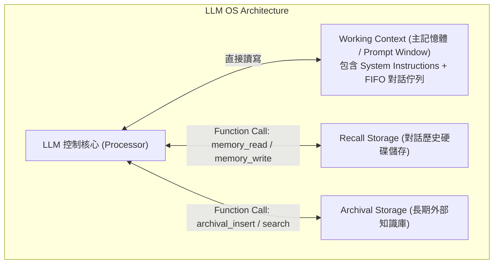

# Domain 06: 外部記憶體架構 (External Memory, MemGPT, A-MEM, Working Memory)

> [!ABSTRACT] 核心問題意識 (Core Problem Statement)
> **靜態 RAG 是被動查詢，無法隨任務進行自主累積、修正與更新狀態。如何為 LLM 賦予如人類大腦或現代作業系統般的長期動態記憶體？**

---

### 一、核心問題意識：RAG $\neq$ Memory
學界在 2024-2026 年取得的一個重要共識：**Memory 不是 RAG 的同義詞**。
- **RAG 是被動資料庫檢索**：外部文檔是唯讀的、靜態的，檢索只為了回答當下 Prompt。
- **Memory 是主動認知狀態維護**：
  1. 具備讀寫雙向能力（Read & Write）；
  2. 具備動態遺忘與整固機制（Consolidation & Decay）；
  3. 能隨著與使用者的長期互動或超長任務的推進，自我演化並維護內部世界模型。

---

### 二、作業系統隱喻：MemGPT 的記憶分層架構
- **代表作**：[[03 - 論文庫 (Literature Notes)/05 - Memory & Agents/(arXiv 2023-10) MemGPT - Towards LLMs as Operating Systems|MemGPT (Packer et al., 2023)]]。
- **核心哲學**：將 LLM 類比為作業系統中的 CPU，將固定長度的 Context Window 類比為實體記憶體（RAM），將外部持久化資料庫類比為硬碟（Disk）。

- **分頁中斷與自我管理 (Paging)**：
  - 當 Working Context 即將超出 Token 上限時，系統觸發『記憶體溢出中斷』。
  - LLM 呼叫函數將重要的長期狀態（如使用者的個人偏好、目前研究進行到第幾階段）寫入持久層，並剔除無關對話歷史，主動騰出上下文空間。

---

### 三、認知心理學啟發的階層記憶體：A-MEM、MemoryBank 與 Generative Agents
- **代表作**：[[03 - 論文庫 (Literature Notes)/05 - Memory & Agents/(UIST 2023-10) Generative Agents - Interactive Simulacra of Human Behavior|Generative Agents (Park et al., 2023)]]、[[03 - 論文庫 (Literature Notes)/05 - Memory & Agents/(AAAI 2024-03) MemoryBank - Enhancing Large Language Models with Long-Term Memory|MemoryBank (Zhong et al., 2024)]]、[[03 - 論文庫 (Literature Notes)/05 - Memory & Agents/(arXiv 2025-02) A-MEM - Agentic Memory System with Hierarchical Structured Storage|A-MEM (2025)]]。
- **神經側網記憶增強**：[[03 - 論文庫 (Literature Notes)/05 - Memory & Agents/(NeurIPS 2023-12) LongMem - Augmenting Language Models with Long-Term Memory|LongMem (Wang et al., 2023)]] 採用凍結 LLM 主幹搭配可訓練 Residual SideNet 與解耦 Key-Value 記憶體檢索，打破 KV Cache 顯存瓶頸。
- **遺忘曲線與主動整固**：MemoryBank 借鑑艾賓浩斯遺忘曲線（$R = e^{-\Delta t / S}$）動態調整記憶強度，避免陳舊對話無效膨脹。
- **四種記憶系統協同**：
  1. **工作記憶 (Working Memory)**：當前推理中的暫存資料。
  2. **情節記憶 (Episodic Memory)**：帶有時間戳與因果順序的具體事件記錄（如『在第 3 次搜尋時發現了 A 與 B 公司的合資協議』）。
  3. **語義記憶 (Semantic Memory)**：脫離具體時間情境的抽象常識與規則（如『這兩家公司在 2023 年前是競爭對手，之後結盟』）。
  4. **程序記憶 (Procedural Memory)**：如何執行特定工具鏈的工作流程經驗。
- **主動記憶整固（Memory Consolidation）**：
  - 定期觸發背景 Reflection 任務，將細碎的情節記憶聚類提煉為高階的語義洞察，並自動標記過期或被後續事實否決的舊記憶。

---

### 四、在超長文件撰寫中的實際應用
在撰寫數萬字長篇報告或閱讀多卷宗法律案件時，Memory 架構的典型落地方式是維護兩個獨立存儲：
1. **Document State Store（文檔進度狀態庫）**：
   - 記錄目前大綱完成度、各章節已撰寫字數、已提及實體定義、尚未解決的論點衝突。
2. **Evidence Store（已驗證證據庫）**：
   - 記錄已通過真實性校驗的所有引文與出處索引，避免模型反覆從原始長文中耗費 Token 重新檢索。

---

## 相關導覽與文獻快速跳轉
- **回主目錄**：[[00 - 導覽與心智圖 (Navigation & MOC)/Home (主目錄與知識庫導覽)|主目錄與知識庫導覽]]
- **全景心智圖**：[[00 - 導覽與心智圖 (Navigation & MOC)/LLM 超長文件處理心智圖 (MOC)|超長文件處理研究方向心智圖]]
- **深度研究報告**：[[01 - 深度研究報告 (Deep Research Reports)/01 - LLM 超長文件閱讀與撰寫技術全景 (完整深度報告)|技術全景深度報告]]
- **權衡分析**：[[00 - 導覽與心智圖 (Navigation & MOC)/技術全景與 Pareto 權衡分析 (Trade-offs)|技術成熟度與 Pareto 權衡分析]]
