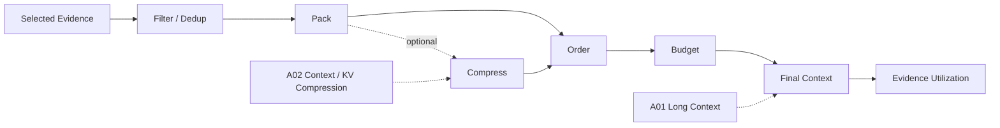

# Domain 07 - Context Construction & Evidence Utilization

## Core Question
候選 evidence 找到後，如何在有限 context budget 中組織資訊，並確保模型真的使用關鍵 evidence？



## Includes
- evidence filtering / deduplication
- context packing
- retrieval-aware compression
- ordering / position effects
- token budget allocation
- lost-in-the-middle
- retrieved-vs-parametric knowledge interaction
- context utilization

## Excludes
- retrieval ranking → D05
- evidence sufficiency → D06
- KV-cache optimization本身 → A02
- output claim verification / citation → D09

## Level-2 Topics
- Context Selection
- Context Packing
- Context Compression for RAG
- Ordering / Position
- Budget Allocation
- Context Utilization
- Parametric vs Retrieved Knowledge

## Boundary
```text
Evidence retrieved
    != evidence placed in context
    != evidence actually used by the model
```

## Representative Notes

**Current primary-note coverage: 3**

- [[03 - 論文庫 (Literature Notes)/06 - Benchmarks & Evaluation/(TACL 2024-01) Lost in the Middle - How Language Models Use Long Contexts|Lost in the Middle]]
- [[03 - 論文庫 (Literature Notes)/02 - Compression & KV Cache/(ICLR 2024-05) RECOMP - Improving Retrieval-Augmented LMs with Compression and Selective Augmentation|RECOMP]]
- [[03 - 論文庫 (Literature Notes)/03 - RAG & Retrieval/(EMNLP 2024-11) Chain-of-Note - Enhancing Robustness in Retrieval-Augmented Language Models|Chain-of-Note]]

## Navigation
- [[02 - 研究領域專題 (Research Domains)/Domain 06 - Evidence Sufficiency & Adaptive Retrieval|D06 Evidence Sufficiency & Adaptive Retrieval]]
- [[02 - 研究領域專題 (Research Domains)/Domain 09 - Grounded Generation Attribution & Long-form Synthesis|D09 Grounded Generation & Long-form Synthesis]]
- [[00 - 導覽與心智圖 (Navigation & MOC)/RAG Adjacent Interfaces|RAG Adjacent Interfaces]]
