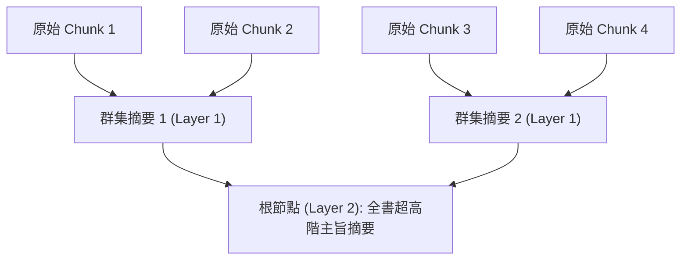

# Domain 07: 分層推理與樹狀檢索 (RAPTOR, Recursive Tree Structuring, Hierarchical QA)

> [!ABSTRACT] 核心問題意識 (Core Problem Statement)
> **超長書籍、上百頁專業財報具備天然的章節階層。如何利用樹狀遞迴摘要與分層遍歷，跨越數萬字實現由局部到宏觀的立體推理？**

---

### 一、核心問題意識：單層檢索的維度災難
長文本的資訊結構天生不是平坦的，而是**樹狀階層結構**：
- 書籍由段落組成章節，章節組成部分，部分構成全書核心主旨。
- 在單層 Vector RAG 中，所有 Chunk 都在同一個平面競爭相似度。若提問：
  > 「這本書的第三章與第七章在論述哲學觀點上有何根本分歧？」
- 單層檢索器只能挑選出相似度零散的段落，模型在缺乏章節語境錨定的情況下，極易張冠李戴，無法完成跨章節的對比推理。

---

### 二、RAPTOR 遞迴樹狀檢索技術剖析
- **代表作**：[[03 - 論文庫 (Literature Notes)/04 - Knowledge & Graph RAG/(ICLR 2024-05) RAPTOR - Recursive Abstractive Processing for Tree-Organized Retrieval|RAPTOR (Sarthi et al., ICLR 2024)]]。
- **核心架構**：

1. **軟聚類（Soft Clustering via GMM）**：
   - 使用高斯混合模型（Gaussian Mixture Models, GMM）對相鄰與語義相近的底層 Chunk 進行分群。允許一個 Chunk 同時隸屬於多個群集（解決跨界主題重疊）。
2. **遞迴抽象（Recursive Summarization）**：
   - 呼叫 LLM 為每個群集生成結構化摘要，並計算摘要向量。
   - 將第一層摘要作為輸入，再次聚類並生成第二層高階摘要，直至收斂為根節點。
3. **推論時的兩種檢索策略**：
   - **樹狀遍歷（Tree Traversal）**：由根節點開始，依相關性自頂向下尋找最具承載力的子樹枝。
   - **全層坍縮檢索（Collapsed Tree Search）**：將所有原始 Chunk 與各層次摘要放在同一個空間中一併比對，利用高層摘要捕捉宏觀語義，利用底層 Chunk 提供微觀引文支持。

---

### 三、分層推理的範式：Map-Reduce vs. Refine vs. Tree-of-Thought
針對超長文理解，目前工業界採用三種主要推理工作流：
1. **Map-Reduce 模式**：
   - **Map**：平行將每一章節/區塊送入 LLM 提取局部關鍵點或評分。
   - **Reduce**：將所有局部萃取結果彙整，送入下一輪 LLM 進行綜合對比生成。
   - *優點*：吞吐量極高、高度可平行；*缺點*：缺乏跨章節雙向交互。
2. **Refine（循序漸進滾動）模式**：
   - 第一個區塊生成初步答案，第二個區塊在已有答案基礎上進行擴充修訂，循序滾動至文末。
   - *優點*：資訊在時序上連續累積；*缺點*：無法平行計算、極易出現時序偏誤（後續區塊完全覆蓋前期重要觀點）。
3. **Tree-of-Thought 結構化漫遊**：
   - 依賴大綱樹與 RAPTOR 樹，模型先在頂層定位涉案章節，再按需深入分支節點檢索，推論效率與邏輯嚴密度最高。

---

## 相關導覽與文獻快速跳轉
- **回主目錄**：[[00 - 導覽與心智圖 (Navigation & MOC)/Home (主目錄與知識庫導覽)|主目錄與知識庫導覽]]
- **全景心智圖**：[[00 - 導覽與心智圖 (Navigation & MOC)/LLM 超長文件處理心智圖 (MOC)|超長文件處理研究方向心智圖]]
- **深度研究報告**：[[01 - 深度研究報告 (Deep Research Reports)/01 - LLM 超長文件閱讀與撰寫技術全景 (完整深度報告)|技術全景深度報告]]
- **權衡分析**：[[00 - 導覽與心智圖 (Navigation & MOC)/技術全景與 Pareto 權衡分析 (Trade-offs)|技術成熟度與 Pareto 權衡分析]]
