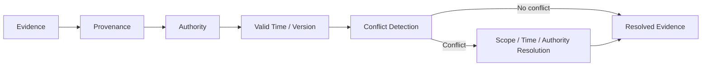

# Domain 08 - Temporal Conflict & Provenance Resolution

## Core Question
當 evidence 的來源、時間、版本、適用條件或 authority 不同時，如何判斷哪些 evidence 適用於目前 query？

## Includes
- source provenance
- authority / source quality
- valid time / record time
- document / knowledge versioning
- temporal constraint matching
- conflict detection / classification
- condition-aware evidence resolution

## Excludes
- citation formatting / attribution output → D09
- index refresh mechanics → D10
- generic relevance ranking → D05

## Level-2 Topics
- Provenance
- Authority
- Temporal RAG
- Version-aware RAG
- Conflict Detection
- Conflict Resolution

## Boundary
Citation answers「輸出引用哪裡」；provenance answers「這份 evidence 從哪裡來、何時有效、適用於什麼條件」。兩者相關但不是同一問題。

## Representative Notes

**Current primary-note coverage: 1**

- [[03 - 論文庫 (Literature Notes)/06 - Benchmarks & Evaluation/(ACL 2026-08) Re3 - Relevance and Recency Retrieval for Mitigating Temporal Hallucination|Re³]]

> [!NOTE]
> 目前 repo 在 provenance、source authority、version conflict 與 condition-aware arbitration 的 primary literature coverage 仍偏薄；這是文獻缺口，不應用 project proposal 補成「既有共識」。

## Navigation
- [[02 - 研究領域專題 (Research Domains)/Domain 09 - Grounded Generation Attribution & Long-form Synthesis|D09 Grounded Generation, Attribution & Long-form Synthesis]]
- [[02 - 研究領域專題 (Research Domains)/Domain 10 - Dynamic Knowledge & Index Maintenance|D10 Dynamic Knowledge & Index Maintenance]]
