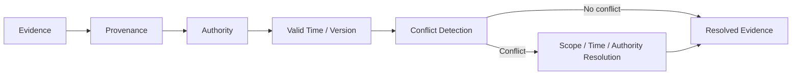

# Domain 08 - Temporal Conflict & Provenance Resolution

## Core Question
當 evidence 隨時間或版本改變、或不同來源對同一事實互相衝突時，如何判斷哪些 evidence 對目前 query 仍有效？

## Includes
- valid time / record time
- document / knowledge versioning
- freshness / recency at query time
- temporal constraint matching
- temporal / version conflict detection
- provenance needed to identify competing evidence sources
- condition-aware evidence resolution

> [!CAUTION]
> **Source authority / generic provenance governance 不等於已成熟的單一 RAG subfield。**  
> 目前最直接的 literature support 是 temporal / version-aware retrieval 與 conflict handling；authority-weighted arbitration 應視為較薄的 Level-2 topic 或 project hypothesis，除非有直接 primary literature。

## Excludes
- citation formatting / attribution output → D09
- index refresh mechanics → D10
- generic relevance ranking → D05

## Research Tracks

1. **Temporal / Version Alignment**：freshness、valid time、version 與 query time 是否一致。
2. **Knowledge Conflict**：context–memory、inter-context、intra-memory conflict 的 detection / diagnosis / resolution。
3. **Provenance / Authority**：source identity、lineage、authority / credibility；目前 direct RAG literature 相對較薄，不能把它當成與 temporal conflict 同樣成熟。

## Level-2 Topics
- Temporal RAG
- Version-aware RAG
- Context–Memory Conflict
- Inter-context Conflict
- Conflict Detection
- Conflict Resolution
- Provenance
- Authority / Credibility

## Boundary
Citation answers「輸出引用哪裡」；provenance answers「這份 evidence 從哪裡來、何時有效、適用於什麼條件」。兩者相關但不是同一問題。

## Representative Notes

**Current primary-note coverage: 3**

- [[03 - 論文庫 (Literature Notes)/06 - Benchmarks & Evaluation/(ACL 2024-08) FreshLLMs - Refreshing Large Language Models with Search Engine Augmentation|FreshLLMs / FreshQA]]
- [[03 - 論文庫 (Literature Notes)/06 - Benchmarks & Evaluation/(ACL 2026-08) Re3 - Relevance and Recency Retrieval for Mitigating Temporal Hallucination|Re³]]
- [[03 - 論文庫 (Literature Notes)/06 - Benchmarks & Evaluation/(ACL 2026-07) When Facts Change - Temporal Knowledge Conflict Resolution in LLMs|When Facts Change]]

> [!NOTE]
> 目前 temporal / version / context–memory conflict 已有直接 literature；真正仍偏薄的是 **source authority / credibility arbitration、provenance-aware multi-source resolution、condition-aware arbitration**。這些仍應標成 coverage gap，而不是用 project proposal 補成「既有共識」。

## Navigation
- [[02 - 研究領域專題 (Research Domains)/Domain 05 - Query Understanding & Retrieval|D05 Query Understanding & Retrieval]]
- [[02 - 研究領域專題 (Research Domains)/Domain 06 - Evidence Sufficiency & Adaptive Retrieval|D06 Evidence Sufficiency & Adaptive Retrieval]]
- [[02 - 研究領域專題 (Research Domains)/Domain 09 - Grounded Generation Attribution & Long-form Synthesis|D09 Grounded Generation, Attribution & Long-form Synthesis]]
- [[02 - 研究領域專題 (Research Domains)/Domain 10 - Dynamic Knowledge & Index Maintenance|D10 Dynamic Knowledge & Index Maintenance]]
