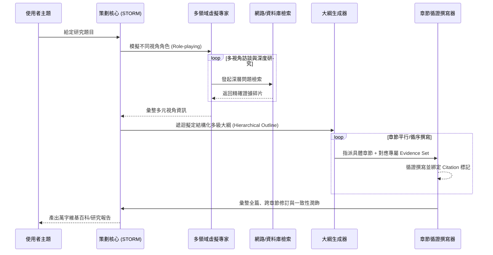

# Domain 08: 長篇生成與報告撰寫 (Long-Form Generation, STORM, Claim-Evidence Ledger)

> [!ABSTRACT] 核心問題意識 (Core Problem Statement)
> **如何打破 LLM 單次輸出的 Token 限制，讓模型撰寫結構嚴謹、前後一致、資訊密集、萬字以上且引文嚴格可驗證的專業學術/產業長篇報告？**

---

### 一、核心問題意識：長文寫作不等於一次生成
要求 LLM 在單一 Prompt 下輸出 20,000 字是極其幼稚且注定失敗的設計：
1. **結構空洞與膨脹廢話**：LLM 為了填補長度要求，會陷入循環重複與空泛修飾，實質資訊密度斷崖式下跌。
2. **前後矛盾與論點漂移**：在缺乏外部顯式狀態追蹤時，生成到第 8,000 字時早已遺忘第 500 字設立的前置假設與術語定義。
3. **引文憑空捏造**：在長篇自由生成時，LLM 的幻覺率呈指數級上升。

---

### 二、史丹佛 STORM 系統：長文寫作的工程典範
- **代表作**：[[Shao2024 - STORM Writing Wikipedia From Scratch|STORM (Shao et al., NAACL 2024)]]。
- **核心架構流程**：

---

### 三、關鍵工程構件：Evidence Store 與 Claim-Evidence Ledger

#### 1. 獨立證據庫 (Evidence Store)
- 長文撰寫絕不能讓生成器自由漫遊於整個原始數據庫。
- 必須在『研究階段』將所有找到的有效文獻段落編號歸檔進專屬的 Evidence Store，每個證據具備唯一識別碼 `[E1]`, `[E2]`。
- 撰寫階段強制要求生成模組只能調用 Evidence Store 中的資料，並標註具體編號。

#### 2. 主張-證據台帳 (Claim-Evidence Ledger)
- 評估與防護長篇論文生成真實性的最強機制：

| Claim ID | 具體主張陳述 (Generated Claim) | 支持證據來源 (Evidence Doc) | 證據支持等級 (Support Level) | 潛在反例或例外 (Exceptions) | 所屬章節位置 |
| :--- | :--- | :--- | :--- | :--- | :--- |
| **C-01** | FlashAttention 透過 SRAM Tiling 實現顯存節省 | Dao et al., 2022, Section 3.1 | Direct (直接完全支持) | Compute 仍為二次方 | 2.1 節 |
| **C-02** | Mamba 在所有長文問答基準上擊敗 Transformer | 缺乏直接支持 (Overclaim) | Unsupported (缺乏證據支持) | NIAH 檢索表現較弱 | 2.3 節 (需修正) |

---

### 四、長篇報告撰寫的黃金原則
1. **Separation of Concerns（研究與撰寫解耦）**：先做完窮盡式資訊檢索與證據鏈審查，再啟動寫作，切忌邊寫邊搜。
2. **Hierarchy-Driven Writing（大綱驅動分段撰寫）**：將萬字大文拆解為 1,000~2,000 字的獨立子章節，各章節帶有明確的 Context Summary 與章節專屬任務說明。
3. **Post-Generation Consistency Pass（後置一致性校準）**：撰寫完畢後，由審閱 Agent 通讀全篇，專門消除術語不一致、章節重疊與語調斷層。

---

## 相關導覽與文獻快速跳轉
- **回主目錄**：[[00 - 導覽與心智圖 (Navigation & MOC)/Home (主目錄與知識庫導覽)|主目錄與知識庫導覽]]
- **全景心智圖**：[[00 - 導覽與心智圖 (Navigation & MOC)/LLM 超長文件處理心智圖 (MOC)|超長文件處理研究方向心智圖]]
- **深度研究報告**：[[01 - 深度研究報告 (Deep Research Reports)/01 - LLM 超長文件閱讀與撰寫技術全景 (完整深度報告)|技術全景深度報告]]
- **權衡分析**：[[00 - 導覽與心智圖 (Navigation & MOC)/技術全景與 Pareto 權衡分析 (Trade-offs)|技術成熟度與 Pareto 權衡分析]]
