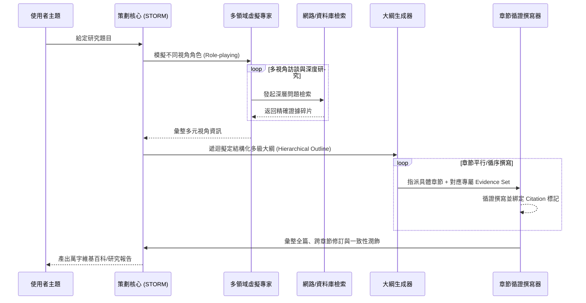

# Domain 08: 長篇生成與報告撰寫 (Long-Form Generation, STORM, Claim-Evidence Ledger)

> [!ABSTRACT] 核心問題意識 (Core Problem Statement)
> **如何打破 LLM 單次輸出的 Token 限制，讓模型撰寫結構嚴謹、前後一致、資訊密集、萬字以上且引文嚴格可驗證的專業學術/產業長篇報告？**

---

### 一、核心問題意識：長文寫作不等於一次生成
單次 Prompt 直接生成超長報告，通常較難同時維持全篇結構、資訊覆蓋、跨章一致性與可追溯引用；因此相關工作常將研究、規劃、寫作與驗證拆成多階段：
1. **結構空洞與膨脹廢話**：LLM 為了填補長度要求，會陷入循環重複與空泛修飾，實質資訊密度斷崖式下跌。
2. **前後矛盾與論點漂移**：缺乏外部狀態或章節級規劃時，跨章術語、假設與主張容易漂移；實際退化程度需依模型、長度與任務測量。
3. **引文憑空捏造**：長篇生成擴大了需要驗證的 claim 與 citation 數量，也增加 coverage 與 consistency 的評估難度；目前不應無來源地宣稱幻覺率會隨篇幅「指數級」上升。

---

### 二、史丹佛 STORM 系統：長文寫作的工程典範
- **代表作**：[[03 - 論文庫 (Literature Notes)/05 - Memory & Agents/(NAACL 2024-06) Assisting in Writing Wikipedia-like Articles From Scratch with Large Language Models|STORM (Shao et al., NAACL 2024)]]。
- **核心架構流程**：

#### 2. WebGPT 與 GopherCite：主動網路研究、逐字引文與拒答機制
- **[[03 - 論文庫 (Literature Notes)/05 - Memory & Agents/(arXiv 2021-12) WebGPT - Browser-assisted question-answering with human feedback|WebGPT (Nakano et al., OpenAI 2021)]]**：首創文字網頁瀏覽器環境（search, browse, scroll, quote），透過 RLHF 訓練模型自主採集網路證據並在長篇回答中標註可驗證引用，在 ELI5 上以 56% 勝率超越人類專家示範。
- **[[03 - 論文庫 (Literature Notes)/05 - Memory & Agents/(arXiv 2022-03) Teaching language models to support answers with verified quotes|GopherCite (Menick et al., DeepMind 2022)]]**：引入強制逐字字面校驗（Verbatim Quotes）與選擇性拒答（Abstention）機制，在缺乏充分證據時主動棄權，將長篇回答高品質率提升至 80%。

#### 3. EviReport 與 EFSG：證據追蹤大綱與結構化生成範式
- **[[03 - 論文庫 (Literature Notes)/05 - Memory & Agents/(ACL 2026-08) EviReport - From Reasoned Outlines to Evidence Tracked Long-Form Reports|EviReport (Findings of ACL 2026)]]**：提出證據錨定大綱（Reasoned Outlines）與缺口感知追加檢索（Gap-Aware Append Queries），在 EviReportBench 上實現 2.16× 事實覆蓋率與 +8.9 分精準度。
- **[[03 - 論文庫 (Literature Notes)/05 - Memory & Agents/(ACL 2026-08) EFSG - Evidence-First Structured Generation for Multilingual RAG Report Generation|EFSG (RAG4Reports 2026)]]**：提出證據先行（Evidence-First）範式，在寫作前完全凍結黃金事實庫，關閉動態檢索，以嚴格結構化解碼根除無支撐大綱導致的事實性漂移。

---

### 三、關鍵工程構件：Evidence Store 與 Claim-Evidence Ledger

#### 1. 獨立證據庫 (Evidence Store)
- **Evidence Store 是一種設計選擇，不是所有長篇生成方法的必要條件。** Evidence-first 方法可在寫作前封存/整理證據池；另一類方法則在寫作期間依 evidence gap 迭代檢索。
- 若採固定 Evidence Store，可為證據配置唯一識別碼（如 `E1`, `E2`）、來源 span 與 provenance，以利 claim-level attribution。
- 正式實驗應比較 fixed evidence pool 與 gap-aware iterative retrieval 在 factual support、coverage、成本與 latency 上的取捨。

#### 2. 主張-證據台帳 (Claim-Evidence Ledger)
- 一種用於檢驗長篇報告真實性、引文涵蓋率與溯源性的可審計架構設計（待驗證研究構想）：

| Claim ID | 具體主張陳述 (Generated Claim) | 支持證據來源 (Evidence Doc) | 證據支持等級 (Support Level) | 潛在反例或例外 (Exceptions) | 所屬章節位置 |
| :--- | :--- | :--- | :--- | :--- | :--- |
| **C-01** | FlashAttention 透過 SRAM Tiling 實現顯存節省 | Dao et al., 2022, Section 3.1 | Direct (直接完全支持) | Compute 仍為二次方 | 2.1 節 |
| **C-02** | Mamba 在所有長文問答基準上擊敗 Transformer | 缺乏直接支持 (Overclaim) | Unsupported (缺乏證據支持) | NIAH 檢索表現較弱 | 2.3 節 (需修正) |

---

### 四、長篇報告撰寫的黃金原則
1. **Separation of Concerns（責任分離）**：將檢索、規劃、寫作與驗證設為可獨立評估的模組；系統可以採生成前固定 Evidence Pool，也可以在寫作期間依 evidence gap 補查，兩者應由 benchmark 比較。
2. **Hierarchy-Driven Writing（大綱驅動分段撰寫）**：將萬字大文拆解為 1,000~2,000 字的獨立子章節，各章節帶有明確的 Context Summary 與章節專屬任務說明。
3. **Post-Generation Consistency Pass（後置一致性校準）**：撰寫完畢後，由審閱 Agent 通讀全篇，專門消除術語不一致、章節重疊與語調斷層。

---

## 五、2026 報告生成評測版圖

長篇報告不能只用單一「品質分數」評估。後續 survey 應至少分成四個軸：

| 軸 | 代表 benchmark / work | 問題 |
| :--- | :--- | :--- |
| Citation / sentence support | RAG4Reports、[[03 - 論文庫 (Literature Notes)/05 - Memory & Agents/(ACL 2026-08) EFSG - Evidence-First Structured Generation for Multilingual RAG Report Generation\|EFSG (ACL 2026)]] | 每句 claim 是否真的被來源支持？ |
| Information coverage | RAG4Reports nugget coverage、[[03 - 論文庫 (Literature Notes)/05 - Memory & Agents/(ACL 2026-08) EviReport - From Reasoned Outlines to Evidence Tracked Long-Form Reports\|EviReport (ACL 2026)]] | 報告是否涵蓋應有的重要資訊？ |
| Factuality / evidence integration | [[03 - 論文庫 (Literature Notes)/05 - Memory & Agents/(ACL 2026-08) EviReport - From Reasoned Outlines to Evidence Tracked Long-Form Reports\|EviReport / EviReportBench]]、[[03 - 論文庫 (Literature Notes)/05 - Memory & Agents/(arXiv 2024-11) OpenScholar - Synthesizing Scientific Literature with Retrieval-Augmented Language Models\|OpenScholar / ScholarQABench]] | 內容是否正確、是否妥善整合證據與學術引用？ |
| Report-level logic / professional quality | ReportLogic、[[03 - 論文庫 (Literature Notes)/06 - Benchmarks & Evaluation/(ACL 2026-08) AnalystBench - Benchmarking Professional Long-Form Report Generation with Web-Mined Multimodal Tasks\|AnalystBench (ACL 2026)]] | 全篇結構、論述、多模態圖表與專業交付品質是否成立？ |

其中 RAG4Reports 是 shared task / benchmark，不應與 EFSG、AMU 等參賽方法論文混為同一種 artifact；ReportLogic、AnalystBench 的資料釋出狀態也應個別核對。完整清單見 [[00 - 導覽與心智圖 (Navigation & MOC)/RAG Benchmark Catalog|RAG Benchmark Catalog]]。

> [!NOTE] Survey coverage
> 長篇報告生成目前不像通用 RAG 那樣已有單一、成熟且涵蓋全部子題的 survey。因此 [[03 - 論文庫 (Literature Notes)/05 - Memory & Agents/(NAACL 2024-06) Assisting in Writing Wikipedia-like Articles From Scratch with Large Language Models|STORM]]、[[03 - 論文庫 (Literature Notes)/05 - Memory & Agents/(ACL 2026-08) EviReport - From Reasoned Outlines to Evidence Tracked Long-Form Reports|EviReport]]、[[03 - 論文庫 (Literature Notes)/05 - Memory & Agents/(ACL 2026-08) EFSG - Evidence-First Structured Generation for Multilingual RAG Report Generation|EFSG]]、[[03 - 論文庫 (Literature Notes)/06 - Benchmarks & Evaluation/(ACL 2026-08) AnalystBench - Benchmarking Professional Long-Form Report Generation with Web-Mined Multimodal Tasks|AnalystBench]]、[[03 - 論文庫 (Literature Notes)/05 - Memory & Agents/(arXiv 2024-11) OpenScholar - Synthesizing Scientific Literature with Retrieval-Augmented Language Models|OpenScholar]]、ReportLogic 等 primary/benchmark works 可以構成 evidence map，但尚未被 survey 直接支持的「Claim-Evidence Ledger」「固定 Evidence Store」「Gap-aware Writer」組合設計，應移至 [[04 - 研究想法與待驗證提案 (Ideas & Hypotheses)/README|Ideas & Hypotheses]]，不得當成 survey 共識。

---

## 相關導覽與文獻快速跳轉
- **回主目錄**：[[00 - 導覽與心智圖 (Navigation & MOC)/Home (主目錄與知識庫導覽)|主目錄與知識庫導覽]]
- **專題連動**：
  - [[02 - 研究領域專題 (Research Domains)/Domain 14 - Evidence Sufficiency & Adaptive Retrieval|Domain 14: Evidence Sufficiency & Adaptive Retrieval]]
  - [[02 - 研究領域專題 (Research Domains)/Domain 16 - Context Utilization & Faithfulness|Domain 16: Context Utilization & Faithfulness]]
  - [[02 - 研究領域專題 (Research Domains)/Domain 17 - RAG Benchmarks & Evaluation Protocols|Domain 17: RAG Benchmarks & Evaluation Protocols]]
- **全景心智圖**：[[00 - 導覽與心智圖 (Navigation & MOC)/LLM 超長文件處理心智圖 (MOC)|超長文件處理研究方向心智圖]]
- **深度研究報告**：[[01 - 深度研究報告 (Deep Research Reports)/01 - LLM 超長文件閱讀與撰寫技術全景 (完整深度報告)|技術全景深度報告]]
- **權衡分析**：[[00 - 導覽與心智圖 (Navigation & MOC)/技術全景與 Pareto 權衡分析 (Trade-offs)|技術成熟度與 Pareto 權衡分析]]
