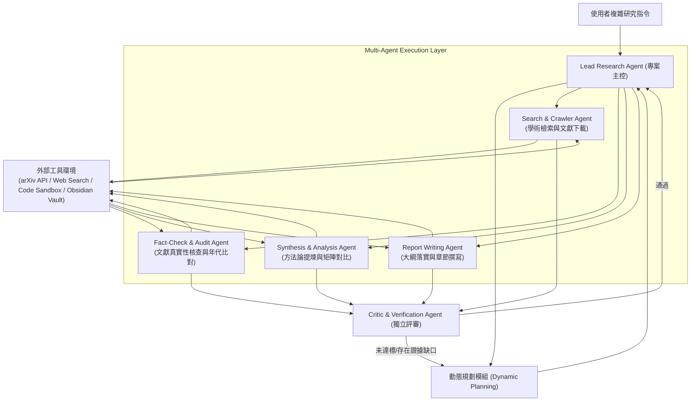

# Domain 09: Agentic 工作流與自主研究 (Autonomous Research, Planning, Multi-Agent Collaboration)

> [!ABSTRACT] 核心問題意識 (Core Problem Statement)
> **面對開放性、未明確定義的高難度長文本任務，單一 Prompt 無法窮盡解法。如何設計具備規劃、工具呼叫、動態反思與多智能體協同的自主研究系統？**

---

### 一、核心問題意識：從單一模型到自主智能體系統
傳統 LLM 應用是單向管線（Pipeline）：輸入 Prompt $\rightarrow$ 模型輸出。
然而超長文件研究任務天生包含不確定性：
- 常常需要多輪查證：第一次檢索出的論文提到了一個未知術語，系統必須能自發暫停，啟動第二次專項檢索；
- 發現既定方案不可行時，必須具備動態重規劃（Re-planning）能力；
- 複雜長文任務涉及多元專業（文獻挖掘、代碼驗證、數據對比、寫作潤飾），單一 Agent 上下文容易混亂，需要**多智能體角色分工（Multi-Agent Specialization）**。

---

### 二、典型 Deep Research 智能體協同架構

---

### 三、關鍵核心機制

#### 1. 動態研究規劃 (Dynamic Research Planning)
- 進入研究前，先將宏觀主題解構為具備依賴關係的研究子任務（Task Dependency Graph）。
- 每一輪工具呼叫後，即時更新任務進度狀態（`pending`, `in_progress`, `completed`, `blocked`），並依據新發現動態調整或增刪後續任務。

#### 2. 工具調用與安全沙盒 (Tool Calling & Sandboxing)
- **學術接口調用**：arXiv API、Semantic Scholar、ACL Anthology。
- **程式碼沙盒執行**：即時撰寫 Python 腳本解析 PDF、提取統計數據、進行向量運算，確保研究數據的嚴謹與可重現。
- **檔案系統持久化**：將中間研究進展即時寫入 Markdown 筆記（如本 Obsidian Vault），防止長程任務因崩潰而丟失成果。

#### 3. 多角色協同 (Multi-Agent Debate & Reflection)
- 透過讓不同 Agent 分別扮演『贊成者』、『質疑審查者（Devil's Advocate）』與『仲裁者』，消除單一模型生成的認知偏誤與幻覺。

---

## 相關導覽與文獻快速跳轉
- **回主目錄**：[[00 - 導覽與心智圖 (Navigation & MOC)/Home (主目錄與知識庫導覽)|主目錄與知識庫導覽]]
- **全景心智圖**：[[00 - 導覽與心智圖 (Navigation & MOC)/LLM 超長文件處理心智圖 (MOC)|超長文件處理研究方向心智圖]]
- **深度研究報告**：[[01 - 深度研究報告 (Deep Research Reports)/01 - LLM 超長文件閱讀與撰寫技術全景 (完整深度報告)|技術全景深度報告]]
- **權衡分析**：[[00 - 導覽與心智圖 (Navigation & MOC)/技術全景與 Pareto 權衡分析 (Trade-offs)|技術成熟度與 Pareto 權衡分析]]
