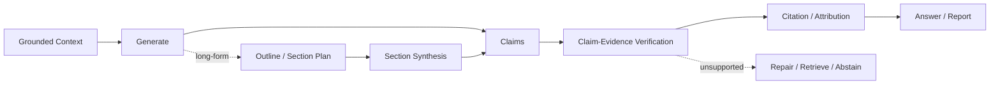

# Domain 09 - Grounded Generation, Attribution & Long-form Synthesis

## Core Question
如何由 evidence 產生可驗證、可歸因的答案或長篇報告，並在無法支持時選擇修正或 abstain？



## Includes
- grounded generation
- claim decomposition
- claim-evidence verification
- faithfulness / groundedness
- citation / attribution
- abstention
- outline / section planning
- long-form synthesis
- revision / cross-section consistency

## Excludes
- retrieval algorithm → D05/D06
- context packing → D07
- benchmark methodology → D13

## Level-2 Topics
- Grounded Generation
- Claim Verification
- Citation / Attribution
- Abstention
- Long-form Report Generation
- Evidence-to-Section Planning
- Revision / Consistency

## Boundary
```text
Citation present
    != citation relevant
    != citation entails claim
    != answer complete
```

## Navigation
- [[02 - 研究領域專題 (Research Domains)/Domain 07 - Context Construction & Evidence Utilization|D07 Context Construction & Evidence Utilization]]
- [[02 - 研究領域專題 (Research Domains)/Domain 13 - RAG Evaluation & Failure Attribution|D13 RAG Evaluation & Failure Attribution]]
