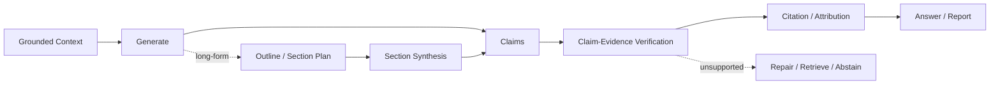

# Domain 09 - Grounded Generation, Attribution & Long-form Synthesis

## Core Question
如何由 evidence 產生可驗證、可歸因的答案或長篇報告，並在無法支持時選擇修正或 abstain？



## Includes
- grounded generation
- claim decomposition
- claim-evidence verification
- faithfulness / groundedness
- citation / attribution
- abstention
- outline / section planning
- long-form synthesis
- revision / cross-section consistency

## Excludes
- retrieval algorithm → D05/D06
- context packing → D07
- benchmark methodology → D13

## Level-2 Topics
- Grounded Generation
- Claim Verification
- Citation / Attribution
- Abstention
- Long-form Report Generation
- Evidence-to-Section Planning
- Revision / Consistency

## Boundary
```text
Citation present
    != citation relevant
    != citation entails claim
    != answer complete
```

## Representative Notes

**Current primary-note coverage: 5**

- [[03 - 論文庫 (Literature Notes)/05 - Memory & Agents/(NAACL 2024-06) Assisting in Writing Wikipedia-like Articles From Scratch with Large Language Models|STORM]]
- [[03 - 論文庫 (Literature Notes)/05 - Memory & Agents/(arXiv 2024-11) OpenScholar - Synthesizing Scientific Literature with Retrieval-Augmented Language Models|OpenScholar]]
- [[03 - 論文庫 (Literature Notes)/05 - Memory & Agents/(ACL 2026-08) EviReport - From Reasoned Outlines to Evidence Tracked Long-Form Reports|EviReport]]
- [[03 - 論文庫 (Literature Notes)/05 - Memory & Agents/(ACL 2026-08) EFSG - Evidence-First Structured Generation for Multilingual RAG Report Generation|EFSG]]
- [[03 - 論文庫 (Literature Notes)/05 - Memory & Agents/(arXiv 2022-03) Teaching language models to support answers with verified quotes|GopherCite]]

## Long-form Orchestration Patterns

長篇生成至少有三種不同 orchestration pattern，不能全部叫「一次生成」：

1. **Outline-first / research-first**：先研究與建立大綱，再依 section 對應 evidence 撰寫；STORM 是代表工作。
2. **Evidence-first fixed pool**：生成前先整理/封存 evidence pool，再從固定證據寫作；適合強調 auditability 的設計。
3. **Gap-aware iterative writing**：寫作或規劃過程發現 coverage gap 時再追加 retrieval；EviReport 類工作靠近這一路線。

### Generic long-document synthesis patterns

早期/通用 long-document pipeline 常見 **Map-Reduce、Refine、tree-search / Tree-of-Thought-like orchestration**。這些可以用於 summarization / synthesis，但本身不是 RAG-specific Domain；只有在它們與 evidence retrieval、citation、verification 或 gap-aware control 結合時，才進入 D09/D12 的研究範圍。

### Evidence Store 與 Claim-Evidence Ledger

- **Evidence Store**：一個可選的系統設計，用穩定 evidence ID、source span、provenance 保存可引用證據；不是所有長文方法的必要條件。
- **Claim-Evidence Ledger**：project-specific 可審計機制，將 generated claim 對應 supporting / contradicting evidence、verification status 與 section。其 canonical 定義放在 [[04 - 研究想法與待驗證提案 (Ideas & Hypotheses)/Idea 04 - End-to-End RAG Failure Attribution and Evidence Governance|Idea 04]]。
- fixed evidence pool 與 iterative retrieval 應作為可比較的設計選擇，而非先驗宣稱其中一種必然較好。


> [!NOTE]
> [[03 - 論文庫 (Literature Notes)/06 - Benchmarks & Evaluation/(EMNLP 2023-12) Enabling Large Language Models to Generate Text with Citations|ALCE]] contributes citation evaluation benchmarks/metrics, so it is D13-primary with D09 secondary relevance.

## Navigation
- [[02 - 研究領域專題 (Research Domains)/Domain 07 - Context Construction & Evidence Utilization|D07 Context Construction & Evidence Utilization]]
- [[02 - 研究領域專題 (Research Domains)/Domain 13 - RAG Evaluation & Failure Attribution|D13 RAG Evaluation & Failure Attribution]]
