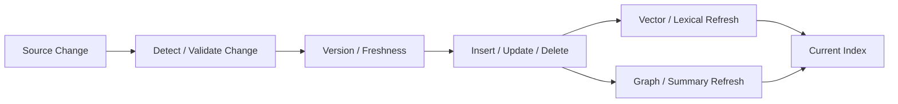

# Domain 10 - Dynamic Knowledge & Index Maintenance

## Core Question
外部 knowledge base 持續新增、修改、刪除或失效時，RAG index 如何正確且低成本地保持最新？

## Includes
- change detection
- freshness / staleness
- insert / update / delete semantics
- incremental indexing
- embedding refresh
- entity resolution across versions
- graph / summary recomputation
- version-aware retrieval support

## Excludes
- persistent user/agent memory → D11
- evidence conflict resolution at query time → D08
- parametric model editing → A05

## Level-2 Topics
- Dynamic Indexing
- Freshness / Staleness
- Incremental Embedding Update
- Graph Maintenance
- Versioned Knowledge
- Deletion / Invalidation

## Boundary
**Dynamic Index ≠ Memory.**  
D10 管 canonical external knowledge/index 的更新；D11 管系統形成且持續演化的 derived memory state。

## Representative Notes

**Current primary-note coverage: 1**

- [[03 - 論文庫 (Literature Notes)/03 - RAG & Retrieval/(ACL 2026-07) AURORA - Neuro-Symbolic Continual Indexing for Evolving RAG Systems|AURORA]]

AURORA 是目前最直接的 D10 primary anchor：它研究 distribution shift 下的 continual index adaptation。FreshLLMs / FreshQA 則屬 current-world QA 與 search augmentation，應放 D08/D13/D05，不能拿來代替 index maintenance。

> [!NOTE]
> 即使加入 AURORA，目前對 **source-level CRUD、deletion propagation、derived-summary/graph invalidation、versioned index 與 production update streams** 的 dedicated coverage 仍不足。

## Navigation
- [[02 - 研究領域專題 (Research Domains)/Domain 04 - Knowledge Representation & Indexing|D04 Knowledge Representation & Indexing]]
- [[02 - 研究領域專題 (Research Domains)/Domain 08 - Temporal Conflict & Provenance Resolution|D08 Temporal Conflict & Provenance Resolution]]
- [[02 - 研究領域專題 (Research Domains)/Domain 11 - Memory-Augmented RAG|D11 Memory-Augmented RAG]]
- [[00 - 導覽與心智圖 (Navigation & MOC)/RAG Adjacent Interfaces|RAG Adjacent Interfaces]]
