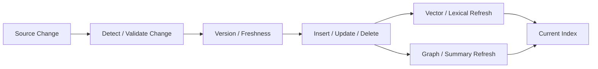

# Domain 10 - Dynamic Knowledge & Index Maintenance

## Core Question
外部 knowledge base 持續新增、修改、刪除或失效時，RAG index 如何正確且低成本地保持最新？

## Includes
- change detection
- freshness / staleness
- insert / update / delete semantics
- incremental indexing
- embedding refresh
- entity resolution across versions
- graph / summary recomputation
- version-aware retrieval support

## Excludes
- persistent user/agent memory → D11
- evidence conflict resolution at query time → D08
- parametric model editing → A05

## Level-2 Topics
- Dynamic Indexing
- Freshness / Staleness
- Incremental Embedding Update
- Graph Maintenance
- Versioned Knowledge
- Deletion / Invalidation

## Boundary
**Dynamic Index ≠ Memory.**  
D10 管 external knowledge base 的狀態；D11 管跨 interaction 的 persistent state。

## Representative Notes

**Current primary-note coverage: 0**

目前 repo **沒有一篇可以直接作為 D10 primary anchor 的 dedicated note**。FreshLLMs / FreshQA 研究的是 current-world QA 與 search augmentation，應放 D08/D13/D05；它不實作 incremental index maintenance。

> [!NOTE]
> 目前 repo 對 incremental vector/graph maintenance、deletion semantics、staleness detection、re-embedding、derived-index invalidation 與 versioned index 的 dedicated literature coverage 仍不足。這是 **真正缺文獻**，不應再用 freshness QA paper 代替。

## Navigation
- [[02 - 研究領域專題 (Research Domains)/Domain 04 - Knowledge Representation & Indexing|D04 Knowledge Representation & Indexing]]
- [[02 - 研究領域專題 (Research Domains)/Domain 08 - Temporal Conflict & Provenance Resolution|D08 Temporal Conflict & Provenance Resolution]]
- [[02 - 研究領域專題 (Research Domains)/Domain 11 - Memory-Augmented RAG|D11 Memory-Augmented RAG]]
- [[00 - 導覽與心智圖 (Navigation & MOC)/RAG Adjacent Interfaces|RAG Adjacent Interfaces]]
