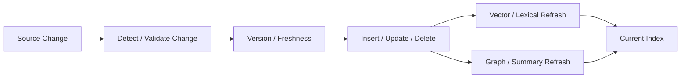

# Domain 10 - Knowledge & Index Maintenance

> [!WARNING]
> **Phase 1 closure is authoritative.** 若本頁較早段落與底部「Phase 1 Closure — 2026-09-27」衝突，以 closure 為準；舊文字暫留作 Phase 2 forensic audit，將於 Phase 7 一次正規化。

## Core Question
外部 knowledge base 持續新增、修改、刪除或失效時，RAG index 如何正確且低成本地保持最新？

```mermaid
flowchart LR
    CH["Source Change"] --> DET["Detect / Validate Change"]
    DET --> VER["Version / Freshness"]
    VER --> UP["Insert / Update / Delete"]
    UP --> V["Vector / Lexical Refresh"]
    UP --> G["Graph / Summary Refresh"]
    V --> IDX["Current Index"]
    G --> IDX
```

## Includes
- change detection
- freshness / staleness
- insert / update / delete semantics
- incremental indexing
- embedding refresh
- entity resolution across versions
- graph / summary recomputation
- version-aware retrieval support

## Excludes
- persistent user/agent memory → D11
- evidence conflict resolution at query time → D08
- parametric model editing → A05

## Level-2 Topics
- Dynamic Indexing
- Freshness / Staleness
- Incremental Embedding Update
- Graph Maintenance
- Versioned Knowledge
- Deletion / Invalidation

## Boundary
**Dynamic Index ≠ Memory.**  
D10 管 canonical external knowledge/index 的更新；D11 管系統形成且持續演化的 derived memory state。

## Representative Notes

**Current primary-note coverage: 1**

- [[03 - 論文庫 (Literature Notes)/03 - RAG & Retrieval/(ACL 2026-07) AURORA - Neuro-Symbolic Continual Indexing for Evolving RAG Systems|AURORA]]

AURORA 是目前最直接的 D10 primary anchor：它研究 distribution shift 下的 continual index adaptation。FreshLLMs / FreshQA 則屬 current-world QA 與 search augmentation，應放 D08/D13/D05，不能拿來代替 index maintenance。

> [!NOTE]
> 即使加入 AURORA，目前對 **source-level CRUD、deletion propagation、derived-summary/graph invalidation、versioned index 與 production update streams** 的 dedicated coverage 仍不足。

## Navigation
- [[02 - 研究領域專題 (Research Domains)/Domain 04 - Knowledge Representation & Indexing|D04 Knowledge Representation & Indexing]]
- [[02 - 研究領域專題 (Research Domains)/Domain 08 - Temporal Conflict & Provenance Resolution|D08 Temporal Conflict & Provenance Resolution]]
- [[02 - 研究領域專題 (Research Domains)/Domain 11 - Memory-Augmented RAG|D11 Memory-Augmented RAG]]
- [[00 - 導覽與心智圖 (Navigation & MOC)/RAG Adjacent Interfaces|RAG Adjacent Interfaces]]

## Phase 1 Closure — 2026-09-27

> [!IMPORTANT]
> **Canonical name: D10 Knowledge & Index Maintenance.**
> This is a cross-lifecycle maintenance plane. Direct academic coverage is emerging; several production CRUD/invalidation concerns are engineering-mature but research-thin.

**Core question**：當 canonical external knowledge 發生新增、修改、刪除或語意分布改變時，RAG 衍生的 chunks、embeddings、graphs、summaries 與 indexes 應如何正確且低成本地同步更新？

**Canonical Level-2**
- Change & Dependency Management
- Incremental Index Maintenance: insert/update/delete, partial re-indexing, embedding refresh
- Structured Knowledge Maintenance: entity reconciliation, graph updates, orphan cleanup, summary recomputation
- Version & Freshness Maintenance: index freshness, version storage, stale-artifact detection, synchronization

**Hard boundary**
- initial index construction → D04
- query-time temporal/version reconciliation → D08
- source-of-truth synchronization → D10
- evolving derived interaction memory → D11
- parametric model editing → A05

**Paper decisions**
- AURORA: KEEP canonical D10 / D04 secondary; remove unnecessary D05 secondary.
- LightRAG: D04 primary / D05+D10 secondary.
- HippoRAG 2: D11 primary / D10 secondary.
- VersionRAG: D08 primary / D10 secondary, emerging preprint.
- Generic stale-embedding work caused by encoder-parameter drift is not automatically D10.
- CRUD, deletion propagation, dependency-aware recomputation, real update-stream benchmarks remain explicit gaps.
