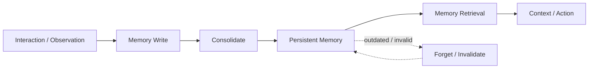

# Domain 11 - Memory-Augmented RAG

## Core Question
系統如何跨 interaction 保存、檢索、整合、更新與遺忘 persistent state，而不是每次只查詢外部 corpus？



## Includes
- episodic / semantic / task memory
- memory write / retrieval
- memory consolidation
- forgetting / invalidation
- long-horizon interaction state
- memory provenance

## Excludes
- general corpus update → D10
- single-turn context packing → D07
- controller deciding when/how to use tools → D12

## Level-2 Topics
- Memory Write
- Memory Retrieval
- Episodic / Semantic Memory
- Consolidation
- Forgetting / Invalidation
- Long-horizon State
- Memory Provenance

## Boundary
```text
RAG corpus = external knowledge source
Persistent memory = state accumulated across interactions
Dynamic index = maintenance of external knowledge/index
```

## Representative Notes

**Current primary-note coverage: 6**

- [[03 - 論文庫 (Literature Notes)/05 - Memory & Agents/(arXiv 2023-10) MemGPT - Towards LLMs as Operating Systems|MemGPT]]
- [[03 - 論文庫 (Literature Notes)/05 - Memory & Agents/(NeurIPS 2023-12) LongMem - Augmenting Language Models with Long-Term Memory|LongMem]]
- [[03 - 論文庫 (Literature Notes)/05 - Memory & Agents/(AAAI 2024-03) MemoryBank - Enhancing Large Language Models with Long-Term Memory|MemoryBank]]
- [[03 - 論文庫 (Literature Notes)/05 - Memory & Agents/(arXiv 2025-02) A-MEM - Agentic Memory System with Hierarchical Structured Storage|A-MEM]]
- [[03 - 論文庫 (Literature Notes)/05 - Memory & Agents/(arXiv 2024-09) MemoRAG - Moving towards Next-Gen RAG Via Memory-Inspired Knowledge Discovery|MemoRAG]]
- [[03 - 論文庫 (Literature Notes)/04 - Knowledge & Graph RAG/(ICML 2025-07) From RAG to Memory - Non-Parametric Continual Learning for Large Language Models|From RAG to Memory]]

## Navigation
- [[02 - 研究領域專題 (Research Domains)/Domain 10 - Dynamic Knowledge & Index Maintenance|D10 Dynamic Knowledge & Index Maintenance]]
- [[02 - 研究領域專題 (Research Domains)/Domain 12 - Agentic RAG & Orchestration|D12 Agentic RAG & Orchestration]]
