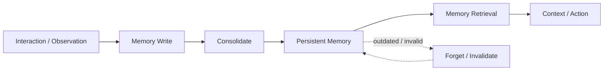

# Domain 11 - Persistent Memory Management

> [!WARNING]
> **Phase 1 closure is authoritative.** 若本頁較早段落與底部「Phase 1 Closure — 2026-09-27」衝突，以 closure 為準；舊文字暫留作 Phase 2 forensic audit，將於 Phase 7 一次正規化。

## Core Question
系統如何建立可跨 interaction / task 持續存在的 derived memory，並進行 write、link、retrieve、consolidate、evolve 與 forget，而不是每次只從原始 corpus 重新開始？


```mermaid
flowchart LR
    I["Interaction / Observation"] --> W["Memory Write"]
    W --> C["Consolidate"]
    C --> M["Persistent Memory"]
    M --> R["Memory Retrieval"]
    R --> CTX["Context / Action"]
    M -. "outdated / invalid" .-> F["Forget / Invalidate"]
    F -.-> M
```

## Includes
- episodic / semantic / task memory
- memory write / retrieval
- memory linking / consolidation / evolution
- forgetting / invalidation
- long-horizon interaction or task state
- derived corpus / world memory used as a persistent memory layer
- non-parametric continual knowledge integration
- memory provenance

## Excludes
- general corpus update → D10
- single-turn context packing → D07
- controller deciding when/how to use tools → D12

## Level-2 Topics
- Memory Write
- Memory Retrieval
- Episodic / Semantic Memory
- Consolidation
- Forgetting / Invalidation
- Long-horizon State
- Memory Provenance

## Boundary
```text
RAG corpus = canonical external source collection
Persistent memory = system-created state / derived representation that persists and evolves across interactions or tasks
Dynamic index = maintenance of the canonical external knowledge/index after source changes
```

## Representative Notes

**Direct RAG-specific anchors：以下 2 篇；不是全部 D11-primary notes 的統計。** 全庫 primary-domain 數量見 [[02 - 研究領域專題 (Research Domains)/README#Literature Coverage Snapshot|Research Domains coverage snapshot]]。

- [[03 - 論文庫 (Literature Notes)/05 - Memory & Agents/(arXiv 2024-09) MemoRAG - Moving towards Next-Gen RAG Via Memory-Inspired Knowledge Discovery|MemoRAG]]
- [[03 - 論文庫 (Literature Notes)/04 - Knowledge & Graph RAG/(ICML 2025-07) From RAG to Memory - Non-Parametric Continual Learning for Large Language Models|From RAG to Memory / HippoRAG 2]]

**General memory mechanisms and adjacent interfaces：依現有 metadata 分列**
- [[03 - 論文庫 (Literature Notes)/05 - Memory & Agents/(AAAI 2024-03) MemoryBank - Enhancing Large Language Models with Long-Term Memory|MemoryBank]] — D11 primary / A04 adjacent；general conversational memory mechanism。
- [[03 - 論文庫 (Literature Notes)/05 - Memory & Agents/(NeurIPS 2025-12) A-MEM - Agentic Memory for LLM Agents|A-MEM]] — D11 primary / A04 adjacent；general agent memory organization/evolution。
- [[03 - 論文庫 (Literature Notes)/05 - Memory & Agents/(arXiv 2023-10) MemGPT - Towards LLMs as Operating Systems|MemGPT]] — D11 primary / D12 secondary / A04 adjacent；persistent memory management 與 action-control interface。
- [[03 - 論文庫 (Literature Notes)/05 - Memory & Agents/(NeurIPS 2023-12) LongMem - Augmenting Language Models with Long-Term Memory|LongMem]] — A01 home / D11 secondary；model-side long-context memory augmentation。

> [!NOTE]
> RAG-specific anchors 與 general memory mechanisms 分開呈現：本 repo 可以依 persistent-state 研究問題將後者歸 D11，並以 A04 記 general-agent interface；這個操作性歸類不能證明 memory 是所有 RAG survey 的標準 top-level Domain。D10 維護 canonical source/index 的同步；D11 建立或演化可重用的 derived persistent state。

## Memory Types and Governance Boundary
Memory 不應只用「向量庫」一詞概括。可用下列維度理解：

- **Working state**：本輪/短期 task state；若只存在 prompt/context，主要屬 D07/D12，而非 persistent memory。
- **Episodic memory**：過去 interaction / observation / trajectory。
- **Semantic memory**：從多次 interaction 整合出的穩定事實或概念。
- **Procedural / skill memory**：工具使用、policy、workflow 等「怎麼做」的知識；通常與 A04 General Agents / D12 相交。
- **Task / document state**：長時間任務的進度、已完成章節、未解決問題與一致性狀態。

### Memory governance

Persistent memory 還需要回答：
- 誰可以 write / read？
- 何時 consolidate / invalidate / forget？
- 原始 source 被刪除後，derived summary / fact / graph edge / memory 是否也要失效？
- 不同 user / tenant 的 memory 是否可能交叉檢索？
- memory update 是否保留 provenance 與 version？

這些治理問題與 D14 privacy/access control 交叉，但 memory lifecycle 本身仍屬 D11。

## Navigation
- [[02 - 研究領域專題 (Research Domains)/Domain 10 - Dynamic Knowledge & Index Maintenance|D10 Dynamic Knowledge & Index Maintenance]]
- [[02 - 研究領域專題 (Research Domains)/Domain 12 - Agentic RAG & Orchestration|D12 Agentic RAG & Orchestration]]

## Phase 1 Closure — 2026-09-27

> [!IMPORTANT]
> **Canonical name: D11 Persistent Memory Management.**
> `memory_augmented_rag` remains a paradigm tag. A paper is not D11 merely because it calls a database or retrieval structure “memory”.

**Core question**：系統如何建立跨 interaction/task 持續存在的 derived memory，並完成 write、retrieve、organize、consolidate、evolve 與 forget？

**Canonical Level-2**
- Memory Formation / Write
- Memory Organization: linking / hierarchy / graph
- Memory Retrieval
- Consolidation & Evolution
- Forgetting & Invalidation
- Memory Governance / provenance / scope

**Hard boundary**
- ordinary external corpus ≠ persistent memory
- working prompt/context → D07/A01
- source-of-truth synchronization → D10
- action planning around memory → D12
- D10 synchronizes canonical source state; D11 evolves derived persistent state

**Paper decisions**
- HippoRAG 2: KEEP D11 / D10 secondary.
- MemoRAG: KEEP D11 primary / D05 secondary / A01 interface（2026-10-02 重核）：原文 Algorithm 1 先形成 global memory，再供多個 queries 共用，並允許 offload 到 disk 供未來重用。這是本 repo 的 derived persistent-state 歸類；clue-based retrieval 為 D05 界面，並不表示已有完整 memory governance／forgetting 方法。[Qian et al. (2025/04), §2.2、Algorithm 1](https://arxiv.org/html/2409.05591v3#S2.SS2)
- A-MEM: MOVE A04 → D11 primary / A04 adjacent.
- MemoryBank: MOVE A04 → D11 primary / A04 adjacent.
- MemGPT: MOVE A04 → D11 primary / D12 secondary / A04 adjacent.
- LongMem: KEEP A01 / D11 secondary.
- Mem0: ADD as supporting preprint.
- EviMem 2026: ADD D11 / D06 secondary as emerging work.
