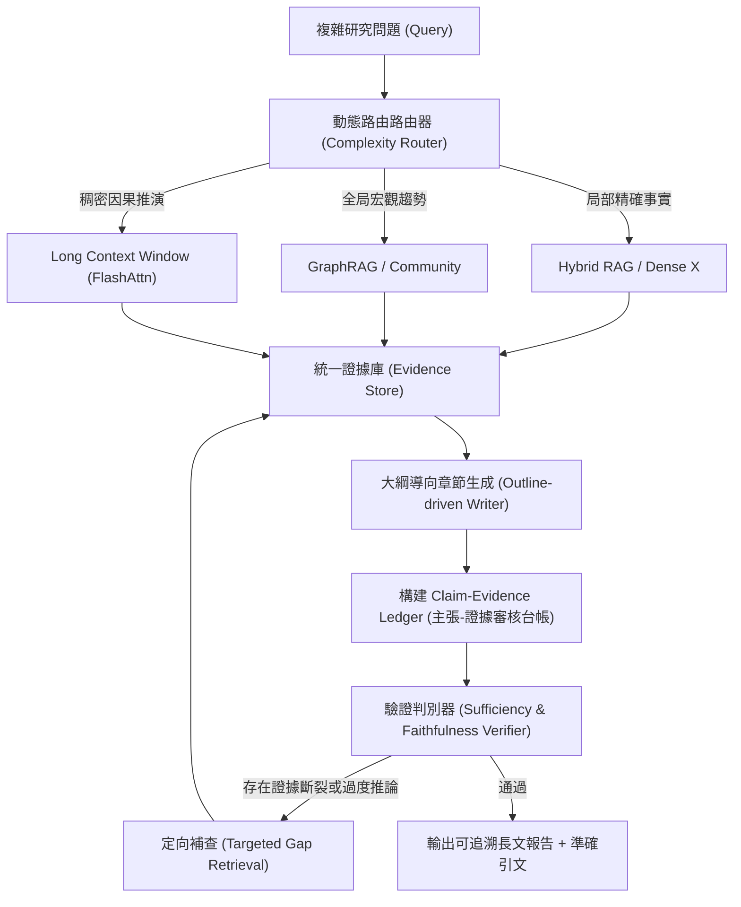

# Domain 11: 最具價值的研究方向與實驗設計 (Research Roadmap & Actionable Proposals)

> [!ABSTRACT] 核心問題意識 (Core Problem Statement)
> **面對 2026 年長文處理的浩瀚領域，哪些題目已經是紅海/死胡同？哪些方向才真正具備高論文價值與實用壁壘？具體實驗該如何設計？**

---

### 一、研究紅海 vs. 研究藍海 (Where NOT to research vs. Where to research)

> [!WARNING] 建議避開的低價值方向（已過度飽和或邊際收益極低）
> 1. **單純把 Context Window 從 2M 拉到 4M**：除非擁有千卡叢集與新算子架構，純粹微調位置編碼已無實質創新空間。
> 2. **粗糙的 Prompt Token 剪枝修補**：在小數據集上微調簡單刪詞策略，往往只能產出難以落地的增量論文。
> 3. **簡單的 Vector RAG 參數調優**：調 Top-K、換 Embedding 模型已無法構成有深度的研究主幹。

> [!TIP] 具備最高學術價值與工業突破潛力的三大藍海
> 1. **Evidence Sufficiency（證據充分性理論與判定）**：
>    - 核心問題：系統何時該知道『檢索到的資料已經足以完全回答問題』？何時應承認『資訊不足，需停止猜測』？
> 2. **Cross-Chunk Knowledge Consolidation（跨區塊語義消解與動態圖演化）**：
>    - 核心問題：如何自動對齊、合併分散在百頁文檔不同角落的矛盾線索，建立全域因果圖？
> 3. **Long Context vs. RAG Dynamic Routing（動態自適應路徑分流）**：
>    - 核心問題：建立輕量級決策器，依據問題複雜度與文檔分佈，動態決定『整份文檔塞入 Long Context』還是『走 GraphRAG 檢索』。

---

### 二、推薦可立即實作的學術實驗方案 (Actionable Proposal)

#### 實驗題目：基於『主張-證據台帳』的動態自省長篇學術報告生成評估系統

#### 關鍵實驗變量控制（Gold-Evidence 實驗）
- **實驗組 A**：Full Long Context（直接將所有參考論文拼接送入 GPT-4o / Claude 3.5 Sonnet / Gemini 1.5 Pro）；
- **實驗組 B**：標準 Advanced Vector RAG；
- **實驗組 C**：微軟 GraphRAG；
- **實驗組 D (本文方法)**：動態路由 + 命題切塊 + Claim-Evidence Ledger。

#### 核心評估指標
1. **Faithfulness（忠實度）**：生成的主張受引文完全支持的比例（藉由人工評審與 LLM-as-a-Judge 雙盲比對）。
2. **Global Sensemaking Score**：在需要跨文件彙整的宏觀評測集上的邏輯完備度。
3. **Pareto 效率**：計算達到 90% 準確率時所需的總 Token 開銷與端到端執行時間。

---

## 相關導覽與文獻快速跳轉
- **回主目錄**：[[00 - 導覽與心智圖 (Navigation & MOC)/Home (主目錄與知識庫導覽)|主目錄與知識庫導覽]]
- **全景心智圖**：[[00 - 導覽與心智圖 (Navigation & MOC)/LLM 超長文件處理心智圖 (MOC)|超長文件處理研究方向心智圖]]
- **深度研究報告**：[[01 - 深度研究報告 (Deep Research Reports)/01 - LLM 超長文件閱讀與撰寫技術全景 (完整深度報告)|技術全景深度報告]]
- **權衡分析**：[[00 - 導覽與心智圖 (Navigation & MOC)/技術全景與 Pareto 權衡分析 (Trade-offs)|技術成熟度與 Pareto 權衡分析]]
