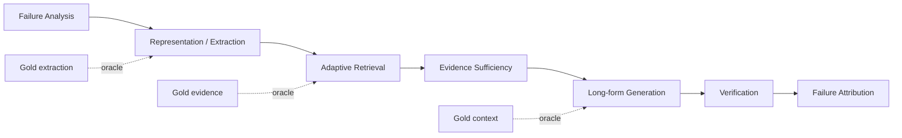

# Domain 11: 研究缺口、可反駁假設與實驗設計

> [!ABSTRACT]
> 本 Domain 不再宣稱哪些題目是「紅海」「藍海」或「最高學術價值」。它的用途是把 survey / primary literature 中仍未充分解決的問題轉成**可反駁假設、baseline、oracle、dataset 與 metric**。尚未被文獻驗證的完整方法設計，一律放到 [[04 - 研究想法與待驗證提案 (Ideas & Hypotheses)/README|Ideas & Hypotheses]]。

## 一、三層證據狀態

| 層級 | 定義 | 在本 Repo 的處理方式 |
| :--- | :--- | :--- |
| A. Survey-backed | 已有 survey/review 將其視為明確研究線 | 可放 Research Domains，並連 Survey Index |
| B. Primary-work gap | 已有方法研究，但仍有可具體描述的限制 | 可在 Domain 中寫「open problem」，但需連 primary paper |
| C. Proposed hypothesis | 本專案提出的 taxonomy、controller、schema 或組合 | 只能放 Ideas；Domain 僅連結並標示 proposed |

## 二、目前候選研究缺口

### 2.1 Information-Preserving Knowledge Extraction
- **已有基礎**：Generative IE、UIE、document-level RE、event extraction、proposition retrieval。
- **待測 gap**：抽取後是否保留 negation、condition、modality、temporal scope、coreference 與 provenance，以及這些失真如何傳播到 RAG。
- **對應專題與提案**：[[02 - 研究領域專題 (Research Domains)/Domain 12 - Knowledge Extraction & Typed Knowledge|Domain 12: Knowledge Extraction]]、[[02 - 研究領域專題 (Research Domains)/Domain 13 - Information Preservation & Cross-chunk Consolidation|Domain 13: Information Preservation]]，以及 [[04 - 研究想法與待驗證提案 (Ideas & Hypotheses)/Idea 01 - Information-Preserving Knowledge Extraction|Idea 01]]。

### 2.2 Evidence Gap-Aware Adaptive Retrieval
- **已有基礎**：IRCoT、Self-RAG、Adaptive-RAG、corrective / iterative retrieval。
- **待測 gap**：從「需要再搜」進一步定位「缺哪一種必要證據」，並以 evidence coverage 決定下一步與停止條件。
- **對應專題與提案**：[[02 - 研究領域專題 (Research Domains)/Domain 14 - Evidence Sufficiency & Adaptive Retrieval|Domain 14: Evidence Sufficiency]]，以及 [[04 - 研究想法與待驗證提案 (Ideas & Hypotheses)/Idea 02 - Evidence Gap-Aware Adaptive Retrieval|Idea 02]]。

### 2.3 Provenance / Temporal / Conflict-Aware Resolution
- **已有基礎**：temporal QA、provenance、citation/attribution、knowledge conflict 等分散研究。
- **待測 gap**：在版本化企業文件中，同時處理 valid time、document version、authority 與 counter-evidence。
- **對應專題與提案**：[[02 - 研究領域專題 (Research Domains)/Domain 15 - Temporal Conflict & Provenance-aware RAG|Domain 15: Temporal & Conflict RAG]]，以及 [[04 - 研究想法與待驗證提案 (Ideas & Hypotheses)/Idea 03 - Provenance Temporal Conflict-Aware Evidence Resolution|Idea 03]]。

### 2.4 End-to-End Failure Attribution & Evaluation Protocols
- **已有基礎**：RAG evaluation / RAGChecker 等會拆解 retriever 與 generator。
- **待測 gap**：進一步定位 Parsing → Chunking → Extraction → Consolidation → Retrieval → Sufficiency → Utilization → Generation → Attribution → Report Quality。
- **對應專題與提案**：[[02 - 研究領域專題 (Research Domains)/Domain 16 - Context Utilization & Faithfulness|Domain 16: Context Utilization]]、[[02 - 研究領域專題 (Research Domains)/Domain 17 - RAG Benchmarks & Evaluation Protocols|Domain 17: Benchmarks & Protocols]]，以及 [[04 - 研究想法與待驗證提案 (Ideas & Hypotheses)/Idea 04 - End-to-End RAG Failure Attribution and Evidence Governance|Idea 04]]。

### 2.5 Evidence-Governed Long-form Deliverable Generation
- **已有基礎**：長篇報告生成、citation / attribution、RAG evaluation、NLI / entailment verification、requirements coverage 等研究線各自存在。
- **待測 gap**：這些機制的完整組合是否能在 RFP / 規格書 / 審計型交付物中，把 Requirement coverage、claim-level support、source authority 與 evidence sufficiency 轉成可程式化 invariant，並透過 targeted repair 改善 end-to-end omission / unsupported-claim error。
- **對應專題與提案**：[[02 - 研究領域專題 (Research Domains)/Domain 08 - 長篇生成與報告撰寫 (STORM, Evidence Store, Ledger)|Domain 08: 長篇生成]]，以及 [[04 - 研究想法與待驗證提案 (Ideas & Hypotheses)/Idea 05 - Evidence-Governed RAG 系統架構構想 (Delta Pipeline Design)|Idea 05]]。
- **Evaluation entry**：[[00 - 導覽與心智圖 (Navigation & MOC)/RAG Benchmark Catalog|RAG Benchmark Catalog]]。現有公開 benchmark 只能覆蓋部分維度；若要測 F/R/D/A/P/C/T、版本權威性、valid time 與 expected sufficiency，需另定義 gold schema 與 annotation protocol。

## 三、統一實驗原則

每個研究提案都必須回答：
1. **Baseline**：與哪些已發表方法比較？
2. **Oracle**：如果上游階段完全正確，下游理論上可改善多少？
3. **Dataset / Gold**：現成 benchmark 是否真的提供所需標註？若沒有，哪些欄位需自行標？
4. **Metric**：模組指標與 end-to-end 指標分開。
5. **Ablation**：一次只移除一個新增機制。
6. **Budget parity**：檢索次數、token、LLM calls 與 latency 應報告，避免以更多計算量冒充方法提升。
7. **Falsification criterion**：預先定義什麼結果代表假設不成立。

## 四、Reference experimental flow

## 五、Benchmark 導覽

- [[00 - 導覽與心智圖 (Navigation & MOC)/RAG Benchmark Catalog|RAG Benchmark Catalog]]
- [[00 - 導覽與心智圖 (Navigation & MOC)/Survey Papers Index|Survey Papers Index]]
- [[00 - 導覽與心智圖 (Navigation & MOC)/RAG Research Taxonomy & Domain Map|RAG Research Taxonomy & Domain Map]]

## 相關導覽

- [[00 - 導覽與心智圖 (Navigation & MOC)/Home (主目錄與知識庫導覽)|主目錄]]
- [[01 - 深度研究報告 (Deep Research Reports)/01 - LLM 超長文件閱讀與撰寫技術全景 (完整深度報告)|技術全景深度報告]]
