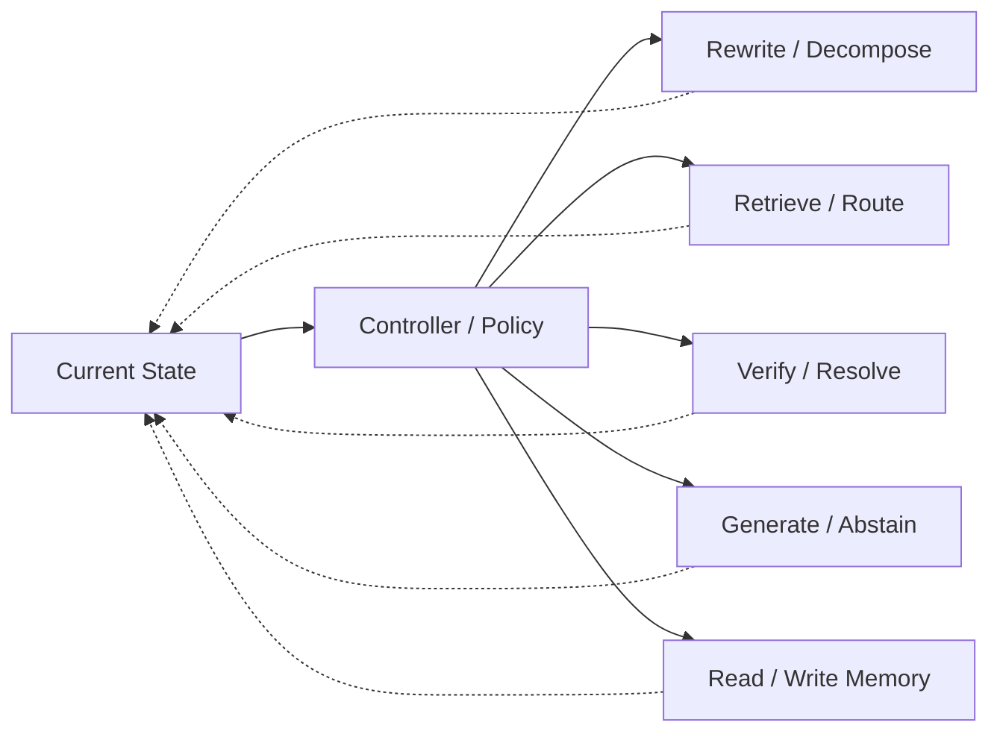

# Domain 12 - Agentic RAG & Orchestration

## Core Question
系統如何根據目前 state 自主選擇下一個 retrieval、tool、verification、memory 或 generation action？

## Includes
- controller / policy
- planning / routing
- tool selection
- iterative search-read-verify-generate loops
- multi-agent coordination
- workflow orchestration
- action selection from system state

## Excludes
- retrieval algorithm本身 → D05
- retrieve / retry / stop 的局部 sufficiency policy → D06
- persistent memory lifecycle本身 → D11
- generic agents without RAG-specific evidence control → A04

## Level-2 Topics
- Planning
- Controller / Policy
- Tool Use
- Routing
- Multi-Agent Coordination
- Research Workflow Orchestration
- Failure-aware Repair

## Boundary
**Agentic RAG 是 control plane，不是固定 pipeline stage。**  
若 paper 只改 retrieval method，不因為使用 agent loop 就自動歸 D12。

## Navigation
- [[02 - 研究領域專題 (Research Domains)/Domain 06 - Evidence Sufficiency & Adaptive Retrieval|D06 Evidence Sufficiency & Adaptive Retrieval]]
- [[02 - 研究領域專題 (Research Domains)/Domain 11 - Memory-Augmented RAG|D11 Memory-Augmented RAG]]
- [[00 - 導覽與心智圖 (Navigation & MOC)/RAG Adjacent Interfaces|RAG Adjacent Interfaces]]
