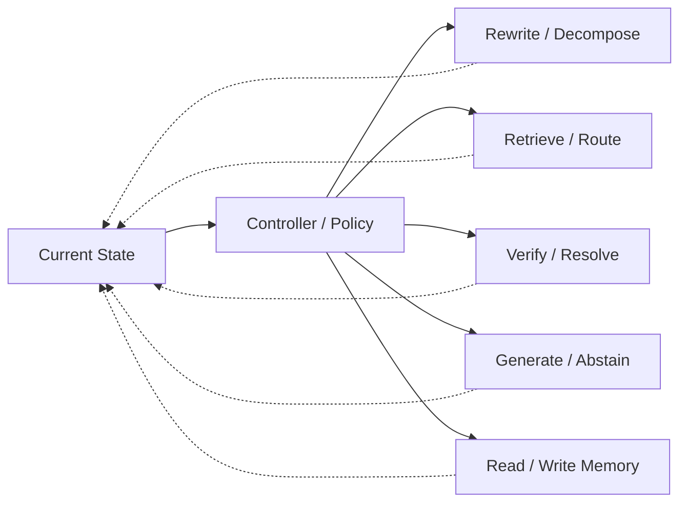

# Domain 12 - RAG Orchestration & Action Control

> [!WARNING]
> **Phase 1 closure is authoritative.** 若本頁較早段落與底部「Phase 1 Closure — 2026-09-27」衝突，以 closure 為準；舊文字暫留作 Phase 2 forensic audit，將於 Phase 7 一次正規化。

## Core Question
系統如何根據目前 state 自主選擇下一個 retrieval、tool、verification、memory 或 generation action？

```mermaid
flowchart LR
    S["Current State"] --> C["Controller / Policy"]
    C --> Q["Rewrite / Decompose"]
    C --> R["Retrieve / Route"]
    C --> V["Verify / Resolve"]
    C --> G["Generate / Abstain"]
    C --> M["Read / Write Memory"]
    Q -.-> S
    R -.-> S
    V -.-> S
    G -.-> S
    M -.-> S
```

## Includes
- controller / policy
- planning / routing
- tool selection
- iterative search-read-verify-generate loops
- multi-agent coordination
- workflow orchestration
- action selection from system state

## Excludes
- retrieval algorithm本身 → D05
- retrieve / retry / stop 的局部 sufficiency policy → D06
- persistent memory lifecycle本身 → D11
- generic agents without RAG-specific evidence control → A04

## Level-2 Topics
- Planning
- Controller / Policy
- Tool Use
- Routing
- Multi-Agent Coordination
- Research Workflow Orchestration
- Failure-aware Repair

## Boundary
**Agentic RAG 是 control plane，不是固定 pipeline stage。**  
若 paper 只改 retrieval method，不因為使用 agent loop 就自動歸 D12。

## Representative Notes

**Current primary-note coverage: 8**

- [[03 - 論文庫 (Literature Notes)/05 - Memory & Agents/(arXiv 2025-01) Agentic Retrieval-Augmented Generation - A Survey on Agentic RAG|Agentic RAG Survey]]
- [[03 - 論文庫 (Literature Notes)/04 - Knowledge & Graph RAG/(EMNLP 2024-11) GraphReader - Building Graph-based Agent to Enhance Long-Context Abilities of Large Language Models|GraphReader]]
- [[03 - 論文庫 (Literature Notes)/04 - Knowledge & Graph RAG/(WWW Companion 2025-04) KAG - Boosting LLMs in Professional Domains via Knowledge Augmented Generation|KAG]] — logical-form solver 與 operator-based hybrid retrieval/reasoning。
- [[03 - 論文庫 (Literature Notes)/04 - Knowledge & Graph RAG/(EMNLP 2023-12) StructGPT - A General Framework for Large Language Model to Reason over Structured Data|StructGPT]] — IRR 的 structured-data interfaces 與工具呼叫序列。
- [[03 - 論文庫 (Literature Notes)/05 - Memory & Agents/(ACL 2025-07) RAG-Critic - Leveraging Automated Critic-Guided Agentic Workflow for Retrieval Augmented Generation|RAG-Critic]]

> [!NOTE]
> ReAct、Toolformer、AutoGen、WebGPT 等目前放在 A04 General Agents & Tool Use；只有當 contribution 直接控制 RAG evidence lifecycle 時，才歸 D12。RAG-Critic 是一個較直接的 D12 method anchor，因為 critic feedback 會驅動 planning model 選擇並執行 RAG repair actions。

## Control Mechanisms
Agentic RAG 的核心不是「用了 Agent」三個字，而是 **state → action policy**。舊版 Agentic/Deep-Research 頁面中的有效機制保留如下：

1. **Dynamic planning**：根據目前 evidence / gap / budget 重規劃下一步。
2. **Tool selection**：search、database、code、file、graph、verification 等 action 的選擇。
3. **Reflection / repair**：依 retrieval、verification、coverage failure 決定重寫 query、補檢索、重驗證或 abstain。
4. **Multi-agent coordination**：角色分工可用於 research / verification / writing，但只有當 coordination 直接控制 RAG evidence lifecycle 時才是 D12。
5. **Sandbox / permission boundary**：tool execution 的安全與權限屬 D14/A04 的系統交界。

ReAct、Toolformer、AutoGen、WebGPT 等一般 agent/tool-use 工作仍放 A04；D12 只保留 RAG-specific orchestration。

## Navigation
- [[02 - 研究領域專題 (Research Domains)/Domain 05 - Query Understanding & Retrieval|D05 Query Understanding & Retrieval]]
- [[02 - 研究領域專題 (Research Domains)/Domain 06 - Evidence Sufficiency & Adaptive Retrieval|D06 Evidence Sufficiency & Adaptive Retrieval]]
- [[02 - 研究領域專題 (Research Domains)/Domain 09 - Grounded Generation Attribution & Long-form Synthesis|D09 Grounded Generation, Attribution & Long-form Synthesis]]
- [[02 - 研究領域專題 (Research Domains)/Domain 11 - Memory-Augmented RAG|D11 Memory-Augmented RAG]]
- [[00 - 導覽與心智圖 (Navigation & MOC)/RAG Adjacent Interfaces|RAG Adjacent Interfaces]]

## Phase 1 Closure — 2026-09-27

> [!IMPORTANT]
> **Canonical name: D12 RAG Orchestration & Action Control.**
> `agentic_rag` remains a paradigm tag. The scientific identity of D12 is **state → action control**, not the word “agent”.

**Core question**：根據目前 query、evidence、memory、中間結果、failure 與 resource state，RAG 系統下一步應執行哪個 action，以及如何將 actions 動態組合成 adaptive workflow？

**Canonical Level-2**
- Planning & Task Decomposition
- Action / Tool Selection
- Adaptive Workflow Execution
- Failure-Aware Repair
- Policy Learning / process supervision / trajectory optimization
- Adaptive Multi-Agent Coordination

**Hard boundary**
- multi-step retrieval ≠ automatically agentic
- reflection ≠ automatically D12
- multiple agents ≠ adaptive orchestration
- fixed agent pipeline ≠ D12 unless state changes action selection
- D06 locally controls retrieve/retry/stop; D12 controls heterogeneous RAG actions

**Paper decisions**
- GraphReader: KEEP D12 / D04 secondary; remove D05 secondary; add DOI `10.18653/v1/2024.findings-emnlp.746`.
- RAG-Critic: KEEP D12 / D13 secondary; remove D06 secondary.
- ADD DecEx-RAG (EMNLP 2025 Industry) as formal state/action-policy anchor.
- ADD Reflective RAG (Findings ACL 2026) as strategy-optimization anchor.
- ADD newer peer-reviewed Agentic RAG survey (Findings ACL 2026); keep Singh et al. broad survey.
- AutoSearch: D06 primary / D12 secondary.
- AgenticRAGTracer: D13 primary / D12 secondary.
- STORM/OpenScholar/etc. are not D12-primary merely because they are iterative or role-based.
