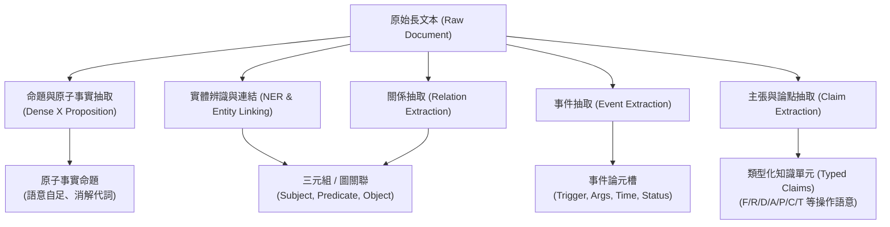
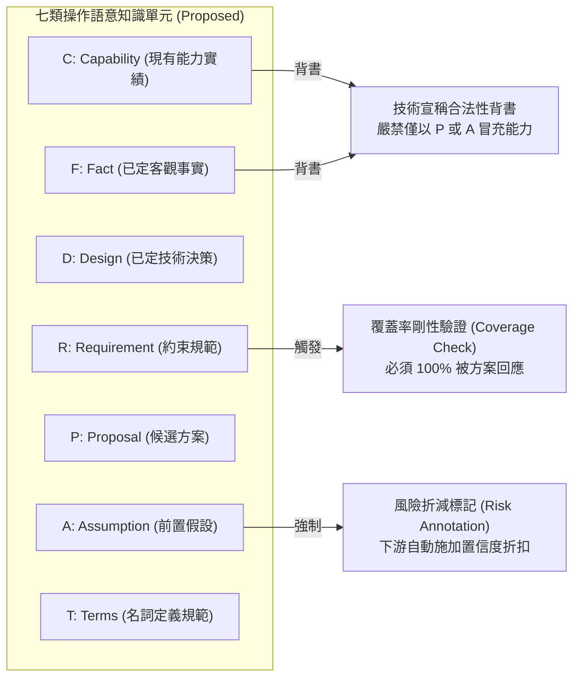

# Domain 12: 知識擷取與類型化知識表示 (Knowledge Extraction & Typed Knowledge)

> [!ABSTRACT] 核心研究問題 (Core Research Question)
> **非結構化長文本中的哪些資訊應以何種語義單位擷取？如何定義結構化 Schema 並忠實對齊原文來源 Span，以避免資訊失真與幻覺？**
> 
> 本專題探討從文件層級文字中抽取命名實體、關係、事件、命題與類型化主張的方法論，分析通用 Schema-guided 資訊抽取（以 UIE 為代表）與領域特定知識分類（如本專案之 F/R/D/A/P/C/T 假設）之邊界，並建立跨句多標籤與 Span 溯源評估標準。

---

## 一、問題定義與研究邊界 (Problem Definition & Scope)

在長文本 RAG 與知識庫建置中，傳統作法常將文件直接切塊（Chunking）後送入 Embedding 模型，忽視了「文本到底包含何種知識」。這種粗粒度做法導致檢索器無法區分客觀事實、客戶需求、技術假設或團隊建議。

知識擷取（Information Extraction, IE / Knowledge Extraction）之核心任務，在於將連續的非結構化文字映射為顯式的語義結構單元：
\[
\mathcal{E}: (D, \mathcal{S}) \longrightarrow \mathcal{K} = \{ (k_i, \tau_i, \sigma_i, \alpha_i) \}_{i=1}^{M}
\]
其中 $D$ 為原文，$S$ 為預定義或動態定義之 Schema，$k_i$ 為抽取出的知識元素，$\tau_i \in \mathcal{T}$ 為語意類別，$\sigma_i \subset D$ 為原文對應的精確字元級 Span，$\alpha_i \in [0, 1]$ 為抽取置信度。

### 核心概念邊界
1. **Retrieval Unit（檢索單元）$\neq$ Semantic Unit（語意單元）**：
   - Chunk 是為了符合模型上下文長度而切分的檢索實體；
   - 知識單元（如命題、事件、實體三元組）是語意自足的表示實體。單一 Chunk 往往同時混合多種知識類型。
2. **Knowledge Type（語意類別）$\neq$ Authority / Usability（來源合法性）**：
   - 語意類別（如「這是一項需求」）描述命題的語義範疇；
   - 權威合法性（如「此需求已由客戶正式批准」）描述命題的行政與法律效力，兩者不可混為一談。

---

## 二、知識分類與概念邊界 (Taxonomy & Conceptual Boundaries)

知識擷取按抽取目標之粒度與結構複雜度，呈現以下光譜：

### 抽取目標分類 (Extraction Targets)
- **命名實體與連結（NER & NED）**：定位特定實體並映射至權威知識庫 ID（如 Wikidata、企業實體庫）。
- **關係抽取（Relation Extraction, RE）**：識別實體間之語意關聯；可分為句子級 RE 與跨句之篇章級 RE（Document-level RE）。
- **事件抽取（Event Extraction, EE）**：識別事件觸發詞（Trigger）及其所屬論元角色（Arguments, e.g., Time, Location, Agent, Patient, Status）。
- **命題抽取（Proposition Extraction）**：將複合句解構為原子級、語意自足陳述（如 Dense X）。
- **類型化主張（Typed Claims / Knowledge Atoms）**：依據企業或任務操作語意標註的主張（如事實 Fact vs 需求 Requirement vs 假設 Assumption）。

---

## 三、前人研究與代表性工作 (Prior Work & Literature Matrix)

| 代表工作 / 論文 | 發表 Venue / 年份 | 核心方法機制 | 抽取目標與特性 | 官方來源 / 邊界 |
| :--- | :--- | :--- | :--- | :--- |
| **[[03 - 論文庫 (Literature Notes)/04 - Knowledge & Graph RAG/(ACL 2022-05) Unified Structure Generation for Universal Information Extraction\|UIE]]** | ACL 2022 | Structural Schema Instructor (SSI) + Text-to-Structure | 通用統一抽取（實體、關係、事件、情感）；Schema-guided | [ACL Anthology](https://aclanthology.org/2022.acl-long.395/)；不含 F/R/D/A/P/C/T 本體 |
| **[[03 - 論文庫 (Literature Notes)/04 - Knowledge & Graph RAG/(EMNLP 2020-11) OpenIE6 - Iterative Grid Labeling and Coordination Analysis for Open Information Extraction|OpenIE 6]]** | EMNLP 2020 | Iterative Grid Labeling + Neural Coordination Parsing | 開放領域多三元組開放抽取；無固定 Schema | [[03 - 論文庫 (Literature Notes)/04 - Knowledge & Graph RAG/(EMNLP 2020-11) OpenIE6 - Iterative Grid Labeling and Coordination Analysis for Open Information Extraction|文獻筆記]] · [EMNLP 2020](https://aclanthology.org/2020.emnlp-main.306/)；易抽得碎片化噪音 |
| **[[03 - 論文庫 (Literature Notes)/04 - Knowledge & Graph RAG/(EMNLP 2024-11) Dense X - Exploring the Limit of Proposition Retrieval for Open-Domain QA\|Dense X]]** | EMNLP 2024 | LLM Propositionizer 兩階段提示與微調 | 原子級命題（Atomic, Minimal, Self-contained） | [EMNLP 2024](https://aclanthology.org/2024.emnlp-main.845/)；專注於檢索粒度 |
| **[[03 - 論文庫 (Literature Notes)/04 - Knowledge & Graph RAG/(ACL 2019-07) DocRED - A Large-Scale Document-Level Relation Extraction Dataset|DocRED]]** | ACL 2019 | 篇章級多跳關係抽取基準與模型 | 跨句子篇章級關係抽取（Document-level RE）；維基百科文章 | [ACL 2019](https://aclanthology.org/P19-1074/) |
| **[[03 - 論文庫 (Literature Notes)/04 - Knowledge & Graph RAG/(ACL 2020-07) SciREX - A Challenge Dataset for Document-Level Information Extraction|SciREX]]** | ACL 2020 | 全文科學文獻端到端 IE 挑戰基準 | 實體、跨句共指、二元關係及 4-ary Salient Relation | [ACL 2020](https://aclanthology.org/2020.acl-main.679/) |
| **[[03 - 論文庫 (Literature Notes)/04 - Knowledge & Graph RAG/(EMNLP 2019-11) Entity, Relation, and Event Extraction with Contextualized Span Representations|DyGIE++]]** | EMNLP 2019 | 跨句動態圖神經網路特徵傳播 | 實體、關係、事件聯合抽取，基於 Span 圖更新 | [EMNLP 2019](https://aclanthology.org/D19-1582/) |
| **[[03 - 論文庫 (Literature Notes)/04 - Knowledge & Graph RAG/(ACL 2020-07) A Joint Neural Model for Information Extraction with Global Features|OneIE]]** | ACL 2020 | 全域結構約束之束搜尋（Beam Search）聯合解碼 | 實體、關係與事件全域特徵打分與 Schema 交叉驗證 | [ACL 2020](https://aclanthology.org/2020.acl-main.713/) |
| **[[03 - 論文庫 (Literature Notes)/04 - Knowledge & Graph RAG/(NAACL 2021-06) A Frustratingly Easy Approach for Entity and Relation Extraction|PURE]]** | NAACL 2021 | 獨立任務編碼器 + 標記實體提示（Typed Entity Markers） | 解除實體與關係表示共享衝突，以極簡管線超越複雜聯合模型 | [NAACL 2021](https://aclanthology.org/2021.naacl-main.5/) |
| **[[03 - 論文庫 (Literature Notes)/04 - Knowledge & Graph RAG/(EMNLP 2021-11) REBEL - Relation Extraction By End-to-end Language generation|REBEL]]** | EMNLP 2021 | Seq2Seq 自回歸生成三元組線性字串 | 統一關係抽取為條件式字串生成，突破預先定義 Schema 限制 | [EMNLP 2021](https://aclanthology.org/2021.emnlp-main.180/) |
| **[[03 - 論文庫 (Literature Notes)/04 - Knowledge & Graph RAG/(NAACL 2022-07) GenIE - Generative Information Extraction|GenIE]]** | NAACL 2022 | 前綴樹（Trie / Prefix-Tree）約束受限自回歸解碼 | 保證封閉式 KG 抽取 100% 合法，根除自回歸生成幻覺 | [NAACL 2022](https://aclanthology.org/2022.naacl-main.224/) |
| **[[03 - 論文庫 (Literature Notes)/04 - Knowledge & Graph RAG/(EMNLP 2020-11) MAVEN - A Massive General Domain Event Detection Dataset\|MAVEN]]** | EMNLP 2020 | 大規模通用領域事件檢測基準 (4,480 篇文檔，11.8 萬 Event Mentions) | 168 類事件類型與觸發詞標註，比 ACE 2005 大 22 倍 | [[03 - 論文庫 (Literature Notes)/04 - Knowledge & Graph RAG/(EMNLP 2020-11) MAVEN - A Massive General Domain Event Detection Dataset\|文獻筆記]] · [EMNLP 2020](https://aclanthology.org/2020.emnlp-main.150/) |

---

## 四、核心方法機制與架構對比 (Methodology & Architectural Comparison)

### 1. 通用模式指導機制：UIE (Universal Information Extraction)
UIE 奠定了利用統一結構化提示（SSI）將多元抽取任務轉化為條件文本生成（Text-to-Structure）的理論標準：
\[
P(y \mid x, s) = \prod_{t=1}^T P(y_t \mid y_{<t}, x, s)
\]
其中 $s$ 為 Structural Schema Instructor，將抽取的目標實體類型與關係結構線性化為前綴引導。UIE 解決了以往不同抽取任務模型架構互不相容的問題，其原生標籤針對學術基準（如 ACE05、CoNLL03、NYT），**並未定義特定企業領域之專屬分類**。

### 2. 本專案領域 Schema 假設：F / R / D / A / P / C / T（Proposed）
針對複雜工程規格書、政府採購與投標文件，本專案提出將知識單元定義為具備**操作語意（Operational Semantics）**的七類企業知識（詳見 [[04 - 研究想法與待驗證提案 (Ideas & Hypotheses)/Idea 05 - Evidence-Governed RAG 系統架構構想 (Delta Pipeline Design)|Idea 05]]）：

### 標註單元對比實驗要求
在將非結構化段落轉化為類型化知識時，文獻與工程存在三種不同標註粒度：
1. **Chunk-level Single Label**：將整個 Chunk 硬分類為單一標籤（如「這段是 Requirement」）。**缺點**：段落內部通常混雜背景事實與例外假設，單標籤造成嚴重資訊抹殺；
2. **Sentence-level Multi-Label**：對每個自然句允許標註多個標籤；
3. **Atomic-Claim-level Span Label**：先解構為原子命題，再賦予單一明確類型與原文 Span。
**判準**：評估時必須報告 Macro-F1、類別混淆矩陣、Span Precision/Recall 與 Inter-annotator Agreement（Cohen's Kappa）。

---

## 五、失效模式與工程陷阱 (Failure Modes & Error Taxonomy)

知識擷取系統在長文本真實場景中常見五大失效模式：

1. **實體混淆與跨專案污染（Cross-project Entity Collision）**：
   - 同名縮寫或代號在不同章節或專案中指向不同實體（如「PM 模組」在第 2 章指 Project Management，在第 8 章指 Preventative Maintenance）。
2. **否定與虛擬態穿透（Negation & Modality Bleaching）**：
   - 原文為「本期工程暫不包含 B 地區水處理系統」，模型錯誤抽取為 `(本工程, 包含, B地區水處理系統)`，將否定詞過濾。
3. **條件依賴脫落（Dangling Condition）**：
   - 原文為「僅在進水溫度高於 $40^\circ\text{C}$ 時，冷卻閥門自動開啟」，抽取時遺失先決條件，簡化為無條件規則。
4. **類別越權提升（Type Promotion Violation）**：
   - 將我方的建議構想（Proposal P）或暫時假設（Assumption A）錯誤提升為已落實的系統能力（Capability C）或客觀事實（Fact F）。
5. **過度抽取與語義幻想（Hallucinatory Schema Filling）**：
   - 在 Open-world 抽取時，LLM 為了填滿 Schema 欄位而憑空推測未言明的數值或關聯。

---

## 六、評測基準與資料集對齊 (Benchmarks, Datasets & Metrics)

| 評測任務 | 官方基準 / 資料集 | 評估指標 | 測試重點與局限 |
| :--- | :--- | :--- | :--- |
| **通用結構抽取** | CoNLL03, ACE05, NYT | Entity F1, Relation Strict F1 | 標準學術測試集，主要覆蓋新聞與百科，缺乏複雜工程邏輯 |
| **篇章級關係** | DocRED (ACL 2019) | Intra-sentence / Inter-sentence F1, Ign F1 | 測試跨句子實體關係推理；[DocRED Repo](https://github.com/thunlp/DocRED) |
| **科學文獻關聯** | SciREX (ACL 2020) | Salient Entity, 4-ary Relation F1 | 包含表格、文字之跨段科學關聯；[SciREX Repo](https://github.com/allenai/SciREX) |
| **事件論元** | MAVEN (EMNLP 2020) | Trigger F1, Argument Classification F1 | 大規模多事件分類；[MAVEN Repo](https://github.com/THU-KEG/MAVEN-dataset) |
| **領域企業治理 (未公開)** | **IPPS-Eval (Proposed)** | Type Macro-F1, Span Precision, Invariant Check | 自定義企業規格書評測集（含 F/R/D/A/P/C/T 與嚴格 Span）；非公開 SOTA |

---

## 七、開放研究問題與可反駁假設 (Open Problems & Falsifiable Hypotheses)

### 待驗證假設 12-A (Information-Preserving Schema Extraction)
- **假說**：相較於無約束的 OpenIE 與單純三元組，採用具備限定詞的模式指導抽取（Qualified Schema-guided Extraction），能在長文本事實抽取中降低 30% 以上的否定態與條件態丟失率，同時維持與 Raw Chunk 相當的下游檢索召回率。
- **Baseline**：OpenIE 6、Naïve SPO Extraction、Raw Chunk Embedding。
- **Oracle**：人工精修之 Gold Qualified Entities & Relations。
- **反駁條件**：若在加入限定詞後，下游 QA 的 Exact Match 未達顯著改善，且抽取延遲增加超過 3 倍，則該假設在推論性價比上被否決。

### 待驗證假設 12-B (Operational Semantics Invariant Enforcement)
- **假說**：在長篇交付物生成時，對抽取出的類型化知識施加「Requirement 100% 覆蓋」與「Capability 來源合法性」代數校驗，能杜絕 95% 以上因方案未回應需求或能力過度承諾導致的審查退件。
- **Baseline**：標準 RAG、未加語意類別標註的 Prompting。
- **反駁條件**：若硬約束導致系統拒答率（Abstention Rate）超過 40% 且無法透過自動修復迴圈恢復，則代表該語意約束過於僵化，無法投入實用。

---

## 八、文獻來源與相關專題導覽 (Sources, Citations & Wikilinks)

- **核心論文**：
  - [[03 - 論文庫 (Literature Notes)/04 - Knowledge & Graph RAG/(ACL 2022-05) Unified Structure Generation for Universal Information Extraction|UIE: Unified Structure Generation for Universal Information Extraction (Lu et al., ACL 2022)]]
  - [[03 - 論文庫 (Literature Notes)/04 - Knowledge & Graph RAG/(EMNLP 2024-11) Dense X - Exploring the Limit of Proposition Retrieval for Open-Domain QA|Dense X: Proposition Retrieval for Open-Domain QA (Chen et al., EMNLP 2024)]]
- **專題連動**：
  - [[02 - 研究領域專題 (Research Domains)/Domain 04 - Chunking 策略與知識擷取 (Proposition, Cross-chunk)|Domain 04: Chunking 策略與知識擷取]]
  - [[02 - 研究領域專題 (Research Domains)/Domain 13 - Information Preservation & Cross-chunk Consolidation|Domain 13: 資訊保真與跨塊關聯整合]]
  - [[02 - 研究領域專題 (Research Domains)/Domain 17 - RAG Benchmarks & Evaluation Protocols|Domain 17: RAG 評測基準與評估協議]]
- **研究提案**：
  - [[04 - 研究想法與待驗證提案 (Ideas & Hypotheses)/Idea 01 - Information-Preserving Knowledge Extraction|Idea 01: 資訊保真知識抽取技術構想]]
  - [[04 - 研究想法與待驗證提案 (Ideas & Hypotheses)/Idea 05 - Evidence-Governed RAG 系統架構構想 (Delta Pipeline Design)|Idea 05: Evidence-Governed RAG 系統架構構想]]
- **全景導覽**：
  - [[00 - 導覽與心智圖 (Navigation & MOC)/Home (主目錄與知識庫導覽)|主目錄與知識庫導覽]]
  - [[00 - 導覽與心智圖 (Navigation & MOC)/RAG Benchmark Catalog|RAG Benchmark Catalog]]
