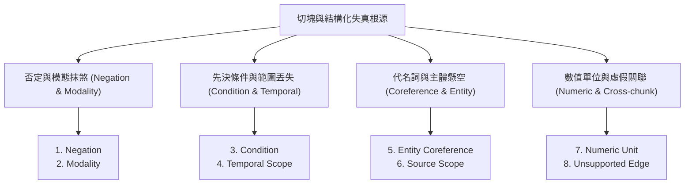
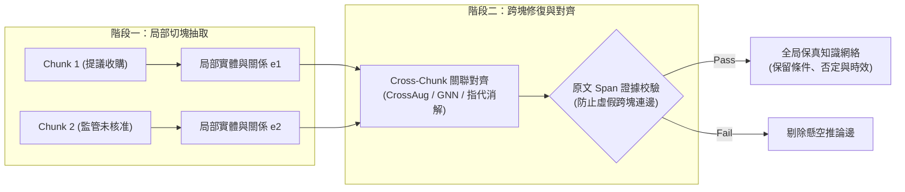

# Domain 13: 資訊保真與跨塊關聯整合 (Information Preservation & Cross-chunk Consolidation)

> [!ABSTRACT] 核心研究問題 (Core Research Question)
> **結構化抽取或文件切塊（Chunking）會造成哪些關鍵語義失真？如何透過跨塊指代消解、限定詞保全、關係對齊與選擇性修復機制，確保檢索與生成時的資訊高保真度？**
> 
> 本專題針對切塊造成的否定態、先決條件、時效範圍及代名詞懸空問題，建立系統性八大錯誤分類學（8-Class Error Taxonomy），比較 Dense X、PropRAG 與 CrossAug 之解法路徑，並提出端到端誤差傳播與跨塊修復實驗協議。

---

## 一、問題定義與研究邊界 (Problem Definition & Scope)

將超長文件切分為局部 Chunk 或將文本降維為孤立三元組時，最嚴重的系統性隱患在於**語義邊界的物理截斷**與**關鍵修飾語的過濾**。

若一個複合事實跨越了兩個切塊：
\[
\text{Fact} = \langle \text{Core Statement} \in \text{Chunk}_A, \quad \text{Constraint / Negation} \in \text{Chunk}_B \rangle
\]
當檢索器僅基於 Query 檢索到 $\text{Chunk}_A$ 時，系統將在完全缺乏 $\text{Chunk}_B$ 先決約束的情況下進行生成，造成客觀事實的災難性逆轉。

跨塊關聯整合（Cross-Chunk Consolidation）研究的邊界在於：
1. **識別與修復局部抽取的盲區**：在不破壞檢索效率的前提下，如何將跨越不同段落甚至不同章節的關聯實體、時序演進與因果約束重新鏈接；
2. **避免幻覺邊注入**：在跨塊補全關係時，如何防止模型憑空捏造跨章節無關實體之間的虛假關聯（Spurious Cross-Chunk Edges）。

---

## 二、知識分類與八大失真分類學 (8-Class Error Taxonomy)

為精確量化與修復抽取及切塊失真，本專題建立具備五維欄位（原文、錯誤抽取、修復後表示、Gold Span、下游影響）的標準錯誤分類學：

### 八大失真型態與修復對照表

| 錯誤類別 (Class) | 正確原文 (Original Text) | 常見錯誤抽取 (Erroneous Extraction) | 資訊保真修復表示 (Repaired Representation) | 標註 Gold Span | 下游檢索與問答影響 |
| :--- | :--- | :--- | :--- | :--- | :--- |
| **1. Negation (否定態遺失)** | 「截至 2025 年底，因監管核准未過，交易**尚未完成**。」 | `(A公司, 收購完成, B公司)` | `Event: Acquisition; Status: Incomplete; Completed: False; Valid_Time: <=2025-12-31` | `Doc1, p.4, L12-L14` | 問「交易是否已完成」時給出完全相反的錯誤肯認答案。 |
| **2. Modality (模態與意圖降維)** | 「A 公司**宣布擬以** 5 億美元收購 B 公司。」 | `(A公司, 收購, B公司, 5億美元)` | `Event: Acquisition; Modality: Proposed/Intention; State: Unexecuted` | `Doc1, p.1, L3-L5` | 將「提案意向」誤認為「已發生事實」，導致商業情報嚴重誤判。 |
| **3. Condition (前置條件截斷)** | 「**僅在操作壓力大於 3 bar 時**，設備額定流量可達 $50\text{ m}^3/\text{h}$。」 | `(設備, 額定流量, 50 m³/h)` | `Fact: Flow_Rate=50m³/h; Condition: [Pressure > 3 bar]` | `Doc2, p.18, L2-L4` | 工程規劃遺失關鍵運行前提，導致極高硬體選型事故風險。 |
| **4. Temporal Scope (時效範圍丟失)** | 「2021 年立項專案代號 Titan，**該代號團隊於 2024 年初撤銷**。」 | `(Titan專案, 狀態, 終止)` *(過度推論)* | `P1: Titan立項(2021); P2: Titan團隊撤銷(2024-Q1); 專案本身狀態: 未言明` | `Doc3, p.2 & p.45` | 混淆「團隊組織異動」與「專案技術終止」，造成推論躍進。 |
| **5. Entity Coreference (代詞指代漂移)** | 「甲系統具備雙備援；**該系統**在故障時 1 秒內自動切換。」 | `(該系統, 切換時間, 1秒)` *(代詞懸空)* | `(甲系統, 故障切換時間, 1秒; Scope: 甲系統)` | `Doc4, p.9, L8-L10` | 獨立檢索該命題時無法匹配查詢實體，導致重要技術指標召回失敗。 |
| **6. Numeric Unit (數值單位遺失)** | 「測試最高耐溫為 $150^\circ\text{F}$。」 | `(測試耐溫, 數值, 150)` *(遺失華氏單位)* | `Fact: Max_Temp; Value: 150; Unit: Fahrenheit (約 65.5°C)` | `Doc5, p.12, L1` | 跨國工程換算時誤當作攝氏 $150^\circ\text{C}$，造成嚴重規範超標。 |
| **7. Source Scope (適用範圍漂移)** | 「**針對北美海外廠區**，工安標準需採用 OSHA 規範。」 | `(全廠區, 工安標準, OSHA)` | `Requirement: OSHA; Applicable_Site: North_America_Only` | `Doc6, p.3, L15` | 將局部特定工廠之法規要求錯誤泛化至全域總部與亞洲廠區。 |
| **8. Unsupported Edge (虛假跨塊邊)** | 第 1 章提張三，第 10 章提同姓張部長。 | `(張三, 職位是, 張部長)` *(跨塊強行連邊)* | `獨立實體 E1(張三, 工程師) 與 E2(張部長, 主管); 關聯: 待確認/無直連邊` | `Doc7, p.5 & p.80` | 圖檢索沿著虛假邊進行多跳路徑遍歷，生成離奇人物幻覺。 |

---

## 三、前人研究與代表性工作 (Prior Work & Literature Matrix)

目前文獻從檢索粒度、圖路徑搜尋與跨塊圖補全三個維度切入此問題：

| 代表工作 / 論文 | 發表 Venue / 年份 | 核心研究維度 | 跨塊與保真機制 | 官方來源與代碼 |
| :--- | :--- | :--- | :--- | :--- |
| **[[Chen2023 - Dense X Proposition Retrieval\|Dense X]]** | EMNLP 2024 | 檢索單元粒度 (Proposition Granularity) | 將代名詞替換為明確全稱，補足時空背景，保證命題語意自包含 | [ACL Anthology](https://aclanthology.org/2024.emnlp-main.845/) |
| **PropRAG** | EMNLP 2025 | 檢索路徑搜尋 (Proposition Paths) | 構建上下文豐富命題路徑，結合免 LLM 在線束搜尋解決多跳割裂 | [EMNLP 2025](https://aclanthology.org/2025.emnlp-main.317/) |
| **CrossAug** | 2026 預印本 | 離線圖拓撲補全 (Cross-chunk Augmentation) | 利用 GNN 引導跨越 Chunk 邊界的關係補全，修復分塊截斷的關聯 | [arXiv:2605.28004](https://arxiv.org/abs/2605.28004) (正式 Venue 待核) |
| **Late Chunking** | 2024 預印本 | 全局編碼池化 (Late Interaction) | 整篇長文雙向注意力編碼後再 Mean-pooling，保留周邊上下文隱層向量 | [arXiv:2409.04701](https://arxiv.org/abs/2409.04701) |

---

## 四、核心方法機制與架構對比 (Methodology & Architectural Comparison)

### 三大技術路線深度剖析
1. **Dense X（命題級自足表示）**：
   - 核心在於**前端重寫**：在離線切塊階段，呼叫 LLM 對句子進行代詞消解與語意自足化，使每個命題即使脫離原章節，也能被單獨理解。
   - 局限：無法修復需要跨越多頁篇幅進行綜合推理的宏觀因果關係。
2. **PropRAG（上下文命題路徑）**：
   - 核心在於**檢索時連鎖**：將具有共同實體或邏輯關係的命題組織成路徑（Paths），在線上透過低成本束搜尋（Beam Search）沿著命題鏈條收集證據。
   - 局限：若底層命題抽取遺漏了關鍵否定態，整條路徑將被錯誤引導。
3. **CrossAug（GNN 引導之跨塊邊修復）**：
   - 核心在於**離線圖補全**：先在各 Chunk 內部進行局部圖抽取，再透過圖神經網路（GNN）預測跨塊實體間潛在的邊，並呼叫驗證模組確認原文證據支持，避免生成無根據虛假邊。

---

## 五、失效模式與工程陷阱 (Failure Modes & Error Taxonomy)

1. **過度指代消解（Hyper-Coreference Resolution）**：
   - 模型強行將不同章節中特徵相似的實體（如「本合約甲方」與另一附錄之「第三方保證人」）合併為同一實體。
2. **條件反噬（Condition Dropping Cascades）**：
   - 在多跳問答中，第一跳命題遺失了前提條件（如「高溫環境適用」），第二跳根據該命題推導出嚴重超標的危險結論。
3. **抽取成本爆炸（Extraction Budget Explosion）**：
   - 為了修復跨塊指代，反覆將相鄰 5 個 Chunk 一起送入 LLM 進行重抽取，導致離線建庫 Token 成本暴增 10 倍以上。

---

## 六、評測基準與資料集對齊 (Benchmarks, Datasets & Metrics)

評估資訊保真度與跨塊整合，必須依賴具備**跨句/跨段 Gold 標註**之基準：

| 評測維度 | 推薦基準 / 資料集 | 評估指標 | 測試重點與邊界 |
| :--- | :--- | :--- | :--- |
| **跨段關聯與指代** | DocRED (ACL 2019) | Intra-sentence vs Inter-sentence RE F1 | 專門衡量跨越句子邊界的實體關係辨識率 |
| **多跳命題路徑** | MultiHop-RAG (2024) | Evidence Path Recall, Precision | 測試檢索出的命題鏈是否覆蓋多跳推理所需各步證據 |
| **保真度消融基準** | **Proposed Fidelity-Eval** | Negation Preservation Rate, False Positive Edge Rate | 注入刻意切斷的條件/否定文本，量測系統之修復與拒絕率 |

---

## 七、開放研究問題與可反駁假設 (Open Problems & Falsifiable Hypotheses)

### 待驗證假設 13-A (Qualified Representation Budget Parity)
- **假說**：在固定總 Token 與計算預算條件下，採用「Raw Chunk + Qualified Proposition 雙層混合索引」，在多跳複雜條件問答上的回答準確率（Accuracy）顯著高於「純 Raw Chunk」與「純三元組圖（Naïve GraphRAG）」，且能降低 40% 以上的因條件遺失導致的幻覺。
- **Baseline**：固定字數切塊（Fixed Chunking）、標準 Dense X 命題、純三元組知識圖譜。
- **Oracle**：使用標註好 Gold Span 與限定詞之 Oracle 命題。
- **反駁條件**：若在加入 Qualified Proposition 後，檢索階段因候選池膨脹導致 Recall@5 下降，且最終端到端答案 F1 未達統計顯著提升（$p > 0.05$），則該假設不成立。

---

## 八、文獻來源與相關專題導覽 (Sources, Citations & Wikilinks)

- **核心論文**：
  - [[03 - 論文庫 (Literature Notes)/Chen2023 - Dense X Proposition Retrieval|Dense X: Proposition Retrieval (Chen et al., EMNLP 2024)]]
  - [[03 - 論文庫 (Literature Notes)/Gunther2024 - Late Chunking|Late Chunking: Contextual Chunk Embeddings (Günther et al., 2024)]]
- **專題連動**：
  - [[02 - 研究領域專題 (Research Domains)/Domain 04 - Chunking 策略與知識擷取 (Proposition, Cross-chunk)|Domain 04: Chunking 策略與知識擷取]]
  - [[02 - 研究領域專題 (Research Domains)/Domain 12 - Knowledge Extraction & Typed Knowledge|Domain 12: 知識擷取與類型化知識表示]]
  - [[02 - 研究領域專題 (Research Domains)/Domain 14 - Evidence Sufficiency & Adaptive Retrieval|Domain 14: 證據充分性與自適應檢索]]
- **全景導覽**：
  - [[00 - 導覽與心智圖 (Navigation & MOC)/Home (主目錄與知識庫導覽)|主目錄與知識庫導覽]]
  - [[00 - 導覽與心智圖 (Navigation & MOC)/RAG Benchmark Catalog|RAG Benchmark Catalog]]
