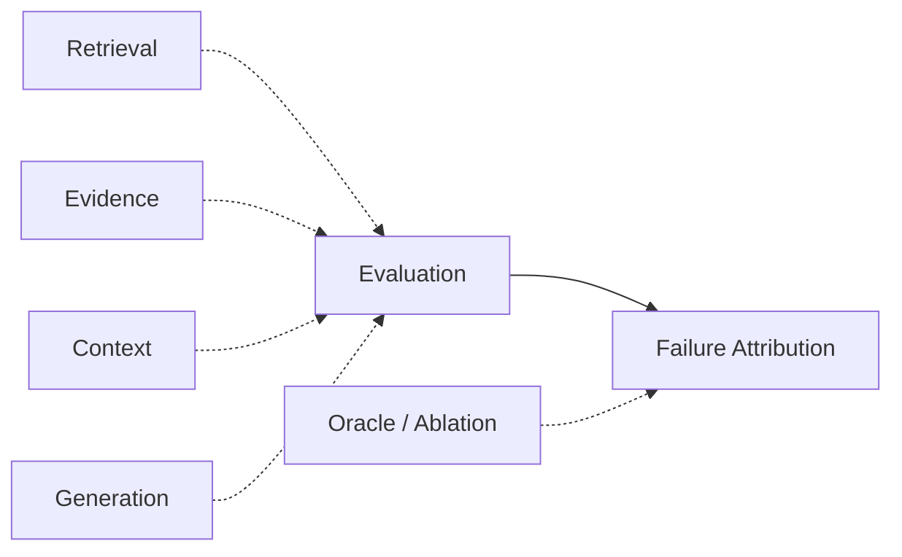

# Domain 13 - RAG Evaluation & Failure Attribution

## Core Question
如何分層評估 retrieval、evidence、context、generation 與 end-to-end quality，並定位 failure 真正發生在哪一層？



## Includes
- benchmark / dataset / metric / evaluation framework
- retrieval evaluation
- evidence coverage / sufficiency evaluation
- context utilization evaluation
- faithfulness / citation evaluation
- long-form evaluation
- oracle / ablation protocol
- failure attribution / error propagation
- meta-evaluation

## Excludes
- retrieval algorithm design → D05
- runtime observability / serving telemetry → D14
- project-specific benchmark proposal presented as public benchmark

## Level-2 Topics
- Retrieval Evaluation
- Evidence Evaluation
- Context Utilization Evaluation
- Generation / Faithfulness Evaluation
- Citation Evaluation
- Long-form Evaluation
- Oracle Evaluation
- Failure Attribution

## Boundary
```text
Benchmark != Dataset != Metric != Evaluation Framework
```
End-to-end score 不能直接說明 bottleneck 位於 retrieval、evidence construction、context utilization 或 generation。

## Representative Notes

**Current primary-note coverage: 20**

- [[03 - 論文庫 (Literature Notes)/06 - Benchmarks & Evaluation/(arXiv 2024-08) RAGChecker - A Fine-grained Framework for Diagnosing Retrieval-Augmented Generation|RAGChecker]]
- [[03 - 論文庫 (Literature Notes)/06 - Benchmarks & Evaluation/(EACL 2024-03) RAGAS - Automated Evaluation of Retrieval Augmented Generation|RAGAS]]
- [[03 - 論文庫 (Literature Notes)/06 - Benchmarks & Evaluation/(NAACL 2024-06) ARES - An Automated Evaluation Framework for Retrieval-Augmented Generation Systems|ARES]]
- [[03 - 論文庫 (Literature Notes)/06 - Benchmarks & Evaluation/(arXiv 2024-06) RAGBench - Explainable Benchmark for Retrieval-Augmented Generation Systems|RAGBench]]
- [[03 - 論文庫 (Literature Notes)/06 - Benchmarks & Evaluation/(CMC 2026-08) Do LLMs Know When Evidence is Insufficient - An Evidence Sufficiency Benchmark|Evidence Sufficiency Benchmark]]
- [[03 - 論文庫 (Literature Notes)/06 - Benchmarks & Evaluation/(ACL 2026-08) ReportLogic - Evaluating Logical Quality in Deep Research Reports|ReportLogic]]

## Navigation
- [[00 - 導覽與心智圖 (Navigation & MOC)/RAG Benchmark Catalog|RAG Benchmark Catalog]]
- [[02 - 研究領域專題 (Research Domains)/Domain 09 - Grounded Generation Attribution & Long-form Synthesis|D09 Grounded Generation & Long-form Synthesis]]
