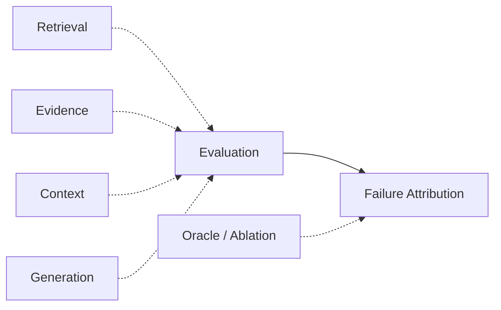

# Domain 13 - RAG Evaluation & Failure Attribution

## Core Question
如何分層評估 retrieval、evidence、context、generation 與 end-to-end quality，並定位 failure 真正發生在哪一層？



## Includes
- benchmark / dataset / metric / evaluation framework
- retrieval evaluation
- evidence coverage / sufficiency evaluation
- context utilization evaluation
- faithfulness / citation evaluation
- long-form evaluation
- oracle / ablation protocol
- failure attribution / error propagation
- meta-evaluation

## Excludes
- retrieval algorithm design → D05
- runtime observability / serving telemetry → D14
- project-specific benchmark proposal presented as public benchmark

## Level-2 Topics
- Retrieval Evaluation
- Evidence Evaluation
- Context Utilization Evaluation
- Generation / Faithfulness Evaluation
- Citation Evaluation
- Long-form Evaluation
- Oracle Evaluation
- Failure Attribution

## Boundary
```text
Benchmark != Dataset != Metric != Evaluation Framework
```
End-to-end score 不能直接說明 bottleneck 位於 retrieval、evidence construction、context utilization 或 generation。

## Representative Notes

**Current primary-note coverage: 21**

- [[03 - 論文庫 (Literature Notes)/06 - Benchmarks & Evaluation/(arXiv 2024-08) RAGChecker - A Fine-grained Framework for Diagnosing Retrieval-Augmented Generation|RAGChecker]]
- [[03 - 論文庫 (Literature Notes)/06 - Benchmarks & Evaluation/(EACL 2024-03) RAGAS - Automated Evaluation of Retrieval Augmented Generation|RAGAS]]
- [[03 - 論文庫 (Literature Notes)/06 - Benchmarks & Evaluation/(NAACL 2024-06) ARES - An Automated Evaluation Framework for Retrieval-Augmented Generation Systems|ARES]]
- [[03 - 論文庫 (Literature Notes)/06 - Benchmarks & Evaluation/(arXiv 2024-06) RAGBench - Explainable Benchmark for Retrieval-Augmented Generation Systems|RAGBench]]
- [[03 - 論文庫 (Literature Notes)/06 - Benchmarks & Evaluation/(CMC 2026-08) Do LLMs Know When Evidence is Insufficient - An Evidence Sufficiency Benchmark|Evidence Sufficiency Benchmark]]
- [[03 - 論文庫 (Literature Notes)/06 - Benchmarks & Evaluation/(ACL 2026-08) ReportLogic - Evaluating Logical Quality in Deep Research Reports|ReportLogic]]
- [[03 - 論文庫 (Literature Notes)/06 - Benchmarks & Evaluation/(PR 2023-12) Hierarchical Multimodal Transformers for Multi-Page DocVQA|MP-DocVQA / Hi-VT5]]

## Evaluation Artifact Types

本 repo 保留四種評測工件的明確區分：

| Type | Meaning | Example |
|---|---|---|
| Benchmark / Shared Task | 定義 task、protocol、split 或競賽規則 | CRAG / shared task |
| Dataset / Corpus | 實際資料與 gold annotations | BEIR / QASPER / DocRED |
| Metric | scoring formula / measurement | Recall@k / nDCG / Faithfulness |
| Evaluation Framework / Tool | 執行多個 metrics 或診斷流程的軟體 | RAGAS / RAGChecker |

**Benchmark ≠ Dataset ≠ Metric ≠ Evaluation Framework.**

### Text-only Evaluation Boundary

若標記為 text-only，至少要說明：
- 原始 corpus 是否含 image / chart / layout；
- model input 是 extracted text/Markdown，還是 page image / VLM；
- gold answer 是否依賴 visual bounding box 或圖像內容；
- table 是 text serialization 還是 rendered image。

這是 repo 的 evaluation convention，用來避免把 multimodal benchmark 誤標成純文字 benchmark。


## Capability-Specific Benchmarking
Long-context benchmark、retrieval benchmark、RAG benchmark 與 long-form report benchmark **不能互相替代**。

- Needle-in-a-Haystack 類測試主要測特定 retrieval/position 能力，不能單獨證明長文理解、multi-hop reasoning 或真實 RAG 品質。
- Long-context evaluation 應至少區分：position robustness、retrieval、multi-hop / aggregation、long-document QA。
- RAG evaluation 還需要 retrieval relevance、evidence sufficiency、faithfulness、citation / attribution。
- Long-form evaluation 另外需要 information coverage、cross-section consistency、report logic 等。

因此「某模型在 128k/1M NIAH 表現很好」不能直接推出「它在真實長文件 RAG / report generation 上同樣可靠」。

### Oracle diagnostic principle

最重要的分離實驗之一是：
`Generator(Gold Evidence)`

若 gold evidence 已完整放入 context，答案仍錯，主要問題就不應再歸咎於 retriever；應繼續檢查 D07 utilization、reasoning、generation 或 attribution。

## Evaluation Failure Modes
- **Pretraining / benchmark contamination**：模型可能憑參數記憶回答，造成 RAG 增益被高估。
- **LLM-as-a-Judge bias**：可能有 verbosity、position、self-preference 等偏差；需做 judge calibration / human audit。
- **Dynamic API drift**：未鎖模型 snapshot、dataset revision、evaluation script 版本時，結果難以重現。
- **Budget mismatch**：多輪 agent / retrieval 系統不能只和 single-call baseline 比 accuracy；token、calls、latency、memory / cost 需一起報。
- **Nonlinear component interaction**：oracle swap 不是嚴格可加的線性誤差分解；單層替換可能改變其他模組輸入分布。

所以 failure attribution 應被視為 diagnostic intervention，而不是宣稱 total error 可以簡單線性相加。

## Navigation
- [[00 - 導覽與心智圖 (Navigation & MOC)/RAG Benchmark Catalog|RAG Benchmark Catalog]]
- [[02 - 研究領域專題 (Research Domains)/Domain 05 - Query Understanding & Retrieval|D05 Query Understanding & Retrieval]]
- [[02 - 研究領域專題 (Research Domains)/Domain 09 - Grounded Generation Attribution & Long-form Synthesis|D09 Grounded Generation & Long-form Synthesis]]
- [[02 - 研究領域專題 (Research Domains)/Domain 14 - RAG Systems, Robustness & Security|D14 RAG Systems, Robustness & Security]]
