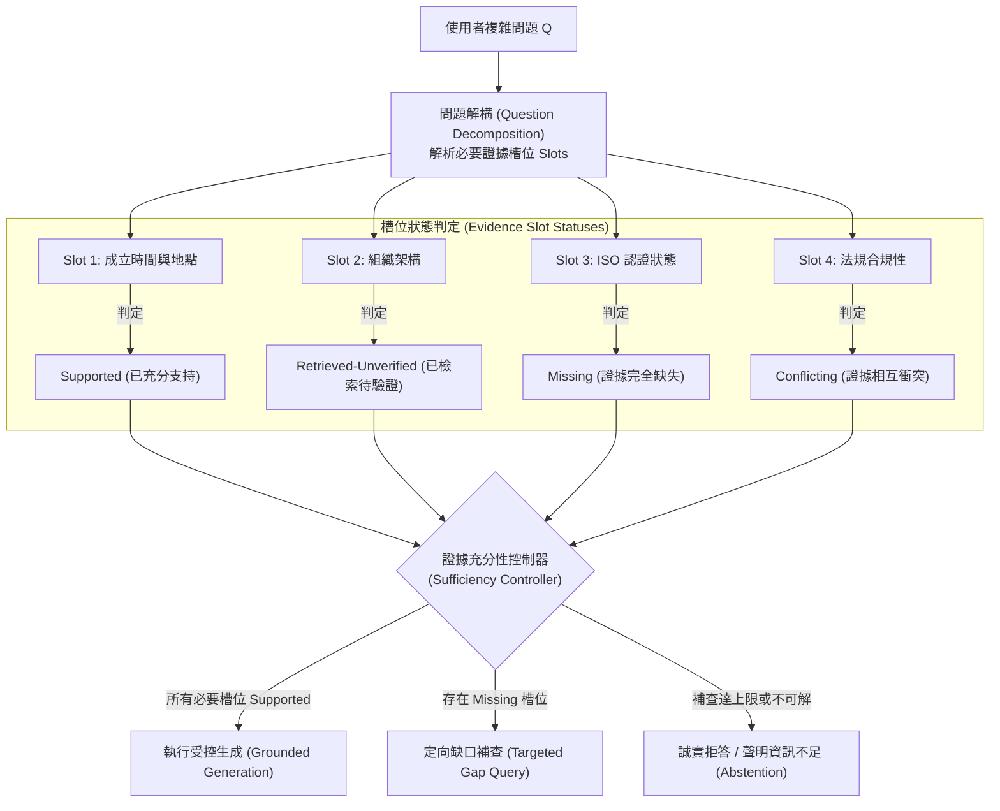

# Domain 14: 證據充分性與自適應檢索 (Evidence Sufficiency & Adaptive Retrieval)

> [!ABSTRACT] 核心研究問題 (Core Research Question)
> **檢索到的相關文檔是否已涵蓋回答問題的「全部必要條件」？當證據不足時，系統能否精確定位資訊缺口（Evidence Gap）並自適應發起定向補查或誠實拒答（Abstention）？**
> 
> 本專題探討超越單純語義相似度（Relevance）的證據充分性（Sufficiency）理論，建立問題槽位解構（Evidence Slot Decomposition）與缺口定位模型，剖析 Adaptive-RAG、Self-RAG 與 IRCoT 的決策機制，並對齊 2026 年 Evidence Sufficiency Benchmark。

---

## 一、問題定義與研究邊界 (Problem Definition & Scope)

傳統 RAG 的致命弱點在於將「相關度（Relevance）」與「充分性（Sufficiency）」畫上等號：
\[
\boxed{\text{Relevance} \neq \text{Sufficiency}}
\]
- **相關度（Relevance）**：衡量文檔與問題在向量空間或關鍵字維度上的語意接近程度；
- **充分性（Sufficiency）**：衡量已檢索出的證據集合 $\mathcal{E}$ 是否在演繹或歸納邏輯上完整封閉，滿足問題的所有先決條件，且無未經證實之推論躍進。

若問題為複合查詢：
> 「A 公司在 2024 年是否在 B 國家建立了研發中心，且該中心目前是否已取得當地的 ISO 認證？」

檢索器可能召回了大量關於「A 公司在 B 國成立研發中心」的高度相關新聞（High Relevance），但完全沒有任何關於「ISO 認證」的記錄。傳統 RAG 會強行將這批高分文檔餵給 LLM，導致模型利用內部參數知識產生幻覺，宣稱「已獲得認證」。

充分性研究的邊界在於：
1. **問題需求解構**：將複雜查詢分解為必要證據槽位（Required Evidence Slots）；
2. **缺口精確定位（Gap Localization）**：識別哪一個槽位缺失或衝突；
3. **自適應控制與拒答**：決定何時終止檢索、何時定向補查、何時觸發拒答（Abstention）。

---

## 二、知識分類與槽位狀態模型 (Taxonomy & Evidence Slot Model)

為達成確定性充分性評估，系統將問題 $Q$ 解析為相依證據槽位圖 $\mathcal{G}_Q = (\mathcal{S}, \mathcal{D})$，每個槽位 $s_i \in \mathcal{S}$ 被賦予明確的狀態值：

### 槽位五大狀態定義
1. `missing`：知識庫中尚未檢索到任何能填補該槽位的候選證據；
2. `retrieved-unverified`：已檢索到相關片段，但尚未經過 NLI 或 Span-level 邏輯蘊涵驗證；
3. `supported`：已有經核實之高權威來源嚴格蘊涵該槽位之主張；
4. `conflicting`：檢索到兩份以上相互矛盾的文獻（例如不同年份版本給出相左數值）；
5. `ineligible`：文檔與主題相關但來源合法性不符（如未獲核准的草案或非權威來源）。

---

## 三、前人研究與代表性工作 (Prior Work & Literature Matrix)

| 代表工作 / 論文 | 發表 Venue / 年份 | 決策時機與觸發方式 | 是否需專門訓練 | 停止與拒答機制 |
| :--- | :--- | :--- | :--- | :--- |
| **[[03 - 論文庫 (Literature Notes)/03 - RAG & Retrieval/(ICLR 2024-05) Self-RAG - Learning to Retrieve, Generate, and Critique through Self-Reflection\|Self-RAG]]** | ICLR 2024 | 生成每個段落前，以 `[Retrieve]` 預測是否檢索 | 需以 SFT 訓練 Reflection Tokens | 依 Beam Search 分數決定是否停止檢索 |
| **[[03 - 論文庫 (Literature Notes)/03 - RAG & Retrieval/(ACL 2023-07) Interleaving Retrieval with Chain-of-Thought Reasoning for Knowledge-Intensive Multi-Step Questions\|IRCoT]]** | ACL 2023 | 結合思維鏈（CoT），在每一步推理生成後檢索 | 免微調，利用 Prompting 與規則交替 | 當 CoT 產生最終答案或達到固定步數時停止 |
| **Adaptive-RAG** | NAACL 2024 | 在檢索前利用分類器評估問題難度（單跳/多跳/無檢索）| 需微調輕量級分類器（如 T5/BERT） | 依問題難度自適應路由至不同策略 |
| **Evidence Sufficiency Benchmark** | CMC 2026 | 評測基準；涵蓋 Full/Partial/Absent/Conflicting 5 種狀態 | 評測協議與資料集 | 評估模型之拒答校準率（Abstention Calibration） |

> [!NOTE] 學術邊界：方法與評測基準之標籤分離
> 2026 年之 **Evidence Sufficiency Benchmark**（[DOI: 10.32604/cmc.2026.086343](https://doi.org/10.32604/cmc.2026.086343)）評估的是模型在 5 種證據充分性條件下的回答與拒答能力，**非天然具備本專案工程治理所需之專有槽位標籤**；工程上的槽位狀態與 IPPS-Eval 映射屬於本專案之待驗證研究假設。

---

## 四、核心方法機制與架構對比 (Methodology & Architectural Comparison)

### 1. 自適應檢索策略光譜
- **固定輪數架構（Fixed Multi-round RAG）**：不論證據是否充足，固定執行 $N$ 次檢索。**弊端**：簡單問題浪費 Token 與延遲，複雜問題在第 $N$ 輪後仍可能殘留致命缺口；
- **自適應反思架構（Adaptive / Reflective RAG）**：由模型自主判斷當前文檔是否足夠。若未將問題解構為具體 Slots，模型往往基於「感覺上文檔挺多的」做出偽充分（False-sufficient）判斷；
- **缺口感知自適應架構（Gap-Aware Adaptive Retrieval）**：
  - 維護顯式狀態帳本（Slot Ledger）；
  - 僅針對標記為 `missing` 或 `conflicting` 的槽位生成定向查詢（Targeted Query），避免全域盲目廣播。

---

## 五、失效模式與工程陷阱 (Failure Modes & Error Taxonomy)

1. **偽充分誤判（False-Sufficient Hallucination）**：
   - 檢索到了大量的背景文字，模型產生語意飽和錯覺，判定「證據已充分」，掩蓋了關鍵數據缺漏。
2. **死循環檢索（Infinite Retrieval Loop）**：
   - 當資料庫中根本不存在某個槽位的答案時，缺口定位器反覆嘗試改寫查詢並檢索，直至耗盡最大 Token 預算。
3. **過度保守拒答（Hyper-conservative Abstention）**：
   - 系統因微小非關鍵修飾語缺失，對大量可回答的問題頻繁觸發「無法回答」，嚴重損害使用者體驗。

---

## 六、評測基準與資料集對齊 (Benchmarks, Datasets & Metrics)

評估證據充分性不可只用開放問答的 EM 或 F1，必須引入**校準指標（Calibration Metrics）**：

| 評估維度 | 核心指標 | 定義與意義 |
| :--- | :--- | :--- |
| **缺口定位精確度** | **Gap Localization F1** | 模型標註出的缺失槽位與人工標註 Gold Gaps 的精確率與召回率。 |
| **偽充分率** | **False-Sufficient Rate** | 在客觀證據缺失的情境下，系統錯誤判定為「充分」並嘗試回答的比例（越低越好）。 |
| **拒答品質** | **Selective Accuracy / Abstention AUC** | 量測模型在「回答時的精確度」與「不足時正確拒答率」之間的權衡曲線。 |
| **系統成本** | **Tokens / Queries per Resolved Question** | 達到相同正確率所需的平均檢索輪數與 API Token 消耗。 |

---

## 七、開放研究問題與可反駁假設 (Open Problems & Falsifiable Hypotheses)

### 待驗證假設 14-A (Gap-Aware vs Fixed-Round Efficiency)
- **假說**：在相同或更低總 Token 預算下，採用「基於槽位狀態的缺口感知控制器（Gap-Aware Controller）」，其在多跳複雜決策問答上的 Answer Accuracy 顯著高於「固定 3 輪檢索」與「單純 Self-RAG」，並能將偽充分率降低 50% 以上。
- **Baseline**：Fixed Top-k RAG、Fixed 3-Round Iterative RAG、Adaptive-RAG、標準 Self-RAG。
- **Oracle**：使用標註好 Gold Requirement Slots 與對應文檔的 Oracle Controller。
- **反駁條件**：若缺口定位本身的 LLM 呼叫開銷超過了盲目檢索節省的成本，且端到端 Answer Accuracy 未達顯著改善，則該假設在性價比維度被否決。

---

## 八、文獻來源與相關專題導覽 (Sources, Citations & Wikilinks)

- **核心論文**：
  - [[03 - 論文庫 (Literature Notes)/03 - RAG & Retrieval/(ICLR 2024-05) Self-RAG - Learning to Retrieve, Generate, and Critique through Self-Reflection|Self-RAG: Learning to Retrieve, Generate, and Critique (Asai et al., ICLR 2024)]]
  - [[03 - 論文庫 (Literature Notes)/03 - RAG & Retrieval/(ACL 2023-07) Interleaving Retrieval with Chain-of-Thought Reasoning for Knowledge-Intensive Multi-Step Questions|IRCoT: Interleaving Retrieval and Chain-of-Thought (Trivedi et al., ACL 2023)]]
  - Evidence Sufficiency Benchmark (CMC 2026, [DOI: 10.32604/cmc.2026.086343](https://doi.org/10.32604/cmc.2026.086343))
- **專題連動**：
  - [[02 - 研究領域專題 (Research Domains)/Domain 03 - 先進 RAG 與檢索機制 (ColBERT, HyDE, Self-RAG)|Domain 03: 先進 RAG 與檢索機制]]
  - [[02 - 研究領域專題 (Research Domains)/Domain 15 - Temporal Conflict & Provenance-aware RAG|Domain 15: 時序衝突與來源仲裁 RAG]]
  - [[02 - 研究領域專題 (Research Domains)/Domain 16 - Context Utilization & Faithfulness|Domain 16: 上下文利用率與忠實度]]
- **研究提案**：
  - [[04 - 研究想法與待驗證提案 (Ideas & Hypotheses)/Idea 02 - Evidence Gap-Aware Adaptive Retrieval|Idea 02: 證據缺口感知自適應檢索]]
- **全景導覽**：
  - [[00 - 導覽與心智圖 (Navigation & MOC)/Home (主目錄與知識庫導覽)|主目錄與知識庫導覽]]
  - [[00 - 導覽與心智圖 (Navigation & MOC)/RAG Benchmark Catalog|RAG Benchmark Catalog]]
