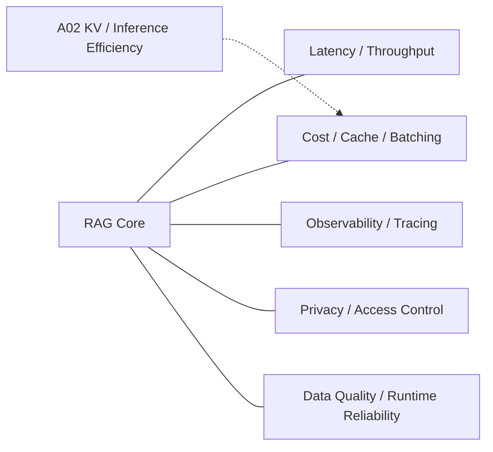

# Domain 14 - RAG Systems & Reliability

## Core Question
如何讓 RAG 在真實部署條件下維持可接受的 latency、throughput、cost、observability 與 runtime reliability？

## Includes
- latency / throughput / cost
- indexing / serving scalability
- cache / batching
- observability / tracing
- privacy / access control
- data quality
- runtime reliability
- production failure handling

## Excludes
- retrieval relevance algorithm → D05
- benchmark methodology → D13
- general model / KV architecture itself → Adjacent Interfaces

## Level-2 Topics
- Serving Architecture
- Latency / Throughput
- Cost
- Caching / Batching
- Observability
- Privacy / Access Control
- Data Quality / Reliability

## Boundary
D14 是 **system plane**。只有當研究問題是 RAG deployment / reliability 時才歸 D14；一般 LLM inference optimization 放在 A02/A03。

## Navigation
- [[02 - 研究領域專題 (Research Domains)/Domain 13 - RAG Evaluation & Failure Attribution|D13 RAG Evaluation & Failure Attribution]]
- [[00 - 導覽與心智圖 (Navigation & MOC)/RAG Adjacent Interfaces|RAG Adjacent Interfaces]]
