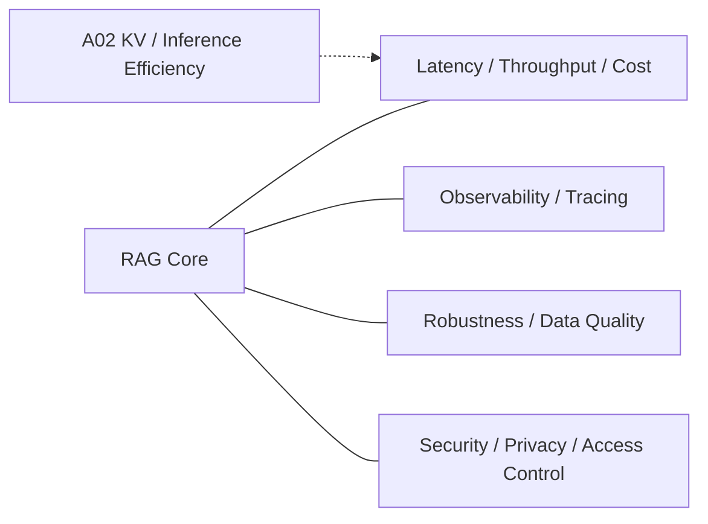

# Domain 14 - RAG Systems, Robustness & Security

## Core Question
如何在真實部署條件下控制 latency、throughput、cost 與 observability，同時維持 RAG 對雜訊、錯誤資料與攻擊面的韌性？

## Includes
- latency / throughput / cost
- indexing / serving scalability
- cache / batching
- observability / tracing
- robustness to noisy or adversarial evidence
- corpus / retrieval integrity
- privacy / access control
- retrieved-content prompt injection and corpus poisoning defenses

## Excludes
- general model architecture → Adjacent Interface
- benchmark methodology → D13
- retrieval relevance algorithm → D05

## Level-2 Topics
- Serving Latency / Throughput / Cost
- Indexing & Serving Scalability
- Cache / Batching
- Observability / Tracing
- Robustness to Noise
- Corpus / Retrieval Integrity
- Retrieved-content Prompt Injection
- Corpus Poisoning
- Privacy / Access Control

## Boundary
D14 是 deployment / infrastructure / robustness plane，不是 retrieval quality 本身。若研究主要改進 ranking relevance，歸 D05；若主要評估 failure，歸 D13。

## Literature Coverage

**Current primary-note coverage: 0**

目前 repo 尚未收錄以 D14 為 primary contribution 的 dedicated RAG systems / robustness / security paper note。已有的 KIVI、CacheGen 等是 A02 inference/serving efficiency 與 D14 的交界，不能代替 RAG-specific robustness/security literature。

Adjacent notes:
- [[03 - 論文庫 (Literature Notes)/02 - Compression & KV Cache/(ICML 2024-07) KIVI - A Tuning-Free Asymmetric 2-bit Quantization for KV Cache|KIVI]]
- [[03 - 論文庫 (Literature Notes)/02 - Compression & KV Cache/(SIGCOMM 2024-08) CacheGen - KV Cache Compression and Streaming for Fast Large Language Model Serving|CacheGen]]

## Navigation
- [[00 - 導覽與心智圖 (Navigation & MOC)/RAG Research Taxonomy & Domain Map|RAG Research Taxonomy & Domain Map]]
- [[00 - 導覽與心智圖 (Navigation & MOC)/RAG Adjacent Interfaces|RAG Adjacent Interfaces]]
