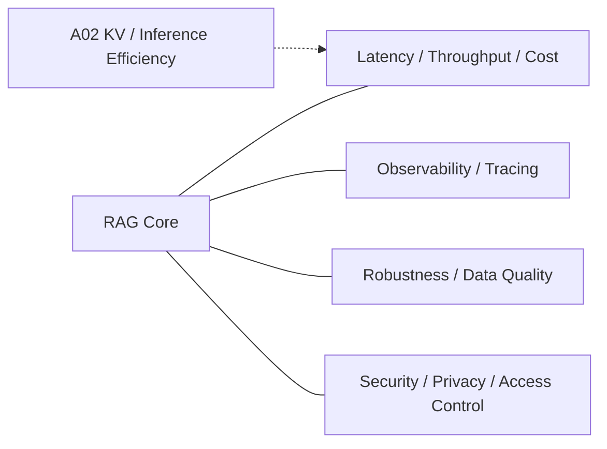

# Domain 14 - RAG Systems, Robustness & Security

## Core Question
如何在真實部署條件下控制 latency、throughput、cost 與 observability，同時維持 RAG 對雜訊、錯誤資料與攻擊面的韌性？

## Includes
- latency / throughput / cost
- indexing / serving scalability
- cache / batching
- observability / tracing
- robustness to noisy or adversarial evidence
- corpus / retrieval integrity
- privacy / access control
- retrieved-content prompt injection and corpus poisoning defenses

## Excludes
- general model architecture → Adjacent Interface
- benchmark methodology → D13
- retrieval relevance algorithm → D05

## Level-2 Topics
- Serving Latency / Throughput / Cost
- Indexing & Serving Scalability
- Cache / Batching
- Observability / Tracing
- Robustness to Noise
- Corpus / Retrieval Integrity
- Retrieved-content Prompt Injection
- Corpus Poisoning
- Privacy / Access Control

## Boundary
D14 是 deployment / infrastructure / robustness plane，不是 retrieval quality 本身。若研究主要改進 ranking relevance，歸 D05；若主要評估 failure，歸 D13。

## Literature Coverage

**Current primary-note coverage: 0**

目前 repo 尚未收錄以 D14 為 primary contribution 的 dedicated RAG systems / robustness / security paper note。已有的 KIVI、CacheGen 等是 A02 inference/serving efficiency 與 D14 的交界，不能代替 RAG-specific robustness/security literature。

Adjacent notes:
- [[03 - 論文庫 (Literature Notes)/02 - Compression & KV Cache/(ICML 2024-07) KIVI - A Tuning-Free Asymmetric 2-bit Quantization for KV Cache|KIVI]]
- [[03 - 論文庫 (Literature Notes)/02 - Compression & KV Cache/(SIGCOMM 2024-08) CacheGen - KV Cache Compression and Streaming for Fast Large Language Model Serving|CacheGen]]

## Systems and Threat Model
### End-to-end systems path

RAG latency 不只來自 generator，可拆為：

[
T_{total}=T_{parse/embed}+T_{search}+T_{rerank}+T_{prefill}+T_{decode}
]

部署評估因此至少應同時報告 latency / TTFT、throughput、token / model-call budget、peak memory、indexing / serving cost；具體數值必須在同硬體、同模型、同 corpus 條件下量測。

### Threat classes

- **Retrieved-content / indirect prompt injection**：外部文件中的 instruction 被模型誤當成可信控制指令。
- **Corpus / retrieval poisoning**：攻擊者操控可被索引與召回的內容，使惡意或錯誤 evidence 被優先檢索。
- **Privacy / tenant leakage**：ACL、tenant isolation 或 retrieval filter 失敗，使一個 user 查到另一個 user 的內容。
- **Derived-data persistence**：原文刪除後，summary、embedding、knowledge graph edge 或 memory 仍保留敏感資訊。
- **Noisy / adversarial evidence**：表面高度相關的 distractor、矛盾內容或偽來源使 generator 失真。

硬邊界：
[
Retrieved Document 
eq Trusted Instruction
]

目前 D14 沒有 dedicated primary paper note，所以上述先作為 threat taxonomy / coverage target，而不是宣稱 repo 已完成此領域文獻 survey。

## Navigation
- [[02 - 研究領域專題 (Research Domains)/Domain 07 - Context Construction & Evidence Utilization|D07 Context Construction & Evidence Utilization]]
- [[02 - 研究領域專題 (Research Domains)/Domain 13 - RAG Evaluation & Failure Attribution|D13 RAG Evaluation & Failure Attribution]]
- [[00 - 導覽與心智圖 (Navigation & MOC)/RAG Research Taxonomy & Domain Map|RAG Research Taxonomy & Domain Map]]
- [[00 - 導覽與心智圖 (Navigation & MOC)/RAG Adjacent Interfaces|RAG Adjacent Interfaces]]
