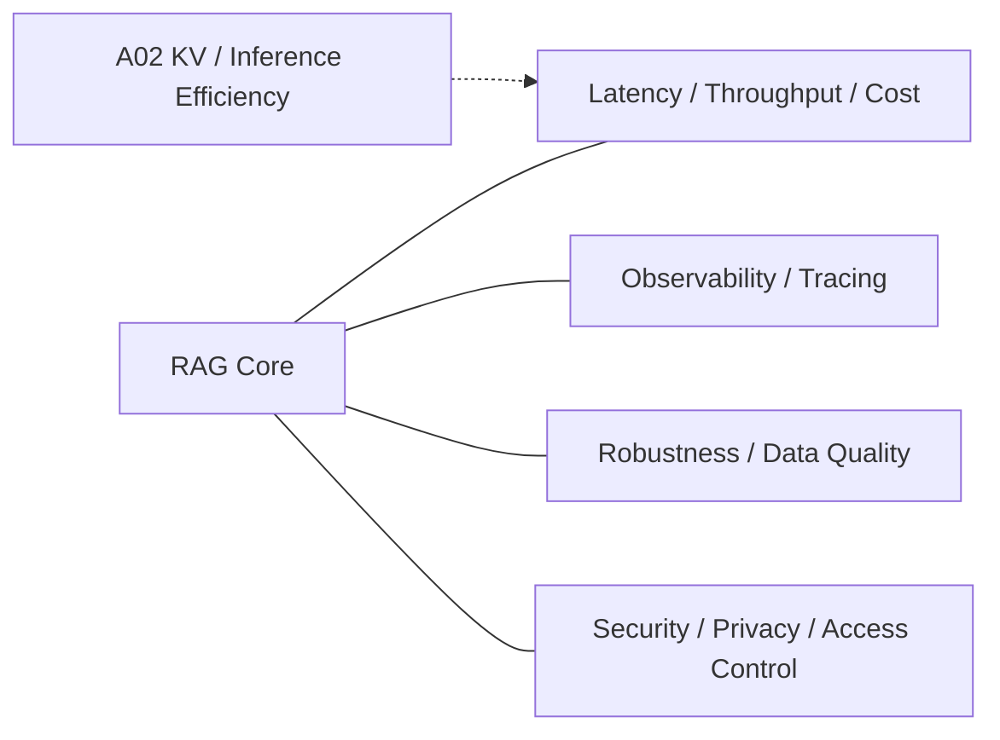

# Domain 14 - RAG Systems, Robustness & Security

## Core Question
如何在真實部署條件下控制 latency、throughput、cost 與 observability，同時維持 RAG 對雜訊、錯誤資料與攻擊面的韌性？



## Includes
- latency / throughput / cost
- indexing / serving scalability
- cache / batching
- observability / tracing
- robustness to noisy or adversarial evidence
- corpus / retrieval integrity
- privacy / access control
- retrieved-content prompt injection and corpus poisoning defenses

## Excludes
- general model architecture → Adjacent Interface
- benchmark methodology → D13
- retrieval relevance algorithm → D05

## Research Tracks

D14 是 deployment umbrella，不代表下列三條線已經是一個單一成熟 subfield：

1. **RAG Systems / Serving**：latency、throughput、cost、index/search scalability、cache/batching、observability。
2. **Robustness & Security**：corpus poisoning、retrieval manipulation、retrieved-content prompt injection、adversarial / noisy evidence。
3. **Privacy & Governance**：access control、tenant isolation、retrieval-data leakage、derived-data persistence。

Security paper 不能拿來當 systems paper；KV-cache / serving paper 也不能替代 RAG-specific security evidence。

## Level-2 Topics
- Serving Latency / Throughput / Cost
- Indexing & Serving Scalability
- Cache / Batching
- Observability / Tracing
- Robustness to Noise
- Corpus / Retrieval Integrity
- Retrieved-content Prompt Injection
- Corpus Poisoning
- Retrieval-data Privacy
- Access Control / Tenant Isolation
- Derived-data Deletion / Persistence

## Boundary
D14 是 deployment / infrastructure / robustness plane，不是 retrieval quality 本身。若研究主要改進 ranking relevance，歸 D05；若主要評估 failure，歸 D13。

## Literature Coverage

**Current primary-note coverage: 2**

目前已有兩條直接 primary anchors：
- [[03 - 論文庫 (Literature Notes)/03 - RAG & Retrieval/(SOSP 2025-10) METIS - Fast Quality-Aware RAG Systems with Configuration Adaptation|METIS]] — RAG-specific serving / scheduling / quality-latency configuration adaptation。
- [[03 - 論文庫 (Literature Notes)/03 - RAG & Retrieval/(USENIX Security 2025-08) PoisonedRAG - Knowledge Corruption Attacks to Retrieval-Augmented Generation of Large Language Models|PoisonedRAG]] — corpus / knowledge-base poisoning。

因此 D14 的 **systems** 與 **security** 已各有直接 anchor；仍缺的是 **observability/tracing 與 privacy/access-control/tenant isolation** 的 dedicated RAG primary literature。KIVI、CacheGen 等仍是 A02 inference/serving efficiency 與 D14 的交界。

Adjacent notes:
- [[03 - 論文庫 (Literature Notes)/02 - Compression & KV Cache/(ICML 2024-07) KIVI - A Tuning-Free Asymmetric 2-bit Quantization for KV Cache|KIVI]]
- [[03 - 論文庫 (Literature Notes)/02 - Compression & KV Cache/(SIGCOMM 2024-08) CacheGen - KV Cache Compression and Streaming for Fast Large Language Model Serving|CacheGen]]

## Systems and Threat Model

### End-to-end systems path

```text
T_total =
  T_parse/embed
+ T_search
+ T_rerank
+ T_prefill
+ T_decode
```

部署評估至少應同時報告 latency / TTFT、throughput、token / model-call budget、peak memory、indexing / serving cost；具體數值必須在同硬體、同模型、同 corpus 條件下比較。

### Threat classes

- **Retrieved-content / indirect prompt injection**：外部文件中的 instruction 被模型誤當成控制指令。
- **Corpus / retrieval poisoning**：攻擊者操控可被索引與召回的內容，使惡意或錯誤 evidence 被優先檢索。
- **Privacy / tenant leakage**：ACL、tenant isolation 或 retrieval filter 失敗，使不同 user / tenant 的資料交叉暴露。
- **Derived-data persistence**：原文刪除後，summary、embedding、knowledge graph edge 或 memory 仍殘留。
- **Noisy / adversarial evidence**：高度相關的 distractor、矛盾內容或偽來源導致 downstream generation 失真。

硬邊界：

```text
Retrieved Document ≠ Trusted Instruction
Retrieved Document ≠ Trusted Truth
```

目前 RAG-specific systems（METIS）與 security（PoisonedRAG）都已有 primary anchor；下一個真正缺口是 observability/tracing 與 privacy/access-control，而不是再堆一般 LLM serving papers。

## Navigation
- [[02 - 研究領域專題 (Research Domains)/Domain 07 - Context Construction & Evidence Utilization|D07 Context Construction & Evidence Utilization]]
- [[02 - 研究領域專題 (Research Domains)/Domain 13 - RAG Evaluation & Failure Attribution|D13 RAG Evaluation & Failure Attribution]]
- [[00 - 導覽與心智圖 (Navigation & MOC)/RAG Research Taxonomy & Domain Map|RAG Research Taxonomy & Domain Map]]
- [[00 - 導覽與心智圖 (Navigation & MOC)/RAG Adjacent Interfaces|RAG Adjacent Interfaces]]
