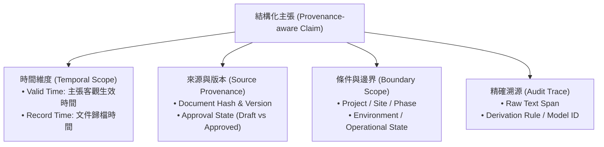
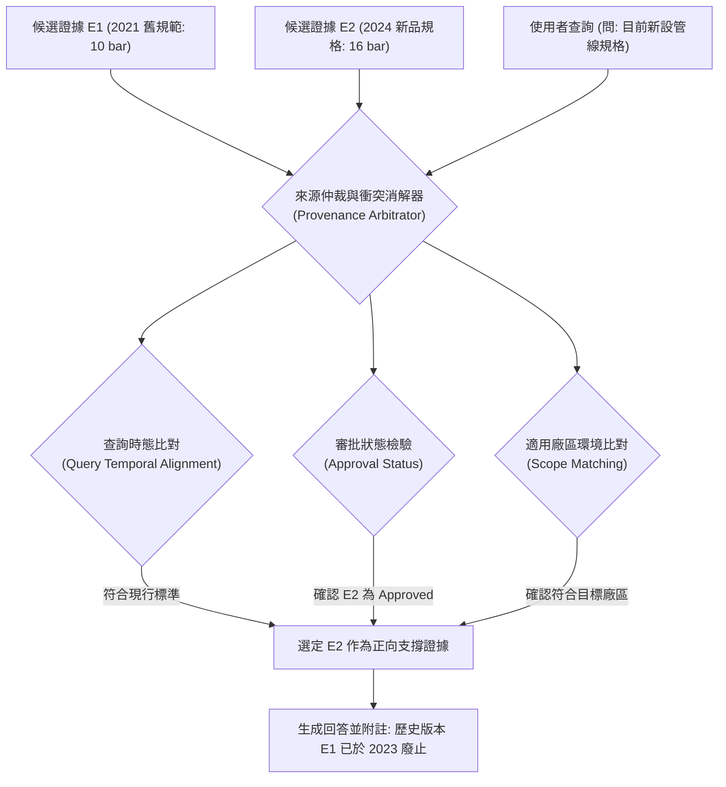

# Domain 15: 時序衝突與來源仲裁 RAG (Temporal Conflict & Provenance-aware RAG)

> [!ABSTRACT] 核心研究問題 (Core Research Question)
> **當知識庫中存在兩個相互抵觸的主張（Claims）時，系統如何判斷這是「時間更新」、「適用條件不同（不同廠區/工況）」、「來源權威等級不一致」，還是「真正的客觀事實衝突」？**
> 
> 本專題探討版本化長文本環境下的時序語義（Valid Time vs Record Time）、來源譜系追溯（Data Provenance）與衝突消解機制，破除「較新來源永遠覆蓋舊來源」的武斷假設，並對齊 Re³ 與 ConfRAG 評測範式。

---

## 一、問題定義與研究邊界 (Problem Definition & Scope)

在企業知識庫、法規庫與大型工程檔案中，文檔隨時間不斷修訂、迭代與擴充，導致向量資料庫中同時共存大量新舊版本段落：
\[
\mathcal{C} = \{ D_{\text{v1.0}}^{(2021)}, D_{\text{v2.1}}^{(2023)}, D_{\text{Draft}}^{(2024)}, D_{\text{SpecialSite}}^{(2024)} \}
\]
當檢索器基於語意相似度傳回來自不同版本的段落時，系統面臨四重衝突類型（Conflict Types）：
1. **時效演進（Temporal Supercedence）**：新版規格已正式取代舊版規格；
2. **適用範疇不同（Scope Divergence）**：外表看似矛盾的數據，實則適用於不同的工況環境（如低溫 vs 高溫；亞洲廠區 vs 北美廠區）；
3. **權威狀態不一致（Authority Discrepancy）**：正式批准的定案規格書（Approved）vs 內部未經簽核的討論草案（Draft）；
4. **真實矛盾（Genuine Factual Contradiction）**：同版本同條件下出現不可調和的數據錯誤。

### 核心學術反思：「較新來源」不必然等於「正解」
若使用者提問的是歷史回溯性問題：
> 「本公司在 2022 年向客戶承諾的第一代保固條件為何？」

若檢索器僅依據 Recency（最新日期）粗暴覆蓋舊文檔，將錯誤回傳 2024 年的最新條款，導致法律責任嚴重誤判。因此，**時間感知 RAG 必須同時理解有效時間（Valid Time）、記錄時間（Record Time）與查詢時態（Query Time Scope）**。

---

## 二、知識分類與來源審計模型 (Taxonomy & Provenance Model)

為實現可審計的來源仲裁，本專題定義最小結構化主張表示模型（Minimal Provenance Schema）：



### 最小結構化主張欄位規範 (Proposed Schema)
```yaml
claim_id: "CLM-2026-ENG-089"
subject_entity: "雙備援切換閥 A"
predicate: "最大耐受壓力"
value_with_unit: "16 bar"
valid_time: "[2023-01-01, +inf)"        # 客觀物理世界生效期間
record_time: "2023-03-15T09:30:00Z"      # 文件撰寫或發行時間
applicable_site: "廠區-高雄二廠"         # 適用邊界
source_version: "v2.4-final"             # 文件版本
approval_state: "Approved"               # 簽核狀態: Draft | Under_Review | Approved
source_span: "Spec_Manual_v2.4.pdf, p.14, L5-L8"
conflict_relation: null                  # 關聯衝突主張 ID (若存在)
```

---

## 三、前人研究與代表性工作 (Prior Work & Literature Matrix)

| 代表工作 / 論文 | 發表 Venue / 年份 | 核心研究問題 | 衝突處理機制 | 官方來源與限制 |
| :--- | :--- | :--- | :--- | :--- |
| **[[03 - 論文庫 (Literature Notes)/06 - Benchmarks & Evaluation/(ACL 2026-08) Re3 - Relevance and Recency Retrieval for Mitigating Temporal Hallucination\|Re³]]** | ACL 2026 | Relevance, Recency 與舊版本干擾 | 雙編碼器架構 (TADRE) + 衝突感知過濾器 (CARF)；提出 1.3M 規模之 Re² Bench 測試過期干擾 | [[03 - 論文庫 (Literature Notes)/06 - Benchmarks & Evaluation/(ACL 2026-08) Re3 - Relevance and Recency Retrieval for Mitigating Temporal Hallucination\|文獻筆記]] / [ACL Anthology](https://aclanthology.org/2026.acl-long.1180/) |
| **[[03 - 論文庫 (Literature Notes)/06 - Benchmarks & Evaluation/(ACL 2024-08) FreshLLMs - Refreshing Large Language Models with Search Engine Augmentation|FreshLLMs]]** | ACL 2024 | 動態世界知識與快速時效性問答 (FreshQA) | FreshPrompt 增強檢索整合搜尋引擎；分析快慢變動知識與時間幻覺 | [[03 - 論文庫 (Literature Notes)/06 - Benchmarks & Evaluation/(ACL 2024-08) FreshLLMs - Refreshing Large Language Models with Search Engine Augmentation|文獻筆記]] / [ACL Anthology](https://aclanthology.org/2024.acl-long.464/) |
| **ConfRAG** | 2024 預印本 | 外部檢索內容與參數記憶的知識衝突 | 區分內在知識衝突與外部上下文衝突，引導模型權衡 | [arXiv:2403.08319](https://arxiv.org/abs/2403.08319) |
| **TimeQA / TempLAMA** | TACL / EMNLP | 時間演化事實問答（Temporal QA） | 探討實體屬性隨時間變更時之檢索與預測能力 | 多針對百科類實體，缺乏複雜工程版本矩陣 |
| **W3C PROV-DM** | W3C Standard | 資料譜系（Data Provenance）標準 | Entity-Activity-Agent 溯源三元組與演變歷史建模 | 資料庫與語意網標準，尚未被大語言模型廣泛原生支援 |

---

## 四、核心方法機制與架構對比 (Methodology & Architectural Comparison)



### 四大衝突消解策略對比
1. **純時序覆蓋（Recency Heuristic）**：盲目挑選日期最新的文檔。**缺陷**：無法處理歷史查詢、局部特規與未批准草案；
2. **多版本並列呈顯（Disclaim & Juxtaposition）**：當檢索到衝突時，不強行武斷決定，而是在回答中明確向使用者陳述版本演進（如「依據 2021 年版為 10 bar；但自 2023 年版修訂為 16 bar」）；
3. **基於譜系的層次仲裁（Provenance-based Hierarchical Arbitration）**：
   - 剛性過濾：草案（Draft）絕不可覆蓋已批准文件（Approved）；
   - 範疇限定：特規文件（Site-specific）優先於全域通用文件（Global Policy）；
4. **反證注入校驗（Counter-evidence Stress Testing）**：將衝突的兩份文檔同時送入驗證模組，迫使模型分析衝突產生的根本原因。

---

## 五、失效模式與工程陷阱 (Failure Modes & Error Taxonomy)

1. **版本穿透幻覺（Version Contamination）**：
   - 檢索器從 v1.0 抓取了零件尺寸，又從 v3.0 抓取了工作電壓，生成出一個歷史上從未存在過的「拼裝怪物型號」。
2. **草案越權上位（Draft Authority Usurpation）**：
   - 搜尋引擎因關鍵字重合度高，優先召回了某員工尚未定稿的個人技術筆記，將其非官方構想作為最終合規結論。
3. **單位與時區混淆（Temporal / Unit Collision）**：
   - 跨國工廠文件中，將美東時間與亞洲時間混淆，或將舊制英制規格與公制規格在未換算情況下直接比對大小。

---

## 六、評測基準與資料集對齊 (Benchmarks, Datasets & Metrics)

| 評測任務 | 官方基準 / 資料集 | 關鍵指標 | 測試重點 |
| :--- | :--- | :--- | :--- |
| **時效事實問答** | Re² Bench (Re³ 論文) | Recency Accuracy, Stale Fact Intrusion Rate | 測試過期資訊作為干擾項（Distractor）時之模型魯棒性 |
| **知識衝突消解** | ConfRAG / ConflictQA | Conflict Resolution Accuracy, Attribution Fidelity | 測試外部證據與內部知識衝突時之仲裁能力 |
| **版本化工程問答** | **Proposed Version-Eval** | Version Precision, Contradiction Detection F1 | 注入版本演進與不同工況之企業合約，測試來源判定正確率 |

---

## 七、開放研究問題與可反駁假設 (Open Problems & Falsifiable Hypotheses)

### 待驗證假設 15-A (Provenance-aware Conflict Arbitration)
- **假說**：相較於單純依賴文字檢索的 Recency-weighted RAG，導入顯式來源譜系（包含 Valid Time, Source Version, Approval State）的層次仲裁模組，能將版本混淆造成的嚴重事實錯誤率降低 60% 以上，且在回溯性歷史問題上取得高於 90% 的版本精確率。
- **Baseline**：標準 Dense RAG、Recency-biased RAG（優先檢索最新文檔）、Time-filtered RAG。
- **Oracle**：由領域專家標註正確版本、生效時段與衝突分類的 Oracle Arbitrator。
- **反駁條件**：若來源譜系解析之錯誤率過高，導致合法文檔被誤判為過期並引發拒答率上升超過 25%，則該假設在工程實用性上不成立。

---

## 八、文獻來源與相關專題導覽 (Sources, Citations & Wikilinks)

- **核心論文**：
  - Re³: Evaluating and Mitigating Stale Information Interference in RAG (ACL 2026, [ACL Anthology](https://aclanthology.org/2026.acl-long.1180/))
  - ConfRAG: Resolving Internal-External Knowledge Conflicts in LLMs (2024, [arXiv:2403.08319](https://arxiv.org/abs/2403.08319))
- **專題連動**：
  - [[02 - 研究領域專題 (Research Domains)/Domain 13 - Information Preservation & Cross-chunk Consolidation|Domain 13: 資訊保真與跨塊關聯整合]]
  - [[02 - 研究領域專題 (Research Domains)/Domain 14 - Evidence Sufficiency & Adaptive Retrieval|Domain 14: 證據充分性與自適應檢索]]
  - [[02 - 研究領域專題 (Research Domains)/Domain 16 - Context Utilization & Faithfulness|Domain 16: 上下文利用率與忠實度]]
- **研究提案**：
  - [[04 - 研究想法與待驗證提案 (Ideas & Hypotheses)/Idea 03 - Provenance Temporal Conflict-Aware Evidence Resolution|Idea 03: 來源譜系與時序衝突證據仲裁]]
- **全景導覽**：
  - [[00 - 導覽與心智圖 (Navigation & MOC)/Home (主目錄與知識庫導覽)|主目錄與知識庫導覽]]
  - [[00 - 導覽與心智圖 (Navigation & MOC)/RAG Benchmark Catalog|RAG Benchmark Catalog]]
