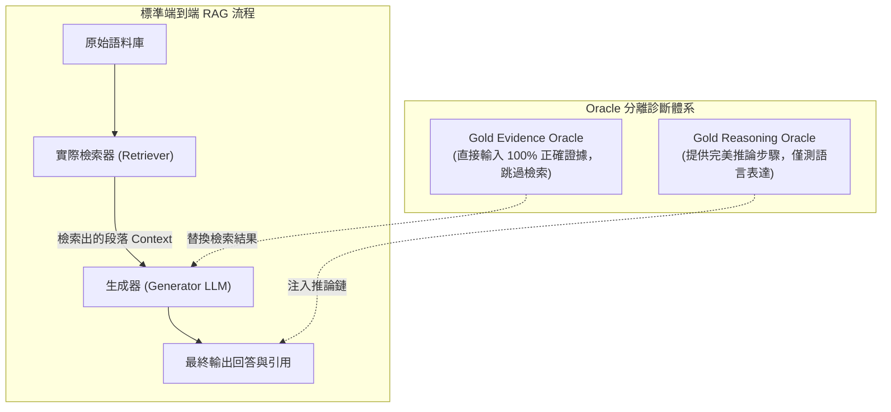
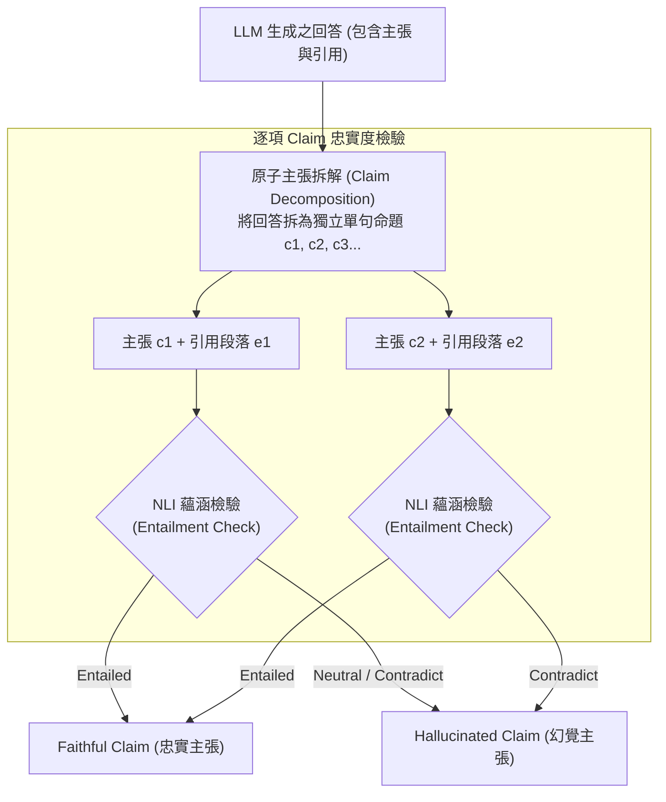

# Domain 16: 上下文利用率與生成忠實度 (Context Utilization & Faithfulness)

> [!ABSTRACT] 核心研究問題 (Core Research Question)
> **當檢索器已成功將 100% 正確的黃金證據（Gold Evidence）置入 Prompt 時，LLM 為何仍然回答錯誤或產生幻覺？如何診斷位置偏置、噪聲干擾、內部參數競爭與引用錯配？**
> 
> 本專題探討生成端（Generator）的上下文利用失效機理，區分檢索器失敗（Retriever Failure）與生成器失敗（Generator Failure），引入 Oracle 消融隔離協議，並以 RAGChecker 與 RAGAS 為基礎建立 Claim 級別的忠實度（Faithfulness）與引用蘊涵（Citation Entailment）評測標準。

---

## 一、問題定義與研究邊界 (Problem Definition & Scope)

在長文本 RAG 系統的端到端評估中，若最終生成的答案錯誤，傳統工程常盲目指責檢索器（Retriever）。然而大量實證研究表明，即使檢索器完美召回了所有關鍵證據，生成器（LLM）依然存在極高的失敗率：
\[
\text{Total Error} = \underbrace{\mathcal{E}_{\text{retrieval}}}_{\text{Retriever Failure (未找到證據)}} + \underbrace{\mathcal{E}_{\text{utilization}}}_{\text{Context Utilization Failure (找到但用錯)}}
\]
生成端上下文利用失效的典型機制包含：
1. **位置偏置（Lost in the Middle）**：關鍵證據落在上下文窗口中央時，注意力權重衰減；
2. **干擾項敏感情結（Distractor Vulnerability）**：當 Context 中混入表面相似但結論相左的噪音段落時，LLM 產生混淆；
3. **內部參數知識優先（Parametric Prior Bias）**：模型對預訓練記憶過度自信，無視上下文給出的相反最新事實；
4. **表面引用假象（Citation without Entailment）**：模型在句子末尾標註了腳標 `[1]`，但該引用段落根本無法在邏輯上蘊涵（Entail）該主張。

---

## 二、知識分類與失敗歸因分離模型 (Oracle Attribution Framework)

為徹底解耦檢索端與生成端的誤差責任，必須採用**三層 Oracle 替換消融實驗**：

### 兩大失敗陣營與診斷判準
1. **Retriever Failure（檢索失敗）**：
   - 表現：Gold Evidence 不在檢索到的 Top-$k$ 段落中；
   - 歸因：Embedding 語義鴻溝、切塊割裂、索引未更新；
2. **Generator Failure（生成失敗）**：
   - 表現：在給定包含完整 Gold Evidence 的 Context 下，模型依然回答錯誤、遺漏主張或引發幻覺；
   - 歸因：上下文長度衰退、推理能力缺陷、數值計算失誤、注意力被無關干擾項吸引。

---

## 三、前人研究與代表性工作 (Prior Work & Literature Matrix)

| 代表工作 / 論文 | 發表 Venue / 年份 | 核心問題與發現 | 診斷機制與貢獻 | 官方來源 |
| :--- | :--- | :--- | :--- | :--- |
| **[[03 - 論文庫 (Literature Notes)/06 - Benchmarks & Evaluation/(TACL 2024-01) Lost in the Middle - How Language Models Use Long Contexts\|Lost in the Middle]]** | TACL 2024 | 長文本位置偏置（U 型注意力曲線） | 證明相關證據放在 Context 開頭與結尾時準確率高，中間段落顯著衰退 | [TACL 2024](https://aclanthology.org/2024.tacl-1.9/) |
| **[[03 - 論文庫 (Literature Notes)/06 - Benchmarks & Evaluation/(arXiv 2024-08) RAGChecker - A Fine-grained Framework for Diagnosing Retrieval-Augmented Generation\|RAGChecker]]** | NeurIPS 2024 | 細粒度 Claim 級別 RAG 診斷框架 | 將 Answer 與 Context 拆解為 Claims，度量 Faithfulness, Completeness, Precision | [NeurIPS 2024](https://proceedings.neurips.cc/paper_files/paper/2024/hash/27245589131d17368cccdfa990cbf16e-Abstract.html) |
| **[[03 - 論文庫 (Literature Notes)/06 - Benchmarks & Evaluation/(EACL 2024-03) RAGAS - Automated Evaluation of Retrieval Augmented Generation\|RAGAS]]** | EACL 2024 | 無參考答案自動化忠實度評估 | 利用 LLM 檢驗回答 Claims 是否被 Context 蘊涵（Faithfulness 分數） | [EACL 2024](https://aclanthology.org/2024.eacl-demo.16/) |
| **CRAG (Meta)** | 2024 預印本 | 知識衝突與干擾項魯棒性基準 | Comprehensive RAG Benchmark，測試模型在噪音干擾下的生成表現 | [GitHub CRAG](https://github.com/facebookresearch/CRAG) |

---

## 四、核心方法機制與架構對比 (Methodology & Architectural Comparison)

### 1. 忠實度驗證階梯：從表面引用到嚴格蘊涵
\[
\boxed{\text{Citation Presence} \neq \text{Citation Relevance} \neq \text{Citation Entailment}}
\]
- **層級 1：表面引用（Citation Presence）**：輸出文字帶有 `[Doc A, p.2]`。極易被大模型模仿與偽造；
- **層級 2：引用相關（Citation Relevance）**：被引用的段落確實討論了相同的實體或主題，但並未證實具體數值；
- **層級 3：邏輯蘊涵（Citation Entailment）**：利用自然語言推理（Natural Language Inference, NLI）或 Claim-level 符號校驗，確認在給定 Evidence $E$ 的條件下，Claim $C$ 在邏輯上必然成立：
\[
P(\text{Entailment} \mid E, C) > 1 - \epsilon
\]

### 2. 上下文重排與重構（Context Packing & Re-ranking）
- **反 U 型重排（Attention-aware Placement）**：將最核心、高置信度的黃金證據動態放置在 Context 的最前部（System Prompt 之後）或最後部（User Prompt 之前），避開長注意力盲區；
- **去噪與抽取式壓縮（Context Selective Pruning）**：在餵入 Generator 前，使用句子級 Cross-encoder 剔除與查詢無關的冗餘背景段落，防止干擾項稀釋注意力。

---

## 五、失效模式與工程陷阱 (Failure Modes & Error Taxonomy)

1. **幻覺引用（Phantom Citations）**：
   - 模型生成了正確的事實，但隨機給出了一個根本未提及該事實的無關頁碼引用（Citation Misattribution）。
2. **參數先入為主偏置（Sycophancy to Pretrained Priors）**：
   - 當 Context 明確指出「2025 年某法規修正案將稅率改為 25%」時，模型因預訓練權重記憶過深，堅持輸出舊稅率「20%」。
3. **數值與邏輯運算失能（Symbolic Blindness）**：
   - 上下文中包含「A 產品銷量 100 件，B 產品銷量 200 件」，模型能正確引用文字，但在計算「總銷量」或「占比」時出現荒謬的算術錯誤。

---

## 六、評測基準與資料集對齊 (Benchmarks, Datasets & Metrics)

評估 Context 利用率與忠實度，必須採用 Claim 級細粒度指標：

| 評測維度 | 核心指標 | 定義與測量工具 |
| :--- | :--- | :--- |
| **生成忠實度** | **Faithfulness Rate** | $\frac{\text{被引用上下文嚴格蘊涵的 Claim 數}}{\text{回答包含的總 Claim 數}}$（量測工具：RAGAS / RAGChecker） |
| **事實完備度** | **Claim Recall / Coverage** | $\frac{\text{回答中涵蓋的黃金事實 Claim 數}}{\text{標準答案所需的總 Claim 數}}$ |
| **引用精確率** | **Citation Precision** | 標註的引用標籤中，真正提供直接證據支持的比例 |
| **位置敏感度** | **Position Robustness Index** | 黃金證據置於前、中、後三處時，回答準確率的標準差（越小越穩定） |

---

## 七、開放研究問題與可反駁假設 (Open Problems & Falsifiable Hypotheses)

### 待驗證假設 16-A (Context Packing vs Position Bias)
- **假說**：相較於按檢索相似度降序排列的默認上下文排版，採用「依相關性與證據依賴關係重構的雙端排版（Two-end Packing：最關鍵證據置於開頭與尾端，背景置於中央）」，在 32k 以上長文本問答中的 Faithfulness 與 Answer Accuracy 能提升 15% 以上，顯著消除 Lost in the Middle 現象。
- **Baseline**：相似度降序排列（Descending Relevance Order）、隨機排列（Random Order）。
- **Oracle**：僅餵入單一黃金段落（No-distractor Oracle）。
- **反駁條件**：若最新長上下文模型（如 Gemini 1.5 Pro / GPT-4o）在全窗口位置上的表現方差低於 2%，則位置重排之邊際效益在強底座模型上被否決。

---

## 八、文獻來源與相關專題導覽 (Sources, Citations & Wikilinks)

- **核心論文**：
  - [[03 - 論文庫 (Literature Notes)/06 - Benchmarks & Evaluation/(TACL 2024-01) Lost in the Middle - How Language Models Use Long Contexts|Lost in the Middle: How Language Models Use Long Contexts (Liu et al., TACL 2024)]]
  - [[03 - 論文庫 (Literature Notes)/06 - Benchmarks & Evaluation/(arXiv 2024-08) RAGChecker - A Fine-grained Framework for Diagnosing Retrieval-Augmented Generation|RAGChecker: A Fine-grained Framework for Diagnosing RAG (Ru et al., NeurIPS 2024)]]
  - [[03 - 論文庫 (Literature Notes)/06 - Benchmarks & Evaluation/(EACL 2024-03) RAGAS - Automated Evaluation of Retrieval Augmented Generation|RAGAS: Automated Evaluation of Retrieval Augmented Generation (Es et al., EACL 2024)]]
- **專題連動**：
  - [[02 - 研究領域專題 (Research Domains)/Domain 01 - Long Context 與序列架構 (Attention, SSM, Ring)|Domain 01: Long Context 與序列架構]]
  - [[02 - 研究領域專題 (Research Domains)/Domain 08 - 長篇生成與報告撰寫 (STORM, Evidence Store, Ledger)|Domain 08: 長篇生成與 Claim-Evidence Ledger]]
  - [[02 - 研究領域專題 (Research Domains)/Domain 14 - Evidence Sufficiency & Adaptive Retrieval|Domain 14: 證據充分性與自適應檢索]]
  - [[02 - 研究領域專題 (Research Domains)/Domain 17 - RAG Benchmarks & Evaluation Protocols|Domain 17: RAG 評測基準與評估協議]]
- **全景導覽**：
  - [[00 - 導覽與心智圖 (Navigation & MOC)/Home (主目錄與知識庫導覽)|主目錄與知識庫導覽]]
  - [[00 - 導覽與心智圖 (Navigation & MOC)/RAG Benchmark Catalog|RAG Benchmark Catalog]]
