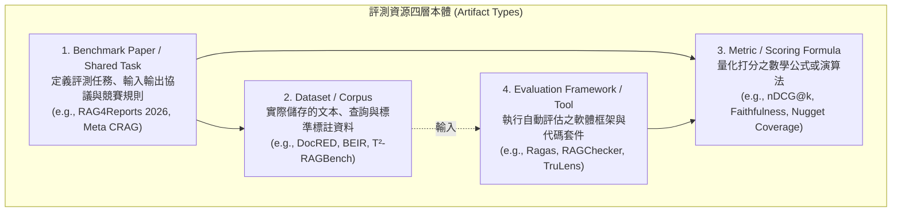
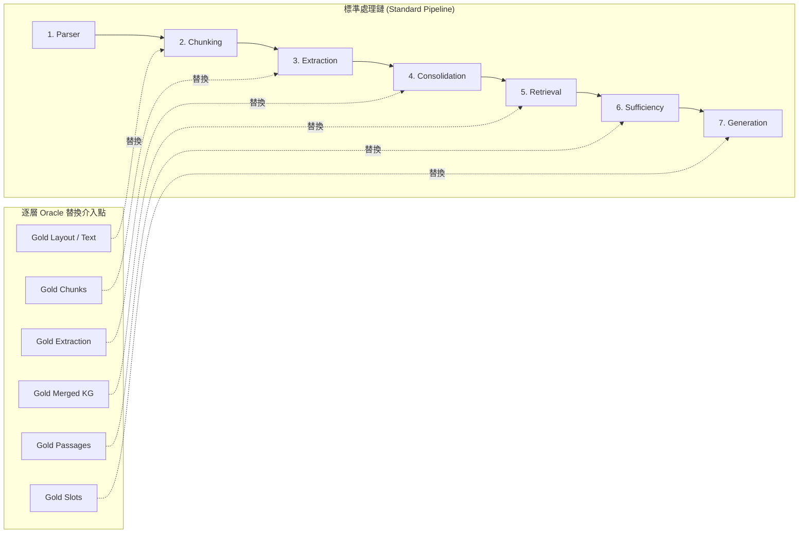

# Domain 17: RAG 評測基準與評估協議 (RAG Benchmarks & Evaluation Protocols)

> [!ABSTRACT] 核心研究問題 (Core Research Question)
> **如何建立涵蓋文件解析、知識抽取、多跳檢索、證據充分性、長篇生成與邏輯一致性的端到端 RAG 評測體系？如何嚴格區分 Benchmark（任務協議）、Dataset（資料集）、Metric（計分公式）與 Evaluation Framework（評估工具），避免非學術性的概念混淆？**
> 
> 本專題確立 RAG 評測工件之四層本體分類（Artifact Type Taxonomy），建立橫跨 12 個細分領域的全面評測矩陣，深入分析各基準「能測什麼」與「不能證明什麼」，並制定純文字資料研究之判準與失效歸因協議。

---

## 一、問題定義與研究邊界 (Problem Definition & Scope)

在長文本與 RAG 研究中，常見以下幾種嚴重的評測亂象：
1. **概念混稱（Conflation of Artifact Types）**：把 RAG4Reports（共享任務）、EFSG（參賽方法）、sentence_support（指標）寫成三個 Dataset；或把 Corrective RAG（方法）與 Meta 的 Comprehensive RAG Benchmark（CRAG，評測集）混為一談；
2. **單一指標遮蔽（Single Metric Illusion）**：僅回報單一最終答案的 Exact Match（EM）或 ROUGE 分數，無法定位是前端切塊、中端檢索還是後端生成的責任；
3. **合成任務過度推廣（Overclaiming from Synthetic Tests）**：將單針大海撈針（Single-needle NIAH）的 100% 滿分等同於系統具備完美的長文本理解或 RAG 推理能力；
4. **模態條件不清（Modality Ambiguity）**：在宣稱「純文字（Text-only）」研究時，卻混入包含圖像的視覺 PDF 評測集，未說明是否過濾了視覺測項。

本專題的研究邊界在於**定義標準化評估協議（Standardized Protocols）**，建立可溯源、可重現、可歸因的科學評測體系。

---

## 二、知識分類與評測工件四層本體 (Artifact Type Taxonomy)

為建立嚴格學術邊界，所有評測資源必須明確標註其**工件類型（Artifact Type）**：

### 純文字資料研究（Text-only Evaluation）的嚴格判準
當論文或系統宣稱「Text-only Evaluation」時，必須明確交代以下四個邊界條件：
- **原始語料性質**：語料中是否原生包含圖片、圖表或排版向量；
- **解析輸入方式**：方法是直接讀取抽取後的純文字/Markdown，還是調用多模態視覺模型（VLM）讀取頁面圖片；
- **Gold 標籤構成**：官方答案是否依賴圖像中的視覺幾何座標（Visual Bounding Box）或圖片內容；
- **表格處理機制**：表格是作為純文字化（Markdown / HTML / CSV）處理，還是保留原始渲染影像。

---

## 三、前人研究與代表性評測矩陣 (Prior Work & Literature Matrix)

完整詳細清單請同步對照 [[00 - 導覽與心智圖 (Navigation & MOC)/RAG Benchmark Catalog|RAG Benchmark Catalog]]。

| 研究階段 / 子題 | 評測資源名稱 | 工件類型 (Artifact Type) | 核心測試任務與 Gold 標註 | 局限性：這個 Benchmark 不能證明什麼？ | 官方來源連結 |
| :--- | :--- | :---: | :--- | :--- | :--- |
| **Parsing / Layout** | **DocLayNet** | `dataset` | 11 類版面區域（Paragraph, Table, Title 等）人工邊框標註 | **不測**文本內容語意理解與檢索準確度（純視覺版面分割）。 | [GitHub](https://github.com/DS4SD/DocLayNet) |
| **Entity / Relation**| **DocRED** | `dataset` | 跨句子命名實體、關係與指代消解 Gold | **不測**企業特定操作語意（無 F/R/D/A/P/C/T 標註）。 | [GitHub](https://github.com/thunlp/DocRED) |
| **Event Extraction** | **MAVEN** | `dataset` | 4,480 篇文檔，168 類事件觸發詞與論元 | **不測**深層跨章節商業合約時效狀態與條件依賴。 | [GitHub](https://github.com/THU-KEG/MAVEN-dataset) |
| **Dense/Sparse 檢索**| **BEIR** | `dataset` / `benchmark_paper` | 18 個跨領域檢索資料集，nDCG@10, Recall@k | 主要衡量**第一階段檢索**跨域泛化，**不測**完整長篇報告生成。 | [GitHub](https://github.com/beir-cellar/beir) |
| **多跳關聯推理** | **HotpotQA / MultiHop-RAG**| `dataset` | 多跳推理問答，附帶 Supporting Facts 證據鏈標註 | 各資料集 Supporting Fact 粒度不同，分數不可直接橫向相加。 | [HotpotQA](https://hotpotqa.github.io/) · [MultiHop-RAG](https://github.com/yixuantt/MultiHop-RAG) |
| **RAG 細粒度診斷** | **RAGChecker** | `evaluation_framework` | Claim 級雙向診斷（Retrieval & Generation 精確率與召回率）| 是一個**評估診斷工具**，不可直接當作開放域問答之原始語料庫。 | [GitHub](https://github.com/amazon-science/RAGChecker) |
| **動態衝突與時效** | **Re² Bench (Re³)** | `dataset` / `benchmark_paper` | 時效敏感事實問答，注入過期舊版本干擾項 | 不能推廣為「最新文檔永遠為正解」的萬能證明。 | [ACL Anthology](https://aclanthology.org/2026.acl-long.1180/) |
| **證據充分性** | **Evidence Sufficiency BM** | `benchmark_paper` / `dataset` | 5 種證據充分性狀態（Full/Partial/Absent 等），測拒答能力 | 僅評估回答-拒答校準率，**不包含**專案權威治理標籤。 | [CMC 2026](https://doi.org/10.32604/cmc.2026.086343) |
| **表格與數值推理** | **T²-RAGBench** | `dataset` / `benchmark_paper` | 文字與表格混合檢索，23,088 組問答與數值推理 | 正式發表版為 23,088 組；早期預印本釋出版本須另行註記。 | [EACL 2026](https://aclanthology.org/2026.eacl-long.8/) · [HF](https://huggingface.co/datasets/G4KMU/t2-ragbench) |
| **長文本基礎力** | **RULER / LongBench**| `benchmark_paper` | 檢索、聚合、變數追蹤、多任務長文本測試 | 證明長文本注意力容量，**不單獨證明** RAG、充分性或長文寫作品質。| [GitHub RULER](https://github.com/NVIDIA/RULER) |
| **長篇報告生成** | **RAG4Reports 2026** | `benchmark_paper` / Shared Task | 長篇報告生成評測（Sentence Support, Nugget Coverage） | Shared Task 競賽協議，資料存取條款與驗證需個別核實。 | [Official](https://rag4reports.github.io/) |
| **事實優先報告** | **EviReportBench** | `benchmark_paper` / `dataset` | 事實準確度（Accuracy）與覆蓋率（Coverage）多維評估 | 包含多模態測項，純文字研究需排除視覺測項。 | [ACL Findings](https://aclanthology.org/2026.findings-acl.1397/) |
| **報告級宏觀邏輯** | **ReportLogic** | `benchmark_paper` / `dataset` | 篇章結構邏輯、論證嚴密性評估（LogicJudge） | 官方 Repo 標註資料集尚待審核釋出，不可虛標為已能完整重現。 | [GitHub](https://github.com/Polaris-JZ/ReportLogic) |

---

## 四、核心方法機制與架構對比 (Methodology & Architectural Comparison)

### 端到端層級失效歸因協議 (Oracle Layer Attribution Protocol)
為避免將下游 QA 失敗簡單歸咎於單一模組，本協議提出逐層替換的 Oracle 實驗規範：

### 歸因診斷矩陣
1. 若將 Actual Retrieval 替換為 **Gold Retrieval Oracle** 後，答案準確率大幅躍升 $\Delta > 30\%$，則主要系統瓶頸在**檢索端（Retriever Bottleneck）**；
2. 若即使給予 100% Gold Evidence，答案錯誤率依然居高不下，則主要瓶頸在**上下文利用與生成端（Generator / Context Utilization Bottleneck）**；
3. 若將 Actual Extraction 替換為 **Gold Extraction Oracle** 後，圖檢索效果顯著超越純文字檢索，則證明原系統之缺陷在於**抽取誤差累積（Extraction Error Propagation）**，而非圖表示架構本身無效。

---

## 五、失效模式與工程陷阱 (Failure Modes & Error Taxonomy)

1. **Benchmark 污染（Data Leakage / Pretraining Contamination）**：
   - 使用開放領域常見基準（如 SQuAD 或 HotpotQA）測試閉源模型，由於測試集文本已進入模型預訓練語料，模型不看檢索結果亦能憑記憶回答，導致 RAG 評測完全失真。
2. **LLM-as-a-Judge 系統偏置（Judge Biases）**：
   - 評估長篇報告時，評判 LLM 存在自偏好（Self-enhancement bias，傾向給自己生成的文本打高分）、長度偏置（Verbosity bias，篇幅越長分數越高）與位置偏置。
3. **不可重現的 API 評測（Irreproducible Dynamic Baselines）**：
   - 未固定評估時所調用的商業模型版本號（如僅寫 `gpt-4` 而未鎖定具體快照日期 `gpt-4-0613`），導致數月後實驗無法重現。

---

## 六、評測基準與資料集對齊 (Benchmarks, Datasets & Metrics)

評測協議之執行必須嚴格遵循以下四個步驟：
1. **資料版本鎖定**：記錄資料集的下載日期、Git Commit Hash 或 Hugging Face 具體 Revision；
2. **模態一致性檢查**：若採用純文字流程，必須將包含視覺幾何圖片的樣本過濾，並在實驗報告中明確說明過濾規則；
3. **成本與延遲對齊**：不得將一個發起 10 輪檢索、耗費 50,000 Tokens 的 Agent 系統，與僅發起 1 輪檢索、耗費 1,000 Tokens 的 Baseline 進行無條件準確率比較；必須同時呈現 **Token 成本、推論延遲（TTFT）與顯存佔用**。

---

## 七、開放研究問題與可反駁假設 (Open Problems & Falsifiable Hypotheses)

### 待驗證假設 17-A (Oracle Error Localization Validity)
- **假說**：相較於端到端黑盒評估，採用「逐層 Oracle 替換協議（Oracle Layer Attribution）」，能夠將複雜長文本 RAG 系統中各組件（Parser, Chunker, Extractor, Retriever, Generator）對最終錯誤的責任歸因一致性（Human Expert Attribution Agreement）提升至 85% 以上。
- **Baseline**：端到端最終答案評估、純檢索 Recall 評估。
- **反駁條件**：若不同組件之間的誤差存在高度非線性耦合（例如錯誤的切塊反而意外補償了抽取器的特定偏差），導致單層替換無法單調反映模組優劣，則該線性解耦假設需被修正。

---

## 八、文獻來源與相關專題導覽 (Sources, Citations & Wikilinks)

- **核心論文**：
  - [[03 - 論文庫 (Literature Notes)/06 - Benchmarks & Evaluation/(NAACL 2024-06) ARES - An Automated Evaluation Framework for Retrieval-Augmented Generation Systems|ARES: Automated RAG Evaluation with Prediction-Powered Inference (Saad-Falcon et al., NAACL 2024)]]
  - [[03 - 論文庫 (Literature Notes)/06 - Benchmarks & Evaluation/(ACL 2024-08) RAGTruth - A Hallucination Corpus for Developing Trustworthy Retrieval-Augmented Language Models|RAGTruth: Hallucination Corpus for RAG (Yuan et al., ACL 2024)]]
  - [[03 - 論文庫 (Literature Notes)/06 - Benchmarks & Evaluation/(arXiv 2024-06) RAGBench - Explainable Benchmark for Retrieval-Augmented Generation Systems|RAGBench: Explainable Benchmark for RAG Systems (Truong et al., arXiv 2024)]]
  - [[03 - 論文庫 (Literature Notes)/06 - Benchmarks & Evaluation/(COLM 2024-10) MultiHop-RAG - Benchmarking Retrieval-Augmented Generation for Multi-Hop Queries|MultiHop-RAG: Benchmarking Multi-Hop Queries in RAG (Tang & Yang, COLM 2024)]]
  - [[03 - 論文庫 (Literature Notes)/06 - Benchmarks & Evaluation/(NeurIPS 2021-12) BEIR - A Heterogeneous Benchmark for Zero-shot Evaluation of Information Retrieval Models|BEIR: Zero-shot Information Retrieval Benchmark (Thakur et al., NeurIPS 2021)]]
  - [[03 - 論文庫 (Literature Notes)/06 - Benchmarks & Evaluation/(EMNLP 2018-10) HotpotQA - A Dataset for Diverse, Explainable Multi-hop Question Answering|HotpotQA: Multi-hop QA with Supporting Facts (Yang et al., EMNLP 2018)]]
  - [[03 - 論文庫 (Literature Notes)/06 - Benchmarks & Evaluation/(EACL 2026-03) T2-RAGBench - Benchmarking Text-and-Table Retrieval Augmented Generation|T²-RAGBench: Text-and-Table RAG Benchmark (Li et al., EACL 2026)]]
  - [[03 - 論文庫 (Literature Notes)/06 - Benchmarks & Evaluation/(arXiv 2024-08) RAGChecker - A Fine-grained Framework for Diagnosing Retrieval-Augmented Generation|RAGChecker: Fine-grained RAG Diagnosis (Ru et al., NeurIPS 2024)]]
  - [[03 - 論文庫 (Literature Notes)/06 - Benchmarks & Evaluation/(EACL 2024-03) RAGAS - Automated Evaluation of Retrieval Augmented Generation|RAGAS: Automated Evaluation of RAG (Es et al., EACL 2024)]]
  - [[03 - 論文庫 (Literature Notes)/06 - Benchmarks & Evaluation/(arXiv 2024-04) RULER - What is the Real Context Size of Your Long-Context Language Models|RULER: Real Context Size Benchmark (Hsieh et al., 2024)]]
- **專題連動**：
  - [[02 - 研究領域專題 (Research Domains)/Domain 10 - 評估基準、系統工程與安全 (Benchmarks & Safety)|Domain 10: 評估基準、系統工程與安全]]
  - [[02 - 研究領域專題 (Research Domains)/Domain 14 - Evidence Sufficiency & Adaptive Retrieval|Domain 14: 證據充分性與自適應檢索]]
  - [[02 - 研究領域專題 (Research Domains)/Domain 16 - Context Utilization & Faithfulness|Domain 16: 上下文利用率與忠實度]]
- **研究提案**：
  - [[04 - 研究想法與待驗證提案 (Ideas & Hypotheses)/Idea 04 - End-to-End RAG Failure Attribution and Evidence Governance|Idea 04: 端到端 RAG 失效歸因]]
- **評測索引與主導覽**：
  - [[00 - 導覽與心智圖 (Navigation & MOC)/RAG Benchmark Catalog|RAG Benchmark Catalog (基準總索引)]]
  - [[00 - 導覽與心智圖 (Navigation & MOC)/Home (主目錄與知識庫導覽)|主目錄與知識庫導覽]]
