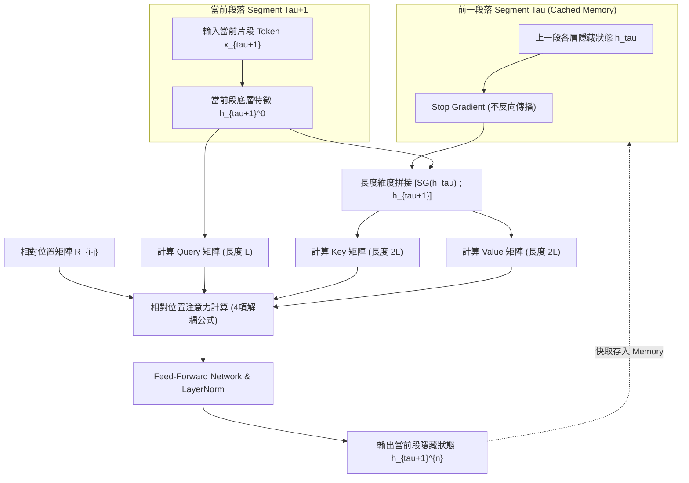

# Transformer-XL: Attentive Language Models Beyond a Fixed-Length Context

> [!INFO] 論文元數據 (Metadata)
> - **Paper ID**：`Dai2019_TransformerXL`
> - **作者**：Zihang Dai, Zhilin Yang, Yiming Yang, Jaime Carbonell, Quoc V. Le, Ruslan Salakhutdinov (CMU & Google Brain)
> - **預印本初次發布年份 (Preprint)**：2019 (arXiv:1901.02860)
> - **正式發表年份 / 會議或期刊 (Venue)**：2019 (ACL 2019, Oral)
> - **DOI**：[10.18653/v1/P19-1285](https://doi.org/10.18653/v1/P19-1285)
> - **arXiv**：[1901.02860](https://arxiv.org/abs/1901.02860)
> - **驗證狀態**：`verified` (已比對 ACL 官方全文與論文 PDF)
> - **本地 PDF 連結**：[[Papers/01 - Long Context & Sequence/(ACL 2019-07) Transformer-XL - Attentive Language Models Beyond a Fixed-Length Context.pdf|開啟本地 PDF 檔案]]
---

## 一話摘要 (TL;DR)
Transformer-XL 透過**分段循環機制（Segment-Level Recurrence）**與**相對位置編碼（Relative Positional Encoding）**，打破了標準 Transformer 的固定長度上下文截斷限制，在無須破壞時間因果連貫性的前提下，實現跨分段的長程依賴建模並消除上下文碎片化（Context Fragmentation），推論速度最高提升 1,874 倍。

---

## 研究背景與問題定義 (Problem Statement)

### 1. 核心痛點
原生 Transformer（Vaswani et al., 2017）受限於固定長度上下文窗口（Fixed-Length Context）：
1. **上下文碎片化問題（Context Fragmentation）**：訓練時長文本被生硬切成固定長度片段（例如 512 tokens），切分邊界完全忽略語意與句法結構，導致模型無法跨片段傳遞語意資訊。
2. **長程依賴上限（Context Length Limit）**：最大依賴距離受限於訓練長度 $L$，無法捕捉跨數千甚至上萬 tokens 的篇章級依賴。
3. **推論極度低效（Evaluation Inefficiency）**：標準語言模型評測時，為了利用最大長度上下文，往往需要逐個 token 滑動窗口（Sliding Window with Step 1），每次預測全新 token 都要重新計算前 $L$ 個 token 的隱藏狀態，造成極嚴重的計算浪費。

### 2. 研究假設
若能在處理當前片段（Segment）時，快取前一個（或數個）片段的歷史隱藏狀態作為 Key 和 Value 且停止梯度回傳（`stop_gradient`），配合能正確反映跨片段相對距離的編碼機制，即可讓模型自然感知超過固定訓練長度數倍的長程上下文。

---

## 核心方法與技術架構 (Methodology & Architecture)

### 1. 分段循環機制 (Segment-Level Recurrence Mechanism)
設相鄰兩個連續片段為 $s_\tau = [x_{\tau,1}, \dots, x_{\tau,L}]$ 與 $s_{\tau+1} = [x_{\tau+1,1}, \dots, x_{\tau+1,L}]$。在計算片段 $s_{\tau+1}$ 第 $n$ 層的隱藏狀態時，將前一片段對應層的隱藏狀態 $h_\tau^{n-1}$ 快取下來，進行拼接（Extended Context）：

$$\tilde{h}_{\tau+1}^{n-1} = [\text{SG}(h_\tau^{n-1}) \circ h_{\tau+1}^{n-1}]$$

其中 $\text{SG}(\cdot)$ 代表停止梯度反傳（Stop-gradient），$\circ$ 表示沿長度維度拼接。接著透過延伸狀態計算 $K$ 與 $V$：

$$q_{\tau+1}^n = h_{\tau+1}^{n-1} W_q^\top$$
$$k_{\tau+1}^n = \tilde{h}_{\tau+1}^{n-1} W_k^\top$$
$$v_{\tau+1}^n = \tilde{h}_{\tau+1}^{n-1} W_v^\top$$

$$h_{\tau+1}^n = \text{Transformer-Layer}(q_{\tau+1}^n, k_{\tau+1}^n, v_{\tau+1}^n)$$

透過每層的遞歸連接，在 $N$ 層網路中，最大有效感受野隨層數線性疊加：最大可捕捉 $O(N \times L)$ 的歷史依賴。

### 2. 相對位置編碼 (Relative Positional Encoding)
傳統絕對位置編碼中，若直接將 $s_\tau$ 與 $s_{\tau+1}$ 的隱藏狀態拼接，兩者會具有相同的位置編碼 $U_{1:L}$，導致注意力模組無法區分兩者。Transformer-XL 將注意力分數公式完全解耦為相對位置形式：

標準絕對位置注意力分數：
$$\mathbf{A}_{i,j}^{\text{abs}} = q_i^\top k_j = (E_{x_i} + U_i) W_q W_k^\top (E_{x_j} + U_j)^\top = E_{x_i}^\top W_q W_k^\top E_{x_j} + E_{x_i}^\top W_q W_k^\top U_j + U_i^\top W_q W_k^\top E_{x_j} + U_i^\top W_q W_k^\top U_j$$

Transformer-XL 提出四項替換：
1. 將絕對位置 $U_j$ 替換為正弦相對位置編碼矩陣 $R_{i-j}$；
2. 將 Query 側的絕對位置 $U_i$ 替換為可學習偏置向量 $u$（針對內容）與 $v$（針對位置）；
3. 區分內容投影矩陣 $W_{k,E}$ 與位置投影矩陣 $W_{k,R}$：

$$\mathbf{A}_{i,j}^{\text{rel}} = \underbrace{q_i^\top k_{j,E}}_{\text{Content-Content}} + \underbrace{q_i^\top W_{k,R}^\top R_{i-j}}_{\text{Content-Dependent Position}} + \underbrace{u^\top k_{j,E}}_{\text{Global Content Bias}} + \underbrace{v^\top W_{k,R}^\top R_{i-j}}_{\text{Global Position Bias}}$$

### 系統架構流程圖 (Mermaid)

#### 圖中節點對照表 (Mermaid Node Mapping)
- `PrevSegment`：歷史片段快取區（Stop-Gradient Memory）
- `CurrSegment`：當前計算片段（Current Active Segment）
- `Concat`：長度維度拼接延伸上下文 $\tilde{h}$
- `RelPos`：正弦相對位置矩陣 $R_{i-j}$
- `RelAttn`：解耦式相對注意力核心計算單元

---

## 主要實驗結果與證據 (Empirical Results & Evidence)

> [!NOTE] 關鍵實證數據與評估條件
> 所有實驗均由 ACL 2019 官方論文直接核對：

1. **詞級語言建模 (Word-Level Language Modeling)**：
   - **WikiText-103 (Table 1, Page 6)**：
     - 基線模型 Baevski & Auli (2018) PPL 為 `20.5`；
     - Transformer-XL（16-layer / 257M 參數量）達到 **PPL `18.3`**，創下新 SOTA，顯著超越同參數量級模型。
   - **One Billion Word (Table 4, Page 7)**：
     - 在無跨句子結構的大型雜湊語料庫上，Transformer-XL 達到 **PPL `21.8`**，超越十倍容量的 RNN/Vanilla Transformer 模型。
2. **字符級語言建模 (Character-Level Language Modeling)**：
   - **enwik8 (Table 2, Page 6)**：
     - 12 層版本達到 `1.06 bpc`；
     - 24 層版本達到 **`0.99 bpc`**，為學術界首次在 enwik8 基準突破 1.0 bpc 大關。
   - **text8 (Table 3, Page 6)**：
     - 達到 **`1.08 bpc`**，優於以前最佳的 1.13 bpc。
3. **長程依賴能力評估 (Effective Context Length, Figure 4, Page 13)**：
   - 相較於標準 Transformer，Transformer-XL 有效依賴長度增加了 **450%**（可有效利用長達 900+ tokens 的上下文）；相較於 LSTM 增加 **80%**。
4. **推論速度對比 (Evaluation Speedup, Page 8)**：
   - 傳統 Transformer 在滑動窗口評測時需逐 token 重新編碼整段歷史；
   - Transformer-XL 透過片段遞歸與 Memory 快取，單次推論步進整個片段長度（如 $L=512$ 或 $1024$），在 WikiText-103 評測上取得高達 **1,874 倍**的極致推論加速。

---

## 優勢、限制及 Trade-offs (Strengths, Limitations & Trade-offs)

### 1. 技術優勢
- **消除 Context Fragmentation**：邊界不再切割上下文語意，段落間透過快取 Memory 自然平滑過渡。
- **推論極限加速**：評測與生成無需對歷史 tokens 重複進行前向計算，直接重用 KV/Hidden Memory。
- **相對位置編碼先驅**：奠定現代位置編碼（如 T5 Relative Bias、RoPE、ALiBi）解耦與相對化設計的理論雛形。

### 2. 限制與潛在弱點
- **單向因果限制**：分段循環本質上依賴時間維度的因果順序（Causal Masking），無法直接套用於雙向 Encoder（如 BERT）。
- **記憶體成本隨層數線性增長**：每層均需快取 $M$ 長度的歷史隱藏層，當模型深度增加時，GPU 記憶體開銷不可忽略。
- **依賴距離仍有實體界限**：雖然理論感受野為 $O(N \times L)$，但在實際訓練中梯度僅在當前 segment 反傳（BPTT 截斷），超長距離資訊只能依賴隱式前向轉移，缺乏跨多個片段的直接梯度引導。

---

## 對本專案研究領域的實際意義 (Implications for Research Domains)

1. **對 Domain 01 (Long Context & Sequence) 的啟發**：
   - Transformer-XL 是現代長序列架構演進史上承前啟後的關鍵節點。它證明了「以快取換計算」及「相對位置編碼」是解除固定長度限制的兩大黃金法則。
2. **對 Domain 02 (KV Cache 管理) 的奠基**：
   - 其 Segment Recurrence Memory 快取機制，正是現代 LLM Serving 中 KV Cache 重用（Prompt Cache / Chunked Prefill / Rolling Cache）的最早實踐形態。
3. **對長文件生成系統的工程借鑑**：
   - 在章節級長篇小說或技術報告生成中，Transformer-XL 提供了「分段生成、隱藏狀態向前流動」的範例架構。

---

## 原始來源及相關筆記連結 (Sources & Related Notes)

- **所屬研究領域**：
  - [[02 - 研究領域專題 (Research Domains)/Domain 01 - Long Context 與序列架構 (Attention, SSM, Ring)|Domain 01 - Long Context 與序列架構 (Attention, SSM, Ring)]]
- **本地 PDF 原文**：
  - [[Papers/01 - Long Context & Sequence/(ACL 2019-07) Transformer-XL - Attentive Language Models Beyond a Fixed-Length Context.pdf|開啟本地 PDF 檔案]]
- **相關演進技術筆記**：
  - [[03 - 論文庫 (Literature Notes)/01 - Long Context & Sequence/(NeurIPS 2017-12) Attention Is All You Need|Attention Is All You Need]]
  - [[03 - 論文庫 (Literature Notes)/01 - Long Context & Sequence/(ACL 2020-07) Longformer - The Long-Document Transformer|Longformer]]
  - [[03 - 論文庫 (Literature Notes)/01 - Long Context & Sequence/(ICLR 2024-05) Efficient Streaming Language Models with Attention Sinks|StreamingLLM]]
- **回主目錄與導覽**：
  - [[00 - 導覽與心智圖 (Navigation & MOC)/Home (主目錄與知識庫導覽)|主目錄與知識庫導覽]]
  - [[03 - 論文庫 (Literature Notes)/README|論文庫總覽]]
