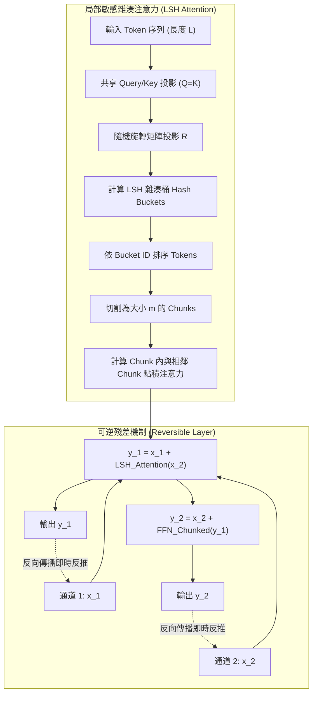

# Reformer: The Efficient Transformer

> [!INFO] 論文元數據 (Metadata)
> - **Paper ID**：`Kitaev2020_Reformer`
> - **作者**：Nikita Kitaev, Łukasz Kaiser, Anselm Levskaya (UC Berkeley & Google Research)
> - **預印本初次發布年份 (Preprint)**：2020 (arXiv:2001.04451)
> - **正式發表年份 / 會議或期刊 (Venue)**：2020 (ICLR 2020)
> - **DOI**：無 (OpenReview)
> - **arXiv**：[2001.04451](https://arxiv.org/abs/2001.04451)
> - **驗證狀態**：`verified` (已比對 ICLR 官方全文與論文 PDF)
> - **本地 PDF 連結**：[[Papers/01 - Long Context & Sequence/(ICLR 2020-04) Reformer - The Efficient Transformer.pdf|開啟本地 PDF 檔案]]
---

## 一話摘要 (TL;DR)
Reformer 透過**局部敏感雜湊注意力（Locality-Sensitive Hashing Attention, LSH）**將計算複雜度從 $O(L^2)$ 降低至 $O(L \log L)$，並引進**可逆殘差網路（Reversible Residual Layers, RevNet）**消除各層激活值快取，使長序列記憶體佔用脫離模型層數相依性，首次實現在單一 GPU/TPU 上訓練與推論長達 64K tokens 的深度 Transformer。

---

## 研究背景與問題定義 (Problem Statement)

### 1. 核心痛點
Transformer 在處理長序列時面臨雙重物理限制：
1. **注意力計算的時間與顯存二次方瓶頸**：$N \times N$ 注意力矩陣的乘法與儲存，在 $L \ge 64\text{K}$ 時需要數十 GB 顯存，直接引發 OOM（Out Of Memory）。
2. **多層中間激活值佔用海量記憶體**：在反向傳播計算梯度時，標準 Transformer 必須保存每一層所有 Token 的激活值（Activations），顯存開銷為 $O(b \cdot L \cdot d_{\text{model}} \cdot n_l)$。例如 16 層、64K 長度、batch size 1 的網路，激活值就需要佔用超過 16GB 顯存，遠大於模型權重本身。

### 2. 研究假設
1. 在注意力分佈中，大多數 Query 只對極少數具有高相似度的 Key 產生顯著權重（Softmax 的稀疏特性）。若能藉由**局部敏感雜湊（LSH）**快速將相似的 Query 與 Key 歸入相同 Bucket，即可只在同桶內計算局部注意力，而無需計算全量點積。
2. 若採用**可逆架構（Reversible Architecture）**，在反向傳播時可從後一層的輸出即時反解出前一層的輸入，即無需在記憶體中快取每一層的中間激活值。

---

## 核心方法與技術架構 (Methodology & Architecture)

### 1. 局部敏感雜湊注意力 (LSH Attention)
傳統注意力計算為 $\text{Softmax}(Q K^\top / \sqrt{d}) V$。在 LSH Attention 中：
1. **共享 Query 與 Key ($Q=K$)**：透過共享投影，讓 Query 與 Key 位於同一向量空間。
2. **隨機投影雜湊 (Angular LSH)**：使用隨機旋轉矩陣 $R$，定義雜湊函數 $h(x) = \arg\max([x R; -x R])$。高維空間中夾角相近的向量具有極高機率被雜湊至同一個桶（Bucket）。
3. **桶內排序與分塊 (Sorting & Chunking)**：
   - 依照桶 ID 對所有 Tokens 進行排序；
   - 排序後切割為大小為 $m = 2L / n_{\text{buckets}}$ 的區塊（Chunks）；
   - 每個 Token 僅關注當前區塊以及前一個相鄰區塊內的 Tokens（以防跨區塊邊界遺漏）。
4. **多輪雜湊 (Multi-round LSH Attention)**：為了降低雜湊碰撞失誤率，平行執行 $n_{\text{rounds}}$ 輪獨立隨機雜湊並融合注意力集合。時間複雜度降為 $O(n_{\text{rounds}} \cdot L \log L)$。

### 2. 可逆殘差層 (Reversible Transformer Layers)
借鑑 Gomez et al. (2017) 的 RevNet 概念，將輸入向量切分為雙通道對 $(x_1, x_2)$：

前向傳播：
$$y_1 = x_1 + \text{Attention}(x_2)$$
$$y_2 = x_2 + \text{FeedForward}(y_1)$$

反向傳播時，無需儲存 $x_1, x_2$ 的激活值，可完全由輸出反推輸入：
$$x_2 = y_2 - \text{FeedForward}(y_1)$$
$$x_1 = y_1 - \text{Attention}(x_2)$$

這使得整座網路的激活值儲存複雜度從 $O(n_l \cdot L)$ 銳減為與層數無關的 $O(L)$！

### 3. 前饋層分塊計算 (FFN Chunking)
由於前饋層（Feed-Forward）在 token 間完全獨立，因此將序列在長度維度進一步切成 $c$ 個小區塊分批計算：$O(b \cdot L \cdot d_{ff}) \to O(b \cdot \frac{L}{c} \cdot d_{ff})$，徹底壓低峰值顯存。

### 系統架構流程圖 (Mermaid)

#### 圖中節點對照表 (Mermaid Node Mapping)
- `SharedQK`：共享 Query-Key 投影空間
- `RandProj`：隨機正交旋轉雜湊映射（Angular LSH）
- `SortBuckets`：依雜湊值將語意相似 Token 集中排序
- `ChunkBlocks`：局部區塊切割
- `RevNet`：無激活值快取的可逆雙通道殘差層

---

## 主要實驗結果與證據 (Empirical Results & Evidence)

> [!NOTE] 關鍵實證數據與評估條件
> 所有實驗均由 ICLR 2020 原文直接核對：

1. **LSH 注意力近似精度驗證 (Synthetic Duplication Task, Table 2, Page 5)**：
   - 評測在序列複製任務上的表現：
     - 單輪雜湊（LSH-1）：準確率為 `77.9%`；
     - 雙輪雜湊（LSH-2）：準確率提升至 `98.1%`；
     - 四輪雜湊（LSH-4）：達到 `99.9%`；
     - 八輪雜湊（LSH-8）：達到 **`100.0%`**，與全量 Full Attention 完全無損一致。
2. **可逆架構效能無損驗證 (Machine Translation, Table 4, Page 8)**：
   - 在 WMT 2014 En-De 基準上：
     - 標準 Transformer Base：BLEU 為 `27.3`；
     - Reversible Transformer Base（100K 步）：BLEU 達到 **`27.6`**；
     - Reversible Transformer Big（300K 步）：BLEU 達到 **`29.1`**；
     - 證實可逆殘差架構在顯存大幅壓縮的同時，完全不損害模型收斂與下游生成能力。
3. **長文本訓練與延遲曲線 (Figure 5, Page 9)**：
   - **enwik8 64K 極限長度**：成功在單一設備上訓練 16 層、長度達 **64,000 tokens** 的模型；標準 Transformer 在此設定下因 OOM 完全無法啟動。
   - **推論延遲曲線 (Figure 5 Right)**：當長度從 1K 延伸至 64K 時，Full Attention 的推論時間呈陡峭二次方飆升，而 Reformer 的推論時間曲線幾乎保持水平平緩（Flat）。

---

## 優勢、限制及 Trade-offs (Strengths, Limitations & Trade-offs)

### 1. 技術優勢
- **極低顯存佔用**：可逆層讓模型深度 $n_l$ 的激活值顯存開銷歸零，真正實現「深層且長序列」之訓練。
- **計算複雜度由二次方降至次二次方**：從 $O(L^2)$ 降為 $O(L \log L)$，為後續線性/次二次方注意力研究開啟先河。

### 2. 限制與工程 Trade-offs
- **排序與雜湊帶來的硬體不友好性**：LSH 過程中的動態排序（Sorting）與雜湊映射牽涉頻繁的動態記憶體索引（Gather/Scatter），在現代 GPU 架構（如 Tensor Cores）上計算吞吐利用率低於密集的 GEMM。
- **因果掩碼（Causal Masking）複雜化**：在自回歸生成時，排序後需額外加入位置索引遮罩，且共享 $Q=K$ 限制了模型表徵能力（無法區分 Query 與 Key 的不對稱關注需求）。
- **後續被 IO-Aware 與 FlashAttention 取代**：隨著硬體頻寬與 FlashAttention 等晶上 Tiling 演算法的成熟，完全精確的 Exact Attention 在現代實務中比近似 LSH 更加高效穩定。

---

## 對本專案研究領域的實際意義 (Implications for Research Domains)

1. **對 Domain 01 (Long Context & Sequence) 的啟發**：
   - Reformer 是早期解決二次方計算與顯存爆炸的集大成者。其提出的可逆殘差思想啟發了後續眾多長序列架構（如 RevViT、Mamba 中的梯度重算設計）。
2. **對 Domain 02 (KV Cache 與顯存優化) 的理論價值**：
   - 證明了「激活值顯存」在長文本中佔比遠高於權重顯存，推動了後續顯存優化從單純關注權重轉向關注動態狀態（KV Cache / Activation Memory）。

---

## 原始來源及相關筆記連結 (Sources & Related Notes)

- **所屬研究領域**：
  - [[00 - 導覽與心智圖 (Navigation & MOC)/RAG Adjacent Interfaces|A01 Long Context & Sequence Architecture]]
- **本地 PDF 原文**：
  - [[Papers/01 - Long Context & Sequence/(ICLR 2020-04) Reformer - The Efficient Transformer.pdf|開啟本地 PDF 檔案]]
- **相關演進技術筆記**：
  - [[03 - 論文庫 (Literature Notes)/01 - Long Context & Sequence/(ACL 2019-07) Transformer-XL - Attentive Language Models Beyond a Fixed-Length Context|Transformer-XL]]
  - [[03 - 論文庫 (Literature Notes)/01 - Long Context & Sequence/(ICLR 2021-05) Rethinking Attention with Performers|Performer]]
  - [[03 - 論文庫 (Literature Notes)/01 - Long Context & Sequence/(NeurIPS 2022-12) FlashAttention - Fast and Memory-Efficient Exact Attention with IO-Awareness|FlashAttention]]
- **回主目錄與導覽**：
  - [[00 - 導覽與心智圖 (Navigation & MOC)/Home (主目錄與知識庫導覽)|主目錄與知識庫導覽]]
  - [[03 - 論文庫 (Literature Notes)/README|論文庫總覽]]
