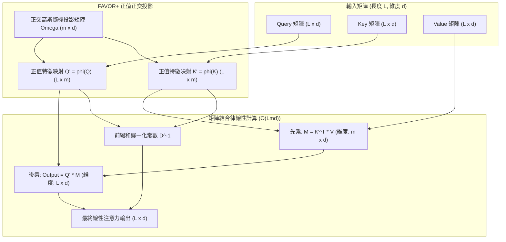

# Rethinking Attention with Performers

> [!INFO] 論文元數據 (Metadata)
> - **Paper ID**：`Choromanski2021_Performer`
> - **作者**：Krzysztof Choromanski, Valerii Likhosherstov, David Dohan, Xingyou Song, Andreea Gane, Tamas Sarlos, Peter Hawkins, Jared Davis, Afroz Mohiuddin, Lukasz Kaiser, David Belanger, Lucy Colwell, Adrian Weller (Google Research, Cambridge, DeepMind)
> - **預印本初次發布年份 (Preprint)**：2020 (arXiv:2009.14794)
> - **正式發表年份 / 會議或期刊 (Venue)**：2021 (ICLR 2021)
> - **DOI**：無 (OpenReview)
> - **arXiv**：[2009.14794](https://arxiv.org/abs/2009.14794)
> - **驗證狀態**：`verified` (已比對 ICLR 官方全文與論文 PDF)
> - **本地 PDF 連結**：[[Papers/01 - Long Context & Sequence/(ICLR 2021-05) Rethinking Attention with Performers.pdf|開啟本地 PDF 檔案]]
---

## 一話摘要 (TL;DR)
Performer 提出 **FAVOR+（Fast Attention Via positive Orthogonal Random features）** 機制，透過**嚴格正值正交隨機特徵（Positive Orthogonal Random Features）**無偏估計 Softmax 注意力核，利用矩陣結合律打破注意力計算的二次方壁壘，將時間與空間複雜度嚴格降至與序列長度成**線性關係 $O(L)$**，且可無縫相容預訓練 Transformer 權重。

---

## 研究背景與問題定義 (Problem Statement)

### 1. 核心痛點
標準 Softmax 注意力矩陣乘法 $(Q K^\top) V$ 具備 $O(L^2)$ 的時空複雜度。為解決此問題，早期高效 Attention 嘗試透過核方法（Kernel Trick）將 Softmax 核分解為映射特徵的內積：

$$\text{Kernel}(q, k) \approx \phi(q)^\top \phi(k)$$

然而，傳統的隨機特徵映射（如基於三角函數的 Rahimi & Recht 隨機傅立葉特徵）存在致命缺陷：
1. **負核值崩潰（Negative Kernel Values）**：隨機特徵內積可能產生負數，破壞了 Softmax 權重全為正值的概率分佈特性，導致除以歸一化常數時出現分母接近零或負值，造成訓練極度不穩定甚至數值發散（NaN）。
2. **估計方差過大（High Estimator Variance）**：採用獨立同分佈（IID）隨機向量進行 Monte Carlo 取樣時，近似方差隨維度增大而劇增，需要極多特徵數 $m$ 才能收斂，抵消了加速優勢。

### 2. 研究假設
若能構建一種數學上**嚴格保證非負性（Strict Positivity）**的特徵映射函數 $\phi(x)$，並透過**正交隨機矩陣（Orthogonal Random Features）**強力壓低估計方差，即可在維持全秩 Softmax 注意力表達能力的同時，透過矩陣結合律實現精確且穩定的線性複雜度。

---

## 核心方法與技術架構 (Methodology & Architecture)

### 1. FAVOR+ 機制：正值正交隨機特徵
Softmax 核定義為 $\text{SM}(x, y) = \exp(x^\top y / \tau)$。利用高斯特徵恆等式：

$$\exp(x^\top y) = \exp\left(-\frac{\|x\|^2}{2}\right) \exp\left(\frac{\|x+y\|^2}{2}\right) \exp\left(-\frac{\|y\|^2}{2}\right)$$

FAVOR+ 構造正值特徵映射 $\phi(x)$：

$$\phi(x) = \frac{h(x)}{\sqrt{m}} \left[ \exp\left(\omega_1^\top x - \frac{\|x\|^2}{2}\right), \dots, \exp\left(\omega_m^\top x - \frac{\|x\|^2}{2}\right) \right]^\top$$

其中 $\omega_1, \dots, \omega_m$ 為隨機採樣的高斯向量。此映射具備關鍵特性：
1. **嚴格正值（Strictly Positive）**：所有維度均為指數函數輸出，保證注意力權重 $\phi(q)^\top \phi(k) > 0$，徹底消除數值發散。
2. **正交結構（Orthogonal Features, ORF）**：將隨機向量塊組裝為正交矩陣（$W W^\top = I$），利用 Gram-Schmidt 或 QR 分解強制正交化。論文定理證明：正交性可將特徵估計的均方誤差（MSE）相較於 IID 採樣降低數倍。

### 2. 矩陣結合律實現線性複雜度
在常規注意力中：
$$\mathbf{A} = (Q K^\top) V \in \mathbb{R}^{L \times L} \times \mathbb{R}^{L \times d} \implies O(L^2 d)$$

在 Performer 中，將 $Q, K$ 分別映射為 $Q' = \phi(Q) \in \mathbb{R}^{L \times m}$ 與 $K' = \phi(K) \in \mathbb{R}^{L \times m}$：

$$\mathbf{A}_{\text{linear}} = \left( Q' (K'^\top V) \right) \in \mathbb{R}^{L \times m} \times \left( \mathbb{R}^{m \times L} \times \mathbb{R}^{L \times d} \right)$$

計算流程改變為：
1. 先計算中間矩陣 $M = K'^\top V \in \mathbb{R}^{m \times d}$，時間與顯存均為 $O(L m d)$；
2. 再計算最終輸出 $Q' M \in \mathbb{R}^{L \times d}$，時間與顯存為 $O(L m d)$；
3. 歸一化常數向量 $D = Q' (K'^\top \mathbf{1}_L) \in \mathbb{R}^{L \times 1}$ 亦以 $O(L m)$ 同步線性計算。

當隨機特徵維度 $m \ll L$ 時（例如 $m=256$ 而 $L=10000$），計算與記憶體複雜度嚴格呈**線性 $O(L)$**！

### 3. 因果自回歸遮罩 (Causal Masking via Prefix Sums)
對於解碼器中的自回歸遮罩，Performer 利用前綴和（Prefix-sums）累加矩陣狀態：

$$G_i = \sum_{j=1}^i \phi(k_j) v_j^\top = G_{i-1} + \phi(k_i) v_i^\top$$

這使自回歸解碼時每一步生成 token 的複雜度為 $O(m d)$，徹底消除 KV Cache 隨長度增長的檢索負擔，轉化為類似 RNN 的常數時間滾動更新。

### 系統架構流程圖 (Mermaid)

#### 圖中節點對照表 (Mermaid Node Mapping)
- `FAVOR_Mapping`：正值正交隨機特徵映射核心
- `Omega`：透過 QR 分解維持正交性之隨機高斯投影基底
- `MulKV`：維度壓縮運算 $K'^\top V$，完全避開 $L \times L$ 矩陣
- `MulQM`：線性解碼投射 $Q' M$

---

## 主要實驗結果與證據 (Empirical Results & Evidence)

> [!NOTE] 關鍵實證數據與評估條件
> 所有實驗數據均直接由 ICLR 2021 原文核實：

1. **近似精度與方差對比 (Figure 4, Page 7)**：
   - 評測特徵估計之均方誤差（MSE）：
     - 三角函數隨機特徵（Trig IID）：因存在負權重，MSE 高且隨維度震盪；
     - 正值隨機特徵（POS IID）：方差顯著降低，保持單調收斂；
     - **正交正值特徵（POS Orthogonal）**：相較於 IID 採樣，在相同特徵數 $m$ 下 MSE 降低達數個數量級，展現極高之理論逼近效率。
2. **預訓練權重直接轉移 (Transferability, Figure 5, Page 7)**：
   - 將原生 Softmax Transformer 預訓練權重直接加載入 Performer 進行微調：
     - Linformer 與非正值核模型直接產生嚴重發散（Loss 崩潰）；
     - Performer（POS）在不重啟預訓練的情況下，僅微調極少步數即無縫恢復原有精度（Accuracy 快速回到原模型水平）。
3. **超長蛋白質序列建模 (TrEMBL Benchmark, Figure 6, Page 8)**：
   - 評測 36 層深層模型於 $L=8192$ 蛋白質序列：
     - Reformer 與 Linformer 出現明顯精度劣化與欠擬合；
     - Performer 訓練曲線與驗證準確率與原生 Full Transformer 完全重合，證明其在複雜長程生物序列中的全秩表達能力。
4. **高解析度影像與推論加速 (ImageNet-64 & Figure 3, Page 6-8)**：
   - 在 ImageNet-64 基準（$L=12,288$）上，Performer 達到與標準 Transformer 完全一致的收斂速度與損失值。
   - **硬體加速比 (Figure 3, Page 6)**：當序列長度 $L \ge 4096$ 時，Performer 接近理論最優加速上限（"X" OPT 線，即完全略過 Attention 層時的硬體吞吐量），展現嚴格的近線性時間與次二次方記憶體特性。

---

## 優勢、限制及 Trade-offs (Strengths, Limitations & Trade-offs)

### 1. 技術優勢
- **真正的嚴格線性複雜度**：時空複雜度均為 $O(L)$，在極限長序列（$L \ge 16\text{K}$）時優勢巨大。
- **正值保證與數值穩定**：從根本上解決了過去線性 Attention 常見的 NaN 崩潰問題。
- **向前相容現有權重**：能夠相容傳統 Transformer 的預訓練 checkpoint，具備工程微調實用性。

### 2. 限制與 Trade-offs
- **特徵維度 $m$ 的折衷**：$m$ 設得太小（如 $m < 128$）會導致近似誤差較大，影響細粒度檢索與 Needle-in-a-Haystack 任務；$m$ 設得過大（如 $m > 512$）則會降低實際計算吞吐。
- **現代 GPU GEMM 特化挑戰**：標準 FlashAttention 透過 SRAM Tiling 讓精確二階 Attention 在現代 GPU 上快如閃電，而在長度小於 8K 時，Performer 額外的隨機特徵映射計算反而在 Tensor Cores 上不如高度融合的密積矩陣高效。
- **狀態遞歸更新帶來的狀態容量瓶頸**：在因果自回歸模式下，將無限歷史壓縮至 $m \times d$ 矩陣中，本質上與 RNN/SSM 類似，存在長程精確檢索記憶衰減（Memory Capacity Limit）。

---

## 對本專案研究領域的實際意義 (Implications for Research Domains)

1. **對 Domain 01 (Long Context & Sequence) 的啟發**：
   - 奠定了線性注意力（Linear Attention）的現代數學基礎，後續的 Linear Transformers、CosFormer、以及今日的 Recurrent / State Space Models（如 Mamba, RWKV, TransNormer）均深受 FAVOR+ 核分解與前綴和遞歸機制的啟發。
2. **對 Domain 02 (KV Cache 替代方案) 的借鑑**：
   - 提供了一種完全不維護巨大歷史 Token-by-Token KV Cache 的思路，以固定的 $m \times d$ 隱藏矩陣實現 $O(1)$ 滾動狀態推論。

---

## 原始來源及相關筆記連結 (Sources & Related Notes)

- **所屬研究領域**：
  - [[00 - 導覽與心智圖 (Navigation & MOC)/RAG Adjacent Interfaces|A01 Long Context & Sequence Architecture]]
- **本地 PDF 原文**：
  - [[Papers/01 - Long Context & Sequence/(ICLR 2021-05) Rethinking Attention with Performers.pdf|開啟本地 PDF 檔案]]
- **相關演進技術筆記**：
  - [[03 - 論文庫 (Literature Notes)/01 - Long Context & Sequence/(ICLR 2020-04) Reformer - The Efficient Transformer|Reformer]]
  - [[03 - 論文庫 (Literature Notes)/01 - Long Context & Sequence/(NeurIPS 2022-12) FlashAttention - Fast and Memory-Efficient Exact Attention with IO-Awareness|FlashAttention]]
  - [[03 - 論文庫 (Literature Notes)/01 - Long Context & Sequence/(arXiv 2023-12) Mamba - Linear-Time Sequence Modeling with Selective State Spaces|Mamba]]
- **回主目錄與導覽**：
  - [[00 - 導覽與心智圖 (Navigation & MOC)/Home (主目錄與知識庫導覽)|主目錄與知識庫導覽]]
  - [[03 - 論文庫 (Literature Notes)/README|論文庫總覽]]
