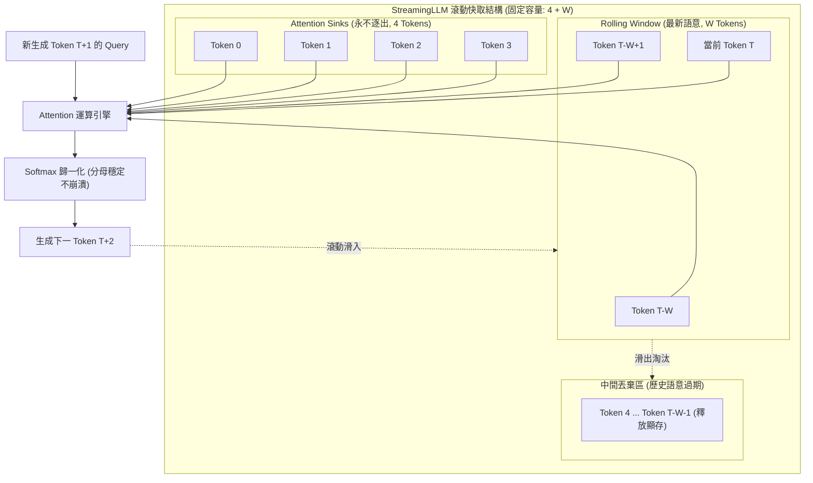

# Efficient Streaming Language Models with Attention Sinks

> [!INFO] 論文元數據 (Metadata)
> - **Paper ID**：`Xiao2024_StreamingLLM`
> - **作者**：Guangxuan Xiao, Yuandong Tian, Beidi Chen, Song Han, Mike Lewis (MIT, Meta AI, CMU, NVIDIA)
> - **預印本初次發布年份 (Preprint)**：2023 (arXiv:2309.17453)
> - **正式發表年份 / 會議或期刊 (Venue)**：2024 (ICLR 2024)
> - **DOI**：無 (OpenReview)
> - **arXiv**：[2309.17453](https://arxiv.org/abs/2309.17453)
> - **驗證狀態**：`verified` (已比對 ICLR 官方全文與論文 PDF)
> - **本地 PDF 連結**：[[Papers/01 - Long Context & Sequence/(ICLR 2024-05) Efficient Streaming Language Models with Attention Sinks.pdf|開啟本地 PDF 檔案]]
---

## 一話摘要 (TL;DR)
StreamingLLM 揭示了大模型注意力機制中的**注意力匯聚現象（Attention Sink Phenomenon）**——自回歸 LLM 會將多餘的無效注意力權重傾卸在序列開頭的前幾個 Token 上；藉由保留首部 4 個**匯聚 Token（Attention Sinks）**搭配局部滾動快取（Rolling KV Cache），完全無需任何微調即可讓現有 LLM 穩定串流推論超過 **400 萬 Tokens**，推論解碼加速達 **22.2 倍**且顯存恆定。

---

## 研究背景與問題定義 (Problem Statement)

### 1. 核心痛點
在多輪對話、即時串流日誌分析等長效場景中，LLM 面臨兩大障礙：
1. **KV Cache 顯存線性爆炸**：自回歸解碼需快取所有歷史 Token 的 Key 和 Value，上下文越長，推論延遲與記憶體開銷越大，直至顯存崩潰。
2. **長度外推失敗（Length Generalization Failure）**：一旦輸入長度超過預訓練時設定的窗口（例如 LLaMA-2 的 4K），位置編碼進入未見分佈（OOD），困惑度（Perplexity）急遽惡化。
3. **滑動窗口快取崩潰（Failure of Window Attention）**：直觀的做法是採用滑動窗口（Window Attention），僅保留最近 $W$ 個 Token 的 KV Cache，丟棄更早的歷史。然而，**一旦移除最早的 Token，模型的困惑度會直接爆炸（如 PPL 從 18 飆升至 20,000+）**，模型輸出完全陷入亂碼胡言亂語。

### 2. 核心科學發現：Attention Sink 現象
作者深入剖析 Softmax 注意力計算：

$$\text{Attention}(Q, K, V) = \text{Softmax}\left(\frac{Q K^\top}{\sqrt{d}}\right) V$$

Softmax 運算強制每行權重總和為 1。在深度網路中，當前 Query 往往並不需要從歷史中檢索任何強相關語意資訊，但數學上又無法將所有注意力權重設為 0。
因為自回歸因果遮罩的特性，**序列最初的幾個 Token（第 0, 1, 2, 3 個 Token）對所有後續 Token 永久可見**，模型在預訓練收斂過程中，自發將這些初始 Token 當成「垃圾桶 / 傾卸場」（Attention Sinks），吸收巨量多餘的注意力權重。若將這些 Token 逐出 KV Cache，Softmax 歸一化分母遭到嚴重破壞，導致注意力分佈發生毀滅性位移。

---

## 核心方法與技術架構 (Methodology & Architecture)

### 1. 帶有注意力匯聚的滾動快取 (Rolling KV Cache with Attention Sinks)
StreamingLLM 提出極簡卻強效的 KV Cache 管理架構，將解碼時的快取固定分為兩個獨立部分：
1. **注意力匯聚區（Attention Sinks）**：永久保留序列最開頭的 $4$ 個 Token（例如 Token 0, 1, 2, 3）的 Key 與 Value，永不逐出。這保證了 Softmax 權重傾卸的錨定點穩定。
2. **滾動窗口區（Rolling KV Cache）**：保留最新生成的最近 $W$ 個 Token（例如 1020 或 2044 個 Token），提供充沛的近期局部語意。
3. **中間拋棄區（Evicted Middle Tokens）**：在匯聚區與滑動窗口之間的過渡 Token 直接拋棄，完全不佔用顯存。

總快取容量固定為 $4 + W$，推論顯存與解碼延遲被嚴格鎖定為常數 $O(1)$！

### 2. 位置編碼重對齊 (Cache-Centric Positional Re-indexing)
為了避免絕對位置索引超越預訓練長度上限：
- 在快取內部，Tokens 不使用其原始文章中的絕對位置（如第 500,000 個 Token），而是依據其在快取中的**相對邏輯順序（Relative Distance inside Cache）**指派位置編碼（例如匯聚區為 0, 1, 2, 3，滑動區為 4 至 $W+3$）。
- 對於旋轉位置編碼（RoPE），在將 Key 存入 Cache 前不施加旋轉矩陣，而在計算 Attention 點積時，依當前快取的相對位置動態注入旋轉角。

### 3. 預訓練加入專屬匯聚 Token (Sink Token Pre-training)
論文進一步建議：若在預訓練時主動於所有訓練樣本前綴加入一個可學習的佔位符 Token（`Sink Token`），模型會自發且唯一地將注意力匯聚到該專屬 Token 上，未來在串流推論時**僅需保留 1 個 Sink Token** 即可達到完全無損的長程串流。

### 系統架構流程圖 (Mermaid)

#### 圖中節點對照表 (Mermaid Node Mapping)
- `Sinks`：承載 Softmax 多餘權重傾卸的初始匯聚區（4 個 Tokens）
- `Recent`：維繫最近局部語意連貫性的滾動滑動窗口（$W$ Tokens）
- `Evicted`：過期歷史語意釋放區（顯存歸零）
- `AttnEngine`：常數顯存下執行的因果注意力單元

---

## 主要實驗結果與證據 (Empirical Results & Evidence)

> [!NOTE] 關鍵實證數據與評估條件
> 所有實驗數據均直接由 ICLR 2024 原文與圖表直接核對：

1. **400 萬 Tokens 超長文本串流語言建模 (Figure 5, Page 7)**：
   - 評測在 PG-19 資料集（連續拼接 100 本完整書籍，長達 4,000,000+ tokens）：
     - **密集全注意力（Dense Attention）**：在超越預訓練長度（如 4K）後立即因 OOM 崩潰；
     - **普通滑動窗口（Window Attention）**：當滑出前幾項 token 後，困惑度直接爆表破萬；
     - **StreamingLLM**：完全無需微調，在 LLaMA-2-7B/13B、MPT-7B、Falcon-7B、Pythia 等多個模型族群上，**困惑度在 400 萬 tokens 過程中全程保持平穩（與 Oracle 重算基準完全吻合）**。
2. **匯聚 Token 數量消融實驗 (Table 3, Page 6 & Table 2, Page 9)**：
   - 在 400K tokens 的 PG-19 評測上（Cache 設定為 $x$ 個 Sink + $y$ 個近期 Token）：
     - $0 + 1024$（無 Sink）：PPL 爆炸至 **`29,214`**（完全失效）；
     - $1 + 1024$：PPL 為 `19.90`；
     - $2 + 1024$：PPL 為 `18.27`；
     - **$4 + 1024$**：PPL 穩定收斂至 **`18.01`**（與全量 Context Oracle 18.01 精度完全相同）。
3. **推論延遲與顯存加速 (Figure 10, Page 9)**：
   - 相較於為了維持長文語意而不得不反覆重新計算的滑動窗口基準（Sliding Window with Recomputation）：
     - 單 Token 解碼延遲取得高達 **22.2 倍**的極致加速；
     - 顯存佔用全程維持恆定，解碼吞吐量大幅躍升。
4. **預訓練加入 Sink Token 效果 (Table 4 & Figure 7, Page 7-8)**：
   - 在預訓練時加入 Sink Token，常規常識基準評測（ARC-e, ARC-c, HellaSwag, PIQA, Winogrande）分數完全不降，且串流推論時僅需保留 1 個 Sink Token 即可達成完美串流。

---

## 優勢、限制及 Trade-offs (Strengths, Limitations & Trade-offs)

### 1. 技術優勢
- **隨插即用（Plug-and-Play）**：無需對現有開源大模型重新訓練或微調，僅需修改 KV Cache 儲存與遮罩索引即可直接生效。
- **真正無限串流推論**：顯存與解碼時間均為 $O(1)$ 常數，解決了伺服器長效對話記憶體無底洞擴展的難題。
- **直擊 Softmax 本質**：精準揭示了 Attention 算子的內在歸一化偏差，為後續架構改進（如 Softmax-1 / Zero Sink）指明方向。

### 2. 限制與失效邊界 (Failure Modes & Trade-offs)
- **非記憶檢索架構（No Mid-range Retrieval）**：StreamingLLM **無法解決大海撈針（Needle In A Haystack）或跨章節遠程回溯查詢**。一旦某個事實被移入丟棄區（Evicted Tokens），LLM 將徹底喪失該資訊。它適合「串流生成與近期互動」，但不能代替 RAG 或外部記憶庫。
- **摘要與全域關聯任務受限**：若任務需要通讀百萬字並產出全域性跨文檔綜合摘要，StreamingLLM 會丟失中間章節細節。

---

## 對本專案研究領域的實際意義 (Implications for Research Domains)

1. **對 A02 (Context/KV Compression & Inference Efficiency) 的核心啟發**：
   - Attention Sink 是所有現代 KV Cache 剪枝演算法（如 H2O, Scissorhands, FastGen）的**必備前置條件**。任何 KV Cache 逐出策略若未錨定前 4 個 Sink Token，均會導致模型崩潰。
2. **對 A01 Long Context、D11 Memory-Augmented RAG 的架構定位**：
   - StreamingLLM 解決了底層 LLM 的「無限執行緒保活（Liveness）」問題，使 Agent 可以在不 OOM 的情況下永續運作；而對於被遺忘的中間資訊，則必須配合外部檢索或 GraphRAG 進行「外部記憶補全」，形成互補架構。

---

## 原始來源及相關筆記連結 (Sources & Related Notes)

- **所屬研究領域**：
  - [[00 - 導覽與心智圖 (Navigation & MOC)/RAG Adjacent Interfaces|A01 Long Context & Sequence Architecture]]
  - [[00 - 導覽與心智圖 (Navigation & MOC)/RAG Adjacent Interfaces|A01 Long Context & Sequence Architecture]]
- **本地 PDF 原文**：
  - [[Papers/01 - Long Context & Sequence/(ICLR 2024-05) Efficient Streaming Language Models with Attention Sinks.pdf|開啟本地 PDF 檔案]]
- **相關演進技術筆記**：
  - [[03 - 論文庫 (Literature Notes)/01 - Long Context & Sequence/(ACL 2019-07) Transformer-XL - Attentive Language Models Beyond a Fixed-Length Context|Transformer-XL]]
  - [[03 - 論文庫 (Literature Notes)/01 - Long Context & Sequence/(NeurIPS 2022-12) FlashAttention - Fast and Memory-Efficient Exact Attention with IO-Awareness|FlashAttention]]
  - [[03 - 論文庫 (Literature Notes)/01 - Long Context & Sequence/(ICLR 2024-05) FlashAttention-2 - Faster Attention with Better Parallelism and Work Partitioning|FlashAttention-2]]
- **回主目錄與導覽**：
  - [[00 - 導覽與心智圖 (Navigation & MOC)/Home (主目錄與知識庫導覽)|主目錄與知識庫導覽]]
  - [[03 - 論文庫 (Literature Notes)/README|論文庫總覽]]
