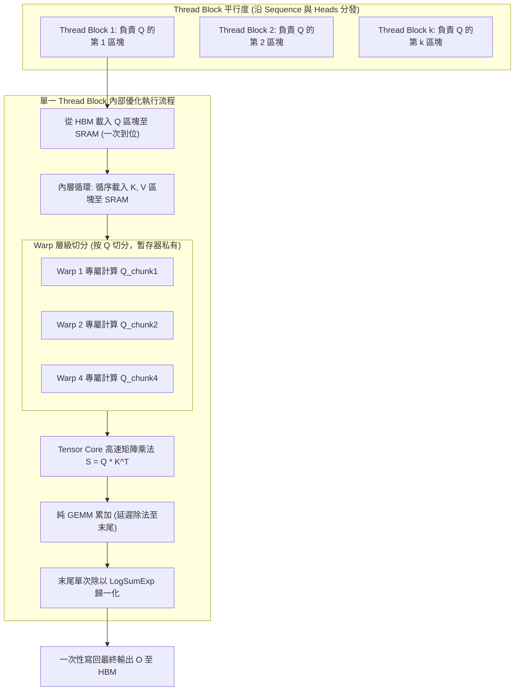

# FlashAttention-2: Faster Attention with Better Parallelism and Work Partitioning

> [!INFO] 論文元數據 (Metadata)
> - **Paper ID**：`Dao2024_FlashAttention2`
> - **作者**：Tri Dao (Princeton University & Stanford University)
> - **預印本初次發布年份 (Preprint)**：2023 (arXiv:2307.08691)
> - **正式發表年份 / 會議或期刊 (Venue)**：2024 (ICLR 2024 Oral)
> - **DOI**：無 (OpenReview)
> - **arXiv**：[2307.08691](https://arxiv.org/abs/2307.08691)
> - **驗證狀態**：`verified` (已比對 ICLR 官方全文與論文 PDF)
> - **本地 PDF 連結**：[[Papers/01 - Long Context & Sequence/(ICLR 2024-05) FlashAttention-2 - Faster Attention with Better Parallelism and Work Partitioning.pdf|開啟本地 PDF 檔案]]
---

## 一話摘要 (TL;DR)
FlashAttention-2 透過**重構 Online Softmax 演算法以減少非矩陣乘法運算（Non-Matmul FLOPs）**、**外層循環改為序列長度維度平行化（Sequence Parallelism）**以及**優化 Warp 間任務劃分避免共享記憶體通訊**，在不犧牲任何數值精準度的前提下，使運算速度較 FlashAttention-1 再提升 2 倍，在 A100 GPU 上達到理論浮點吞吐上限的 73%（高達 230 TFLOPs/s）。

---

## 研究背景與問題定義 (Problem Statement)

### 1. 核心痛點
雖然第一代 FlashAttention（Dao et al., 2022）成功透過 IO-Aware Tiling 解決了 HBM 記憶體頻寬瓶頸，並將顯存開銷降為線性，但在硬體吞吐量（Throughput）利用率上仍存在明顯瓶頸：
1. **硬體利用率未達極限**：第一代 FlashAttention 前向傳播僅達到硬體理論峰值浮點運算的 30–50%，反向傳播僅達 25–35%。
2. **非矩陣乘法運算過重（Non-Matmul FLOPs Overhead）**：GPU 上的 Tensor Core 矩陣乘法極為強大（例如 A100 具備 312 TFLOPs/s 的 FP16/BF16 GEMM 算力），但純量運算單元（FP32 Non-Matmul）僅有 19.5 TFLOPs/s（算力相差 16 倍）。FlashAttention-1 在每一步分塊迭代中頻繁進行 Softmax 縮放與指數運算，嚴重拖累整體計算效率。
3. **長序列平行度受限**：FlashAttention-1 僅在 Batch Size 與 Attention Heads 維度進行 Thread Block 平行化。當 Batch Size 較小或序列極長時，GPU 串流多處理器（SM）無法被充分填滿（Low Occupancy）。
4. **Warp 間共享記憶體競爭（Shared Memory Bank Conflicts）**：FlashAttention-1 在 Thread Block 內部採用 "Split-K" 方案將 $K, V$ 分配給不同 Warps，需要透過 Shared Memory 進行頻繁讀寫與同儕同步。

### 2. 研究假設
若能調整 Online Softmax 結構，將縮放除法延後至最後一步以最大化 GEMM 純度；將外層循環改以 Query（序列維度）劃分並分派給獨立 Thread Block；並將 Warp 劃分改為依 $Q$ 切分，即可消除同步壁壘，使 GPU 算力利用率逼近理論硬體上限。

---

## 核心方法與技術架構 (Methodology & Architecture)

### 1. 減少非矩陣乘法運算 (Algorithmic Tweaks to Online Softmax)
在第一代 FlashAttention 中，每一塊迭代都要對中間累積矩陣 $O$ 進行動態縮放：$O^{(j)} = \text{diag}(\ell^{(j-1)} / \ell^{(j)}) O^{(j-1)} + \dots$。
FlashAttention-2 進行了關鍵演算法簡化：
- **延遲歸一化**：在迭代過程中保持累加狀態為未歸一化的 $\tilde{P} V$，僅記錄指數和 $\ell^{(j)}$；直到所有 $K, V$ 區塊遍歷完畢後，在最後一步才進行一次除法：$O = \text{diag}(\ell)^{-1} \tilde{O}$。
- **反向傳播記憶體精簡**：反向傳播無需同時儲存最大值 $m$ 與指數和 $\ell$，僅需保存 LogSumExp 向量 $L = m + \log \ell$，大幅節省暫存與暫存器開銷。

### 2. 序列長度維度平行化 (Parallelism Across Sequence Length)
- **循環順序翻轉**：
  - FlashAttention-1：外層循環遍歷 $K, V$ 區塊（列區塊），內層遍歷 $Q$ 區塊（行區塊），多個 Block 競爭寫入同一輸出 $O$，需要原子加法（Atomic Add）與跨區塊鎖。
  - FlashAttention-2：**外層循環遍歷 $Q$ 區塊，內層循環遍歷 $K, V$ 區塊**。
  - 由於各個 $Q$ 區塊對應的輸出 $O_i$ 彼此完全獨立，不同 Thread Block 可以完全無通訊（Embarrassingly Parallel）同時處理不同行區塊，即使 Batch Size 為 1，也能輕易打滿 GPU 的 108 個 SMs。

### 3. Warp 間工作劃分優化 (Warp Partitioning)
- **取消 Split-K 方案**：
  - 在每個 Thread Block 內部（通常包含 4 到 8 個 Warps），將 $Q$ 均勻切分給各 Warp，而各 Warp 共享載入的 $K, V$ 區塊。
  - 每個 Warp 可以在自己的暫存器（Registers）中獨立累積局部輸出矩陣，完全避開 Warp 間透過 Shared Memory 的中間讀寫與 `__syncthreads()` 同步開銷。

### 4. 因果遮罩分塊跳過 (Causal Masking Optimization)
對於因果語言模型（Autoregressive LM），若某個 $K, V$ 區塊的所有 Token 索引均嚴格大於當前 $Q$ 區塊的最小索引，直接跳過該區塊的載入與計算；對於對角線區塊才套用遮罩。此優化直接帶來 **1.7–1.8 倍**的計算量理論縮減。

### 系統架構流程圖 (Mermaid)

#### 圖中節點對照表 (Mermaid Node Mapping)
- `GridParallel`：外層沿序列維度（Row Blocks）的無鎖極限平行架構
- `ThreadBlockInner`：單一 SM 內部的非 GEMM 開銷最小化管線
- `WarpSplit`：基於暫存器的 Warp-private 輸出累加（免共享記憶體衝突）
- `DivNorm`：延遲 Online Softmax 歸一化除法

---

## 主要實驗結果與證據 (Empirical Results & Evidence)

> [!NOTE] 關鍵實證數據與評估條件
> 所有實驗數據均直接由 ICLR 2024 原文與實驗圖表核對：

1. **單元 Attention 運算速度與硬體利用率 (Figure 4, 5, Page 10-11)**：
   - 在 NVIDIA A100 80GB SXM4 上評測（Head Dim = 64 或 128）：
     - 前向傳播速度達到 **230 TFLOPs/s**（佔 A100 理論極限 312 TFLOPs/s 的 **73%**）。
     - 前向 + 反向聯合計算速度達到 **225 TFLOPs/s**（佔理論極限 **72%**）。
     - 相較於 FlashAttention-1 提升 **1.7–2.0 倍**；相較於 Triton 基準實作提升 **1.3–1.5 倍**；相較於 PyTorch 標準 Attention 提升 **5–9 倍**。
2. **新一代 H100 GPU 表現 (Figure 7, Page 13)**：
   - 在 NVIDIA H100 80GB SXM5 上，未完全使用 H100 專屬 TMA（Tensor Memory Accelerator）的情況下，即達到 **335 TFLOPs/s** 的驚人吞吐。
3. **端到端 GPT 模型訓練加速 (Table 1, Page 12)**：
   - 在 8× A100 伺服器上訓練不同規模與長度的 GPT 模型（包含因果遮罩）：
     - **GPT3-1.3B (8K Context)**：
       - Standard Baseline：`72 TFLOPs/s`
       - FlashAttention-1：`170 TFLOPs/s`
       - **FlashAttention-2**：**`220 TFLOPs/s`**（相較於原生 Baseline 加速達 **3.05 倍**，相較於 FA-1 提升 **1.29 倍**）。
     - **GPT3-2.7B (8K Context)**：
       - Standard Baseline：`80 TFLOPs/s`
       - FlashAttention-1：`175 TFLOPs/s`
       - **FlashAttention-2**：**`225 TFLOPs/s`**（Model FLOPs Utilization 達到 **72%**）。

---

## 優勢、限制及 Trade-offs (Strengths, Limitations & Trade-offs)

### 1. 技術優勢
- **無損數值精度（Exact Attention）**：與任何近似注意力（如稀疏、局部雜湊、線性投影）不同，FlashAttention-2 計算結果在位階上與原生 Softmax 完全一致。
- **近乎硬體理論極限的 MFU**：將 GPU 利用率推至 73%，是少數能在深度學習領域達到硬體頂標利用率的 CUDA 算子。
- **對長 Context 友善度劇增**：外層序列平行設計使模型在長序列、小批次情境下也能達到滿載吞吐。

### 2. 限制與 Trade-offs
- **時間複雜度本質仍為 $O(L^2)$**：雖然常數項被極致壓縮、顯存壓至線性，但在百萬級（$1\text{M}+$）極端序列下，總計算量仍以二次方增長，必須搭配分散式 RingAttention 或稀疏/狀態空間機制。
- **強硬體與底層相依性**：極度依賴特定架構（NVIDIA Ampere/Hopper/Ada Lovelace）的 SRAM 大小、Warp 排程與暫存器資源，在 AMD（ROCm）或 Apple Silicon 上的跨平台遷移需要深度硬體特化改寫。

---

## 對本專案研究領域的實際意義 (Implications for Research Domains)

1. **對 A01 (Long Context & Sequence Architecture) 的底層推動力**：
   - FlashAttention-2 已經成為當前全球所有前沿長文本大模型（LLaMA-3, Mistral, Gemma, Qwen, DeepSeek）的標準標配。
2. **對分散式超長上下文（RingAttention）的支撐**：
   - RingAttention 與 DeepSpeed Ulysses 的核心 Blockwise 運算，底層正是依賴 FlashAttention-2 的分塊計算與狀態轉移能力，才得以實現 1M–10M 上下文的分散式擴展。

---

## 原始來源及相關筆記連結 (Sources & Related Notes)

- **所屬研究領域**：
  - [[00 - 導覽與心智圖 (Navigation & MOC)/RAG Adjacent Interfaces|A01 Long Context & Sequence Architecture]]
- **本地 PDF 原文**：
  - [[Papers/01 - Long Context & Sequence/(ICLR 2024-05) FlashAttention-2 - Faster Attention with Better Parallelism and Work Partitioning.pdf|開啟本地 PDF 檔案]]
- **相關演進技術筆記**：
  - [[03 - 論文庫 (Literature Notes)/01 - Long Context & Sequence/(NeurIPS 2022-12) FlashAttention - Fast and Memory-Efficient Exact Attention with IO-Awareness|FlashAttention]]
  - [[03 - 論文庫 (Literature Notes)/01 - Long Context & Sequence/(ICLR 2024-05) RingAttention with Blockwise Transformers for Near-Infinite Context|RingAttention]]
  - [[03 - 論文庫 (Literature Notes)/01 - Long Context & Sequence/(ICML 2024-07) LongRoPE - Extending LLM Context Window Beyond 2 Million Tokens|LongRoPE]]
- **回主目錄與導覽**：
  - [[00 - 導覽與心智圖 (Navigation & MOC)/Home (主目錄與知識庫導覽)|主目錄與知識庫導覽]]
  - [[03 - 論文庫 (Literature Notes)/README|論文庫總覽]]
