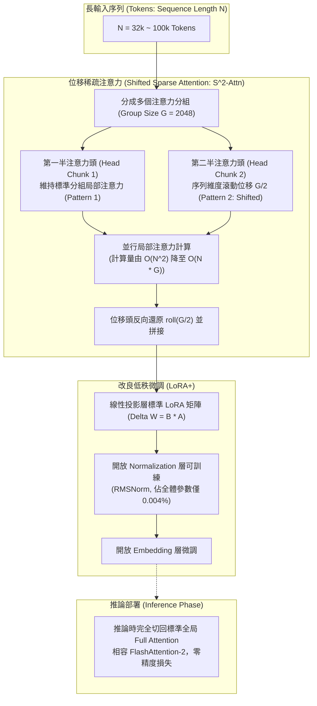

# LongLoRA: Efficient Fine-tuning of Long-Context Large Language Models

## 1. 一話摘要 (TL;DR)
LongLoRA 提出了一種極為高效的長上下文微調方法，在訓練階段採用「位移稀疏注意力（Shifted Sparse Attention, $S^2$-Attn）」大幅降低計算複雜度，並發現開放 Normalization 與 Embedding 層微調（LoRA+，參數佔比僅 0.004%）即可彌補標準 LoRA 與全量微調之間的鴻溝；在僅需單台 8 卡 A100 伺服器下，成功將 Llama-2 7B 的上下文窗口從 4k 擴展至 100k，且在推論時完全無縫退回標準全局 Dense Attention。

---

## 2. 研究背景與問題定義 (Problem Statement)

### 2.1 長上下文模型微調的高昂代價
將預訓練 LLM（如原始窗口為 2k 或 4k 的 Llama-2）擴展至長上下文時，全參數微調（Full Fine-Tuning）面臨著災難性的計算與顯存開銷：
1. **二次方計算複雜度**：標準 Self-Attention 的計算量與顯存隨序列長度成 $O(n^2)$ 爆炸。訓練 8k 上下文長度需要比 2k 高出 16 倍的計算資源。
2. **標準 LoRA 在長序列適應上的失效**：實驗證明，若僅對線性投影層（$W_q, W_k, W_v, W_o$）進行低秩分解（LoRA），即使將 rank 調大到 256，困惑度（PPL）依然顯著劣於全參數微調（PPL 11.4+ vs 8.08），存在無法跨越的性能斷層。
3. **推論期相容性要求**：若在訓練時採用修改模型本體架構的稀疏注意力，推論時往往需要重寫 CUDA 算子或破壞現有的推論優化庫（如 vLLM、FlashAttention）。

### 2.2 核心研究假設
- 訓練階段是否可以採用稀疏分組注意力，只需透過極少量的通道位移（Shift）實現跨組資訊流通？
- 造成標準 LoRA 適應長序列失敗的瓶頸，是否僅在於極少數未參與訓練的關鍵結構（如 LayerNorm / RMSNorm）？

---

## 3. 核心方法與技術架構 (Methodology & Architecture)

LongLoRA 由兩個關鍵創新組成：$S^2$-Attn 與 LoRA+。

### 圖中節點對照
- `S^2-Attn`：核心代碼僅需兩行 PyTorch 滾動操作（Algorithm 1, Page 5）：在多頭維度將注意力頭平分為兩部分，前半部正常計算分組局部注意力，後半部沿 Token 維度平移半個組大小（$-G/2$），使分組邊界的相鄰 Token 能在下半部頭中進行跨組交互。
- `Trainable Normalization`：Table 2 (Page 6) 發現 LayerNorm 的 Scaling 與 Shift 參數是記錄位置分佈與長度外推漂移的關鍵，開放極少的 Norm 參數微調即可消除與全微調的差距。
- `Inference Seamlessness`：$S^2$-Attn 僅用於訓練節省梯度反向傳播顯存；推論時模型仍保留標準 Attention 權重，直接運行全局 Dense FlashAttention。

---

## 4. 主要實驗結果與證據 (Empirical Results & Evidence)

LongLoRA 在 ICLR 2024 原文（Pages 5–7）中在 Proof-pile 與 PG19 驗證集上展示了顯著的微調效果：

### 4.1 Normalization 層訓練的重要性 (Table 2, Page 6)
在 Llama-2 7B 上微調至 32k 長度，評估 PG19 困惑度（Perplexity, 越低越好）：

| 微調方式 | Rank 設定 | 可微調組件 | PG19 困惑度 (PPL) |
|---|---|---|---|
| **Full Fine-Tuning** | 全量參數 | 全部權重 | **8.08** |
| **標準 LoRA** | Rank = 8 | 僅線性投影層 | 11.44 |
| **標準 LoRA** | Rank = 16 ~ 256 | 僅線性投影層 | 11.82 ~ 11.98 |
| **LoRA (Rank = 8) + Normalization** | Rank = 8 | + RMSNorm (0.004% 參數) | 10.49 |
| **LoRA (Rank = 8) + Embeddings** | Rank = 8 | + Token Embedding | 8.29 |
| **LoRA (Rank = 8) + Norm & Embed (LoRA+)** | Rank = 8 | + Norm & Embed | **8.12** |

*註：單純加大 LoRA 的 Rank 完全無法改善長序列適應（Rank 256 PPL 仍高達 11.98）；而加入僅佔全模型 0.004% 參數量的 Normalization 層微調後，PPL 迅速降至 8.12，直接逼近全參數微調的 8.08。出處：Table 2, Page 6。*

### 4.2 Proof-pile 長序列語言建模評測 (Table 3, Page 6)
在 7B 與 13B 模型上，對比不同訓練上下文長度（8k, 16k, 32k）下的困惑度：

| 模型規模 | 訓練窗口 | $S^2$-Attn | LoRA+ | 評估 8192 PPL | 評估 16384 PPL | 評估 32768 PPL |
|---|---|---|---|---|---|---|
| **Llama-2 7B** | 8192 | 全注意力 | 全量 FT | 2.66 | – | – |
| **Llama-2 7B** | 8192 | ✓ | ✓ | 2.72 | – | – |
| **Llama-2 7B** | 16384 | ✓ | ✓ | 2.66 | 2.51 | – |
| **Llama-2 7B** | 32768 | 全注意力 | 全量 FT | 2.69 | 2.54 | **2.49** |
| **Llama-2 7B** | 32768 | ✓ | ✓ | 2.78 | 2.61 | **2.50** |
| **Llama-2 13B** | 32768 | ✓ | ✓ | 2.57 | 2.42 | **2.32** |

*註：在 32k 長度評估下，LongLoRA ($S^2$-Attn + LoRA+) 取得 2.50 PPL，與代價高昂的全參數微調（2.49）幾乎毫無差距，且推論時單卡顯存節省數倍。出處：Table 3, Page 6。*

---

## 5. 優勢、限制及 Trade-offs (Strengths, Limitations & Trade-offs)

### 5.1 優勢
1. **極度節省硬體資源**：使普通學術實驗室使用單台 8 卡 A100 伺服器即可完成 70B 模型的 32k 微調或 7B 模型的 100k 微調。
2. **架構無侵入性**：$S^2$-Attn 僅是訓練時的運算排程，推論部署時完全不需特殊算子，天然支援現有推論加速庫。
3. **突破 PEFT 認知誤區**：精準指出 LoRA 在跨上下文長度外推時，LayerNorm/RMSNorm 是不可或缺的調適載體。

### 5.2 限制與 Trade-offs
1. **依賴位置編碼插值**：LongLoRA 需配合 Position Interpolation (PI) 或 YaRN 等頻率縮放技術，若基礎位置編碼外推性差，模型長程感知仍受限。
2. **大海撈針 (Needle In A Haystack) 極限細節能力**：雖然語言建模困惑度（PPL）平滑下降，但對於需要跨幾十萬 Token 檢索微小特定符號的任務，稀疏訓練仍可能輕微降低極端局部注意力的敏銳度。

---

## 6. 對本專案研究領域的實際意義 (Implications for Research Domains)

1. **A01 (Long Context & Sequence Architecture)**：提供了經濟高效的長上下文擴展標準範式，是開源社群訓練超長上下文模型的核心工程基石。
2. **Domain 02 (脈絡壓縮與 KV 快取)**：證實了注意力局部稀疏分組在梯度流反向傳播中的有效性，為後續測試期 KV 快取動態剪枝提供了架構依據。

---

## 7. 原始來源及相關筆記連結 (Sources & Related Notes)

### 原始文獻
- **OpenReview (ICLR 2024)**：[https://openreview.net/forum?id=6pmfdmzrTG](https://openreview.net/forum?id=6pmfdmzrTG)
- **arXiv ID**：`2309.12307`
- **本地 PDF**：`[[Papers/01 - Long Context & Sequence/(ICLR 2024-05) LongLoRA - Efficient Fine-tuning of Long-Context Large Language Models.pdf|開啟本地 PDF 檔案]]`

### 關聯專題與論文筆記
- **專題報告**：
  - `[[00 - 導覽與心智圖 (Navigation & MOC)/RAG Adjacent Interfaces|A01 Long Context & Sequence Architecture]]`
  - `[[00 - 導覽與心智圖 (Navigation & MOC)/RAG Adjacent Interfaces|A01 Long Context & Sequence Architecture]]`
- **同領域代表性論文**：
  - `[[03 - 論文庫 (Literature Notes)/01 - Long Context & Sequence/(ICLR 2024-05) YaRN - Efficient Context Window Extension of Large Language Models|(ICLR 2024-05) YaRN]]`
  - `[[03 - 論文庫 (Literature Notes)/01 - Long Context & Sequence/(ICLR 2024-05) FlashAttention-2 - Faster Attention with Better Parallelism and Work Partitioning|(ICLR 2024-05) FlashAttention-2]]`
  - `[[03 - 論文庫 (Literature Notes)/01 - Long Context & Sequence/(ICLR 2024-05) Efficient Streaming Language Models with Attention Sinks|(ICLR 2024-05) StreamingLLM]]`
