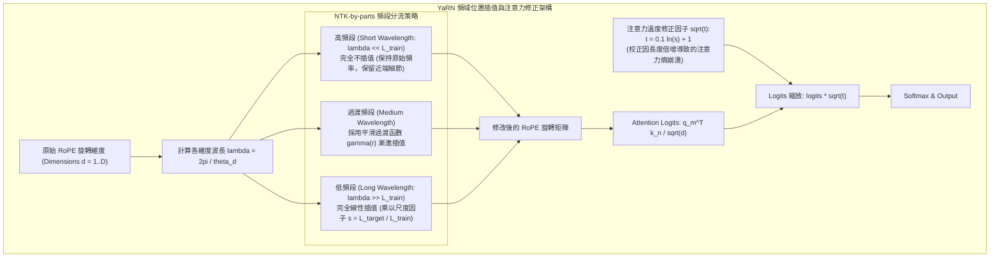

# YaRN: Efficient Context Window Extension of Large Language Models

## 一話摘要 (TL;DR)
YaRN（Yet another RoPE extensioN method）結合「分頻段旋轉位置插值（NTK-by-parts）」與「注意力溫度熵值修正（Attention Temperature Scaling）」，僅需使用前人方法 1/10 的訓練 Token 與 400 步微調，即可將 LLaMA/Llama-2 的上下文長度由 4k 擴展至 128k，並完美維持短文字基準能力。

---

## 研究背景與問題定義 (Problem Statement)

1. **旋轉位置編碼（RoPE）的外推困境**：
   - RoPE（Rotary Position Embedding）在訓練長度範圍內具備出色的相對位置建模能力，但直接外推（Extrapolation）至超出預訓練長度的位置時，注意力矩陣會發生嚴重的數值發散與困惑度爆炸；
2. **早期插值方法的代價與瓶頸**：
   - **線性位置插值（Position Interpolation, PI）**：均勻壓縮所有維度的旋轉波長，導致高頻細節（即相鄰 Token 的近端語義順序）嚴重損失，需要消耗巨額訓練語料（通常數百億 Token）才能重新收斂；
   - **靜態 NTK-aware 插值**：未考慮到不同維度波長對位置資訊編碼的本質差異（長波長編碼絕對位置、短波長編碼相對位置）。
3. **核心研究目標**：
   - 尋求一種在頻域上非均勻插值、且能動態校正注意力分佈熵值變化的超高效率上下文擴展方案。

---

## 核心方法與技術架構 (Methodology & Architecture)

YaRN 由三大核心數學創新構成：**分頻段插值（NTK-by-parts）**、**注意力分佈動態縮放（Dynamic Temperature Scaling）** 與 **漸進式超長外推**：

### 圖中節點對照
- `HIGH`：當波長遠小於原始上下文長度時，模型已能充分感知相對位置，嚴禁插值以防破壞既有知識。
- `LOW`：波長大於上下文時，網絡缺乏全局觀察，此時需進行完整的位置縮放。
- `TEMP`：隨著上下文由 4k 擴展至 128k，Softmax 內部熵值增加，輸出變得過於平滑（High entropy）。乘以縮放因子 $\sqrt{t}$ 能重新恢復注意力集中度。

---

## 主要實驗結果與證據 (Empirical Results & Evidence)

論文對 LLaMA-7B/13B 及 Llama-2-7B/13B 進行了微調擴展與多維度基準測試（Table 2, 3, 4, Page 8-9）：

1. **短文本基準保持度 (Table 2 & 3, Page 9)**：
   - 在 Hugging Face Open LLM Benchmark（ARC-c, HellaSwag, MMLU, TruthfulQA）上：
     - **Llama-2-7B Baseline (4k)**: ARC-c 53.1, HellaSwag 77.8, MMLU 43.8, TruthfulQA 39.0。
     - **Llama-2-7B YaRN (擴展至 64k, $s=16$)**: ARC-c 52.3, HellaSwag 78.8, MMLU 42.5, TruthfulQA 38.2。
     - **Llama-2-7B YaRN (擴展至 128k, $s=32$)**: ARC-c 52.1, HellaSwag 78.4, MMLU 41.7, TruthfulQA 37.3。
     - 短文本評測平均下降率僅 **0.49%**，完勝同條件下大幅掉分的線性位置插值（PI，MMLU 掉至 25.9）。
2. **超長上下文檢索與困惑度 (Page 8)**：
   - 在 128k 長度下，Passkey Retrieval（大海撈針鑰匙檢索）準確率達到 **100%**；
   - 在長文本數據集（GovReport, PG19）上，Perplexity 隨長度由 8k 增加至 128k 呈現單調遞減。
3. **極致的計算效率 (Table 4, Page 9)**：
   - 擴展 7B 模型至 64k 僅需 **256 A100 GPU 小時**（400 微調步數）；
   - 相比之下，Position Interpolation 需要 640 小時，NTK-aware 需要高達 6,400 小時。YaRN 的計算開銷減少了 **10 至 25 倍**。

---

## 優勢、限制及 Trade-offs (Strengths, Limitations & Trade-offs)

1. **適用任務與資料集**：適合需要經濟高效擴展現有開源 RoPE 模型（LLaMA/Mistral/Qwen）上下文視窗至 64k/128k 的場景；
2. **推論硬體負擔**：雖然位置編碼計算零額外開銷，但 128k 長度下的 KV Cache 顯存消耗依然遵循 Transformer 標準規則，需搭配 FlashAttention-2 或 KV Cache 壓縮技術；
3. **失效情境**：
   - **若不微調直接 Zero-shot 擴展**：雖優於傳統外推，但長度超過 32k 後仍會出現局部困惑度回升，建議至少使用 400 步短語料微調。

---

## 對本專案研究領域的實際意義 (Implications for Research Domains)

1. **長文本基礎模型擴展的工程里程碑**：YaRN 被廣泛整合至主流開源推論框架（vLLM, TGI, llama.cpp）中，是目前業界部署超長上下文最經濟的標準方案。
2. **與 LongRoPE 的互補定位**：與微軟後續提出的 [[03 - 論文庫 (Literature Notes)/01 - Long Context & Sequence/(ICML 2024-07) LongRoPE - Extending LLM Context Window Beyond 2 Million Tokens|LongRoPE 2M]]（透過演化搜尋在多維空間尋找最優縮放因子）共同構築了 RoPE 頻域優化的技術基石。

---

## 原始來源及相關筆記連結 (Sources & Related Notes)

- **本地 PDF 原文**：[[Papers/01 - Long Context & Sequence/(ICLR 2024-05) YaRN - Efficient Context Window Extension of Large Language Models.pdf|開啟本地 PDF 檔案]]
- **相關領域專題**：
  - [[00 - 導覽與心智圖 (Navigation & MOC)/RAG Adjacent Interfaces|A01 Long Context & Sequence Architecture]]
  - [[00 - 導覽與心智圖 (Navigation & MOC)/RAG Adjacent Interfaces|A02 Context/KV Compression & Inference Efficiency]]
- **相關核心文獻**：
  - [[03 - 論文庫 (Literature Notes)/01 - Long Context & Sequence/(ICML 2024-07) LongRoPE - Extending LLM Context Window Beyond 2 Million Tokens|LongRoPE (Ding et al., ICML 2024)]]
  - [[03 - 論文庫 (Literature Notes)/01 - Long Context & Sequence/(ICLR 2024-05) FlashAttention-2 - Faster Attention with Better Parallelism and Work Partitioning|FlashAttention-2 (Dao, ICLR 2024)]]
  - [[03 - 論文庫 (Literature Notes)/01 - Long Context & Sequence/(ICLR 2024-05) Efficient Streaming Language Models with Attention Sinks|StreamingLLM (Xiao et al., ICLR 2024)]]
