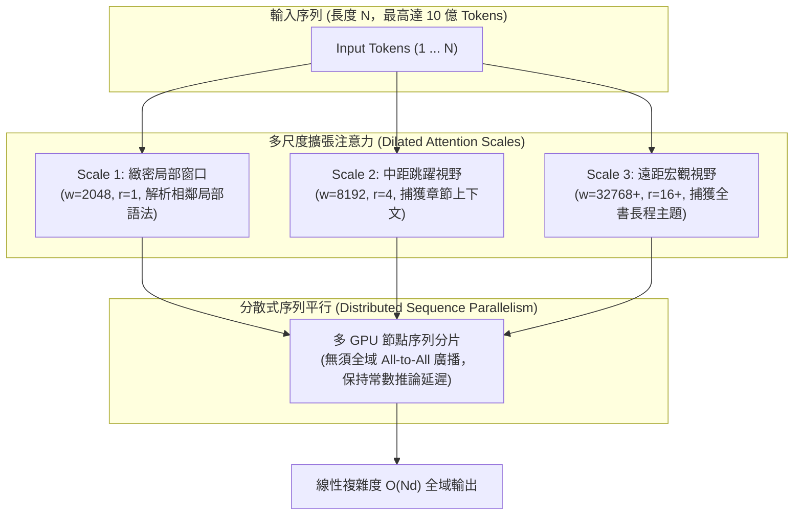

# LongNet: Scaling Transformers to 1,000,000,000 Tokens

## 一話摘要 (TL;DR)
微軟亞洲研究院與西安交通大學提出的 **LongNet** 引入了**擴張注意力（Dilated Attention）**機制，隨著 token 距離增加指數級擴大感受野，將標準 Self-Attention 的計算複雜度從 $O(N^2 d)$ 降低至線性 $O(N d)$，透過分散式序列平行運算首度將 Transformer 的序列長度擴展至創紀錄的 **10 億（1,000,000,000）Tokens**，並在 32K 長度下取得 **3.01 困惑度（PPL）**的極佳語言建模表現。

---

## 研究背景與問題定義 (Problem Statement)

1. **標準 Self-Attention 的平方複雜度障礙**：
   - 標準 Transformer 的注意力計算複雜度與顯存消耗隨序列長度 $N$ 呈二次方增長（$O(N^2)$），導致主流 LLM 的原生上下文大多受限於幾千至數萬 Tokens，難以處理整本書籍、跨年度代碼庫或海量網頁全貌。
2. **先前高效注意力機制的表達能力折損**：
   - 傳統線性注意力（如 Performer, Linear Transformer）雖然將複雜度降至 $O(N)$，但採用核函數近似注意力矩陣，缺乏清晰的局部細節捕捉能力，在短文本語言建模上經常顯著劣於標準 Transformer；
   - 稀疏注意力（如 Sparse Transformer, Longformer）依賴預設的固定局部窗口與跳躍步長，難以兼顧跨越數百萬 token 的極遠距依賴。
3. **極限擴展假設**：
   - 能否設計一種兼具「局部高解析度」與「遠距全域覆蓋」的注意力機制，使其不僅具備線性計算複雜度，且天然具備跨節點分散式平行的能力？

---

## 核心方法與技術架構 (Methodology & Architecture)

LongNet 的核心為**擴張注意力（Dilated Attention）**：

### 1. 擴張注意力數學表述 (Dilated Attention Formulation)
針對長度為 $N$ 的輸入序列，將輸入在序列維度上均勻劃分為多個長度為 $w$ 的連續段落（Segments），並以膨脹率（Dilation Rate）$r$ 進行間隔抽樣：
1. **分段與抽樣**：輸入 Query, Key, Value 被分成片段 $\tilde{Q}, \tilde{K}, \tilde{V} \in \mathbb{R}^{\frac{w}{r} \times d}$；
2. **稀疏注意力計算**：在每個抽樣區塊內執行密集注意力：
   \[
   A_i = \text{Softmax}\left(\frac{\tilde{Q}_i \tilde{K}_i^T}{\sqrt{d}}\right) \tilde{V}_i
   \]
3. **多尺度混合（Multi-scale Mixture）**：
   定義一組不同的分段大小與膨脹率組合 $\{(w_k, r_k)\}_{k=1}^K$（例如 $r$ 隨距離呈指數遞增 $1, 2, 4, 8\dots$）；
   各尺度注意力的輸出透過可學習或依 Softmax 分母動態歸一化的權重進行加權融合：
   \[
   O = \sum_{k=1}^K \alpha_k O_k, \quad \alpha_k = \frac{\sum \exp(S_k)}{\sum_j \sum \exp(S_j)}
   \]

### 圖中節點對照
- `SCALE1`, `SCALE2`, `SCALE3`：不同感受野與膨脹率的注意力計算單元。
- `DIST`：序列平行處理模組，各 GPU 僅需與對應膨脹步長的設備交換特徵。
- `OUT`：最終集成了多尺度幾何上下文的注意力輸出。

### 2. 計算複雜度對比 (Table 1, Page 2)
- **Vanilla Attention**：$O(N^2 d)$（時間與記憶體均為二次方）；
- **Sparse Transformer**：$O(N \sqrt{N} d)$；
- **Dilated Attention (LongNet)**：$O(N d)$（完全線性複雜度）。

---

## 主要實驗結果與證據 (Empirical Results & Evidence)

論文在大型代碼語料庫 The Stack（涵蓋 300+ 種程式語言）上訓練並評估模型表現（第 7–9 頁）：

1. **語言建模困惑度（The Stack PPL, Table 2, Page 8）**：
   - **Vanilla Transformer**：在 2K 長度下 PPL 為 **4.24**，在 8K 長度下為 **5.07**，在 32K 長度下大幅惡化至 **11.29**（產生明顯外推崩潰）；
   - **Sparse Transformer**：在 2K 長度下為 5.15，8K 長度下為 4.00，在 32K 長度下為 **3.64**；
   - **LongNet (Ours, 32K Context)**：
     - 在 2K 測試長度下 PPL 為 **4.37**；
     - 在 8K 測試長度下 PPL 下降至 **3.33**；
     - 在 32K 測試長度下達到最低的 **3.01**（展現長上下文單調遞減的標準 Scaling Law 特性）。
2. **十億 Token 擴展延遲評測（Figure 5, Page 7）**：
   - 評測序列長度從 8K、64K、512K、4M、32M 直至 **1,000,000,000 (1B) Tokens**：
   - Vanilla Attention 在序列超過 32K 時即引發 GPU Out-Of-Memory（OOM）；
   - LongNet 利用分散式序列平行算法，將 forward propagation 的執行延遲維持在幾乎**水平常數（Constant Latency）**，成功在多機 GPU 叢集上跑通 10 億 Token 測試。

---

## 優勢、限制及 Trade-offs (Strengths, Limitations & Trade-offs)

### 優勢
1. **破紀錄的理論長度極限**：首次在 Transformer 架構下實現 1B token 序列的可行性驗證。
2. **無縫兼容 FlashAttention 與分散式通訊**：Dilated Attention 內部的密集分塊運算可直接使用現有 FlashAttention 算子加速，無須自定義稀疏硬體指令。
3. **長程困惑度表現優異**：32K 下 PPL 達 3.01，優於 Sparse Transformer 的 3.64。

### 限制與 Trade-offs
1. **細粒度檢索稀疏盲區（Sampling Sparsity Blindspots）**：
   - 由於在遠距離上採用較大的膨脹率 $r$ 進行間隔抽樣，若關鍵資訊（如精確的 Passkey）恰好落在未被抽樣的 token 位置上，LongNet 在單針檢索（Needle In A Haystack）的穩定性會劣於密集全注意力。
2. **實驗驗證規模**：
   - 論文主要在 Base 規模模型（12 層，Hidden dim 768，約 1.1 億參數）上驗證 1B token 的計算可行性，未在數十億（7B/70B）參數的超大模型上完成完整預訓練。

---

## 對本專案研究領域的實際意義 (Implications for Research Domains)

1. **對 Domain 01（Long Context 與序列架構）的定位**：
   - LongNet 代表了「稀疏注意力 + 多尺度膨脹」技術路線的極限；它證明了完全線性的 Transformer 可以透過多尺度幾何結構實現，為未來的超長 Context 提供了重要的工程與理論邊界。
2. **與 RAG 技術的互補性**：
   - LongNet 雖然能吞下 1B tokens，但抽樣稀疏性決定了它更適合做全域宏觀統計與代碼結構理解，而在需要 100% 精確事實提取時，依然需要 RAG 進行精準的高密度檢索。

---

## 原始來源及相關筆記連結 (Sources & Related Notes)

- **本地 PDF**：`[[Papers/01 - Long Context & Sequence/(arXiv 2023-07) LongNet - Scaling Transformers to 1,000,000,000 Tokens.pdf|開啟本地 PDF 檔案]]`
- **官方開源連結**：[arXiv:2307.02486](https://arxiv.org/abs/2307.02486) · [Microsoft aka.ms/GeneralAI](https://aka.ms/GeneralAI)
- **關聯領域筆記**：
  - [[00 - 導覽與心智圖 (Navigation & MOC)/RAG Adjacent Interfaces|A01 Long Context & Sequence Architecture]]
- **同類/相關論文筆記**：
  - [[03 - 論文庫 (Literature Notes)/01 - Long Context & Sequence/(ICLR 2020-04) Reformer - The Efficient Transformer|(ICLR 2020-04) Reformer]]
  - [[03 - 論文庫 (Literature Notes)/01 - Long Context & Sequence/(ICLR 2021-05) Rethinking Attention with Performers|(ICLR 2021-05) Performer]]
  - [[03 - 論文庫 (Literature Notes)/01 - Long Context & Sequence/(arXiv 2024-04) Leave No Context Behind - Efficient Infinite Context Transformers with Infini-attention|(arXiv 2024-04) Infini-attention]]
