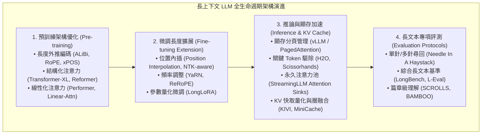

# Advancing Transformer Architecture in Long-Context Large Language Models: A Comprehensive Survey

## 一話摘要 (TL;DR)
南京大學與百度聯合發表的長上下文大模型架構全景綜述，系統性審視了 Transformer 模型在處理超長序列時的架構瓶頸，將長上下文技術演進歸納為預訓練階段架構創新（長度外推、相對位置編碼）、微調階段擴展（長度內插、LoRA 擴展）、推論期計算與 KV Cache 記憶體優化（稀疏驅除、量化、分塊分頁）以及長文本專門評測基準四大體系。

---

## 研究背景與問題定義 (Problem Statement)

1. **短文本預訓練與長文本落地應用的結構性矛盾**：
   - 儘管當代大語言模型（LLM）展示出卓越的泛化推理能力，但受限於顯存與預訓練計算資源，絕大多數模型原生僅在 2K–4K 的短文本片段上進行預訓練；然而真實應用場景（長篇文檔分析、跨文件對比、全代碼庫理解）往往涉及數萬至數十萬 Tokens。
2. **長上下文 Transformer 的三大核心物理挑戰**：
   - **計算複雜度障礙（Computational Complexity）**：Self-Attention 的 $O(N^2)$ 時間與顯存開銷；
   - **位置外推崩潰（Position Extrapolation Failure）**：直接推論超過預訓練長度的序列時，注意力分數急劇飽和或劇烈震盪，困惑度（PPL）瞬間爆炸；
   - **推論期 KV Cache 顯存牆（KV Cache Memory Wall）**：長序列下自回歸生成所需的 Key-Value 緩存隨並發請求與上下文長度急劇膨脹，遠超 GPU 顯存物理極限。
3. **缺乏端到端生命週期的全景視角**：
   - 先前文獻多孤立討論單一技術點（如單純的位置插值或單純的剪枝），亟需橫跨「預訓練、微調擴展、推論加速、標準化評測」全流程的系統化架構綜述。

---

## 核心方法與技術架構 (Methodology & Architecture)

綜述建立了貫穿 Transformer 模型全生命週期的四維架構分類體系：

### 圖中節點對照
- `PT`, `FT`, `INF`, `EVAL`：綜述梳理出的四個互相關聯的核心技術板塊。

### 1. 預訓練與位置編碼演進（Pre-training Innovations）
- **絕對位置編碼之死**：傳統 Learnable Absolute Positional Embedding 缺乏任何長度外推能力；
- **旋轉位置編碼（RoPE）與線性偏置（ALiBi）**：
  - ALiBi 引入隨距離單調遞減的負偏置項（$-m \cdot |i-j|$），賦予模型天然的零樣本外推能力；
  - RoPE 透過複數旋轉矩陣將相對位置注入內積，成為現代主流開源模型（Llama, Mistral）的絕對標準。

### 2. 微調擴展技術（Context Window Extension）
- **位置內插（Position Interpolation, PI）**：直接將位置座標縮小 $\kappa$ 倍，避免直接外推未見過的位置角度，但會模糊局部高頻細節；
- **NTK-aware Scaled RoPE 與 YaRN**：區分高頻與低頻分量，對高頻特徵做微調外推、低頻分量做內插，保證在 32K–128K 擴展下的局部語意敏銳度；
- **LongLoRA**：引入移動稀疏注意力（Shifted Sparse Attention, $S^2$-Attn），大幅降低長序列微調時的通訊與計算開銷。

### 3. 推論期 KV Cache 優化矩陣（KV Cache & Serving）
- **記憶體碎片化解決**：PagedAttention（vLLM）借鑑虛擬記憶體分頁思想，將 KV 快取顯存浪費從 >60% 降至 <4%；
- **動態驅除與 Attention Sinks**：
  - H2O 證明僅保留固定比例的 Heavy Hitters 即可維持模型困惑度；
  - StreamingLLM 揭示了起始前幾個 Token 作為「注意力沉澱池（Attention Sink）」的關鍵角色，保證了無限長串流推論不崩潰。

---

## 主要評測基準與挑戰對比 (Evaluation Protocols & Open Challenges)

綜述深入探討了評估長上下文模型的代表性基準：

1. **大海撈針（Needle In A Haystack, NIAH）**：
   - 測試模型在整篇長文的任意位置插入無關短句並精確尋回的能力；
   - 綜述指出：**單純跑通 NIAH 僅證明模型的檢索尋址能力（Retrieval Capacity），絕不等於具備深層長文本理解與跨章節推理能力**。
2. **多任務長文本基準（LongBench, L-Eval, SCROLLS）**：
   - 包含多篇總結、長篇問答、少樣本分類與代碼調試，能更真實地反映模型在長上下文下的「Lost in the Middle」衰退現象。
3. **開放挑戰（Open Challenges）**：
   - 長上下文預訓練高昂的硬體成本；
   - 超長上下文下的注意力衰減與位置偏差；
   - 長文本真實性驗證與「幻覺放大型（Amplified Hallucination）」風險。

---

## 優勢、限制及 Trade-offs (Strengths, Limitations & Trade-offs)

### 優勢
1. **全景視角完整**：橫跨底層 CUDA 算子優化（FlashAttention）、模型幾何架構（RoPE/YaRN）至上層評測協議。
2. **分類清晰透徹**：將數十種分散的擴展與壓縮技術歸納於清晰的理論脈絡中。

### 限制與 Trade-offs
1. **對狀態空間模型（SSM / Mamba）探討較少**：論文主要聚焦於 Transformer 架構內部的演進，對非 Transformer 替代架構（如 Mamba, RWKV）的對比篇幅有限。

---

## 對本專案研究領域的實際意義 (Implications for Research Domains)

1. **對 A01（Long Context & Sequence Architecture）與 A02（Context/KV Compression & Inference Efficiency）的頂層支撐**：
   - 本綜述完美對齊本知識庫前兩個核心專題，為長序列架構演進提供了標準的學術脈絡依據。
2. **對 Long Context vs. RAG 選型權衡的理論支撐**：
   - 綜述指出的「KV Cache 顯存爆炸」與「深層推理衰退」直接解釋了為何在超長文件分析中，不能盲目無限擴大 Context Window，而必須與 RAG、知識圖譜及外部記憶體架構深度協同。

---

## 原始來源及相關筆記連結 (Sources & Related Notes)

- **本地 PDF**：`[[Papers/01 - Long Context & Sequence/(arXiv 2023-11) Advancing Transformer Architecture in Long-Context Large Language Models - A Survey.pdf|開啟本地 PDF 檔案]]`
- **官方開源連結**：[arXiv:2311.12351](https://arxiv.org/abs/2311.12351)
- **關聯領域筆記**：
  - [[00 - 導覽與心智圖 (Navigation & MOC)/RAG Adjacent Interfaces|A01 Long Context & Sequence Architecture]]
  - [[00 - 導覽與心智圖 (Navigation & MOC)/RAG Adjacent Interfaces|A02 Context/KV Compression & Inference Efficiency]]
  - [[04 - 研究想法與待驗證提案 (Ideas & Hypotheses)/README|Ideas & Hypotheses]]
- **同類/相關論文筆記**：
  - [[03 - 論文庫 (Literature Notes)/01 - Long Context & Sequence/(ICLR 2024-05) FlashAttention-2 - Faster Attention with Better Parallelism and Work Partitioning|(ICLR 2024-05) FlashAttention-2]]
  - [[03 - 論文庫 (Literature Notes)/01 - Long Context & Sequence/(ICLR 2024-05) Efficient Streaming Language Models with Attention Sinks|(ICLR 2024-05) StreamingLLM]]
  - [[03 - 論文庫 (Literature Notes)/01 - Long Context & Sequence/(ICLR 2024-05) YaRN - Efficient Context Window Extension of Large Language Models|(ICLR 2024-05) YaRN]]
  - [[03 - 論文庫 (Literature Notes)/02 - Compression & KV Cache/(NeurIPS 2023-12) H2O - Heavy-Hitter Oracle for Efficient Generative Inference of Large Language Models|(NeurIPS 2023-12) H2O]]
