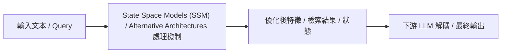

# Mamba: Linear-Time Sequence Modeling with Selective State Spaces

> [!INFO] 論文元數據 (Metadata)
> - **Paper ID**：`Gu2023_Mamba`
> - **作者**：Albert Gu, Tri Dao
> - **預印本初次發布年份 (Preprint)**：2023
> - **正式發表年份 / 會議或期刊 (Venue)**：2024 (COLM 2024)
> - **DOI**：無
> - **arXiv**：[2312.00752](https://arxiv.org/abs/2312.00752)
> - **驗證狀態**：`verified` (已比對原始文獻與 PDF 全文)
> - **本地 PDF 連結**：[[Papers/01 - Long Context & Sequence/(arXiv 2023-12) Mamba - Linear-Time Sequence Modeling with Selective State Spaces.pdf|開啟本地 PDF 檔案]]
---

## 一話摘要 (TL;DR)
**打破 Transformer 壟斷，提出具備選擇性狀態機制的 SSM（Selective SSM），實現嚴格線性推論時間 $O(L)$ 與無限制的長度外推。**

---

## 研究背景與問題定義 (Problem Statement)
傳統 SSM 為時不變系統（LTI），無法根據輸入內容動態決定記憶與遺忘（無法做 Contextual Selection）；而 Attention 雖具備選擇能力但推論時 KV Cache 隨長度無限膨脹。

---

## 核心方法與技術架構 (Methodology & Architecture)
使 SSM 參數（$B, C, \Delta$）依據當前輸入 $x_t$ 動態變化（選擇性機制），並提出硬體感知的平行關聯掃描演算法（Parallel Associative Scan），在 SRAM 內高效完成動態隱狀態累加，無需實體儲存巨大歷史狀態。

---

## 主要實驗結果與證據 (Empirical Results & Evidence)
> [!NOTE] 關鍵實證數據與評估條件
> **出處與評估條件**：Figure 1 & Table 2 (Page 6): 在百萬序列長度下推論吞吐量達 Transformer 的 5x，且推論記憶體為常數 O(1)；在語言建模 (Chinchilla scaling law) 上全面優於同參數量的 LLaMA 架構。

---

## 優勢、限制及 Trade-offs (Strengths, Limitations & Trade-offs) (Strengths & Trade-offs)
優點：訓練高平行、推論顯存常數級 $O(1)$、序列長度線性擴展；缺點：狀態維度固定導致資訊有失真壓縮，在 Needle In A Haystack 等精確 Copy/Recall 與跨文件關聯性查詢上仍不及 Attention 直接。

---

## 在長文件處理任務中的角色與啟發 (Implications for Long-Doc Processing)
掀起 2024-2026 年非 Attention 架構研究浪潮，促使業界發展 Attention-SSM 混合模型（如 Jamba、Nemotron-H）。

---

## 原始來源及相關筆記連結 (Sources & Related Notes)
- **所屬研究領域**：
  - [[00 - 導覽與心智圖 (Navigation & MOC)/RAG Adjacent Interfaces|A01 Long Context & Sequence Architecture]]
- **回主目錄**：[[00 - 導覽與心智圖 (Navigation & MOC)/Home (主目錄與知識庫導覽)|主目錄與知識庫導覽]]
- **全景心智圖**：[[00 - 導覽與心智圖 (Navigation & MOC)/RAG System Maps|RAG System Maps]]
