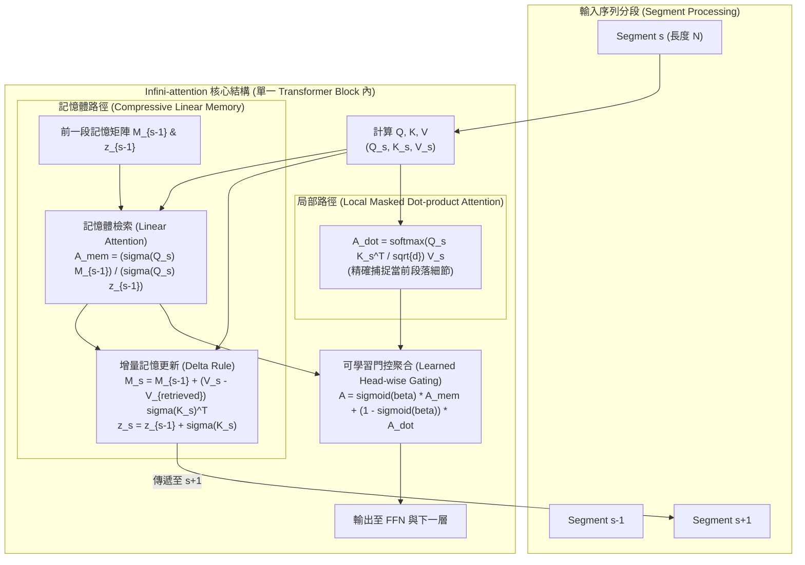

# Leave No Context Behind: Efficient Infinite Context Transformers with Infini-attention

## 1. 一話摘要 (TL;DR)
Google 團隊提出 **Infini-attention** 機制，在標準 Transformer 注意力層中同時融合局部遮罩點積注意力（Masked Local Dot-product Attention）與壓縮線性記憶體（Compressive Memory），透過單一可學習門控參數 $\beta$ 動態平衡短距上下文與全局長期記憶，僅需極小的有界記憶體開銷（1.6M 參數，相較 Memorizing Transformers 節省 **114×** 記憶體），即可在微調 5K 長度序列後成功泛化至 **100 萬 Token (1M)** 大海撈針任務（100% 召回），並在 500K 長度的 BookSum 書籍摘要任務上刷新 SOTA。

---

## 2. 研究背景與問題定義 (Problem Statement)

### 既有長序列架構的兩難困境
1. **點積注意力（Vanilla Attention）的記憶體爆炸**：
   - 傳統自注意力機制的計算複雜度與 KV Cache 空間佔用隨序列長度呈二次方 $\mathcal{O}(N^2)$ 或線性增長 $\mathcal{O}(N)$。當 Context 長度擴充至 100K 或 1M 時，KV Cache 的顯存佔用超出單卡上限，推論吞吐量驟降。
2. **段落丟棄與滑動窗口的上下文割裂（Transformer-XL / StreamingLLM）**：
   - Transformer-XL 與滑動窗口模型僅保留前一段落（Segment）的 KV 快取，將更早的上下文直接丟棄，導致模型對跨段落的長距離依賴完全失明（Context Discarding）。
3. **外部向量檢索記憶體的巨大膨脹（Memorizing Transformers）**：
   - Memorizing Transformers 等架構透過 kNN 檢索保存過去的 Key-Value 對，雖然打破了 Context 限制，但記憶體佔用隨序列長度無限膨脹（如 65K 長度需額外 183M 參數的向量索引），檢索延遲隨時間顯著增加。

---

## 3. 核心方法與技術架構 (Methodology & Architecture)

### 圖中節點對照
- `InputSeq`：[[00 - 導覽與心智圖 (Navigation & MOC)/RAG Adjacent Interfaces|A01 Long Context & Sequence Architecture]]
- `LocalBranch`：[[00 - 導覽與心智圖 (Navigation & MOC)/RAG Adjacent Interfaces|A01 Long Context & Sequence Architecture]]
- `MemoryBranch`：[[02 - 研究領域專題 (Research Domains)/Domain 02 - 動態記憶體與 KV Cache 壓縮 (Streaming, H2O, SnapKV)|壓縮線性關聯記憶體]]
- `Gate`：[[00 - 導覽與心智圖 (Navigation & MOC)/RAG Adjacent Interfaces|A01 Long Context & Sequence Architecture]]

### 數學原理與關鍵公式
1. **壓縮記憶體矩陣表示（Compressive Memory）**：
   - 每個 Attention Head 維護一個固定維度的記憶狀態矩陣 $M_s \in \mathbb{R}^{d_{key} \times d_{val}}$ 與歸一化向量 $z_s \in \mathbb{R}^{d_{key}}$。
   - 記憶檢索公式（採用 ELU 激活函數 $\sigma(x) = \text{ELU}(x) + 1$）：
     $$A_{mem} = \frac{\sigma(Q_s) M_{s-1}}{\sigma(Q_s) z_{s-1} + \epsilon}$$
2. **Delta Rule 記憶體更新機制**：
   - 為避免舊有資訊覆蓋或容量飽和，引入 Delta 更新規則：在寫入新 Value 之前，先檢索舊 Value 並計算殘差：
     $$M_s = M_{s-1} + \left(V_s - \frac{\sigma(K_s) M_{s-1}}{\sigma(K_s) z_{s-1} + \epsilon}\right) \sigma(K_s)^T$$
     $$z_s = z_{s-1} + \sum_{t=1}^N \sigma(k_{s,t})$$
3. **門控融合機制（Gated Context Aggregation）**：
   - 每個 Attention Head 擁有一個純量門控參數 $\beta$：
     $$A = \text{sigmoid}(\beta) \odot A_{mem} + (1 - \text{sigmoid}(\beta)) \odot A_{dot}$$
   - 論文觀察到訓練後各頭會自動特化：部分頭的 $\text{sigmoid}(\beta) \approx 0$（專門處理局部上下文），部分接近 $1$（專門檢索長期記憶），部分接近 $0.5$（混合頭）。

---

## 4. 主要實驗結果與證據 (Empirical Results & Evidence)

### 1. 長文本語言建模與記憶體壓縮比 (Table 2, Page 7)
在 PG19 與 Arxiv-math 基準上（段落長度 2048），比較模型複雜度與壓縮比：

| 模型架構 | Compressive Memory 參數 | 壓縮比 (Comp. Ratio) | XL Cache 尺寸 | PG19 PPL ↓ | Arxiv-math PPL ↓ |
| :--- | :---: | :---: | :---: | :---: | :---: |
| **Transformer-XL** | 50M | 3.7× | 2048 | 11.88 | 2.42 |
| **Memorizing Transformers** | 183M | 1.0× (基準) | 2048 | 11.37 | 2.26 |
| **RMT (Recurrent Memory)** | 2.5M | 73× | None | 13.27 | 2.55 |
| **Infini-Transformer (Linear)** | **1.6M** | **114×** | **None** | **9.65** | 2.24 |
| **Infini-Transformer (Linear + Delta)** | **1.6M** | **114×** | **None** | **9.67** | **2.23** |

- *核心亮點*：Infini-Transformer 以僅 **1.6M** 記憶體參數（相較 Memorizing Transformers 壓縮 **114 倍**），在 PG19 上取得了 **9.65 PPL**，顯著超越 Memorizing Transformer 的 11.37 與 Transformer-XL 的 11.88。

### 2. 100 萬 Token (1M) 大海撈針檢索 (Table 3, Page 7)
將 1B 模型替換為 Infini-attention，僅在 5K 長度序列上微調 400 步，測試長度由 32K 延伸至 1M，Passkey 分別置於開頭、中段與結尾：

| 評估配置 | 32K (S / M / E) | 128K (S / M / E) | 256K (S / M / E) | 512K (S / M / E) | 1M (S / M / E) |
| :--- | :---: | :---: | :---: | :---: | :---: |
| **Zero-shot (Linear)** | 14 / 13 / 98 % | 11 / 14 / 100 % | 6 / 3 / 100 % | 6 / 7 / 99 % | 8 / 6 / 98 % |
| **Zero-shot (Linear+Delta)** | 13 / 11 / 99 % | 6 / 9 / 99 % | 7 / 5 / 99 % | 6 / 8 / 97 % | 7 / 6 / 97 % |
| **FT 400 steps (Linear)** | **100 / 100 / 100 %** | **100 / 100 / 100 %** | **100 / 100 / 100 %** | 97 / 99 / 100 % | 96 / 94 / 100 % |
| **FT 400 steps (Linear+Delta)** | **100 / 100 / 100 %** | **100 / 100 / 99 %** | **100 / 100 / 99 %** | **100 / 100 / 100 %** | **100 / 100 / 100 %** |

- *核心亮點*：Linear + Delta 模型在 1M 長度的開頭、中段、結尾均達成 **100% / 100% / 100% 完美檢索**。

### 3. 500K 長度書籍摘要評測 (Table 4, Page 8)
在 BookSum 基準上（以 8B LLM 預訓練並以 32K 微調，測試 500K 全書）：

| 模型 | ROUGE-1 ↑ | ROUGE-2 ↑ | ROUGE-L ↑ | Overall ↑ |
| :--- | :---: | :---: | :---: | :---: |
| **BART** | 36.4 | 7.6 | 15.3 | 16.2 |
| **BART + Unlimiformer** | 36.8 | 8.3 | 15.7 | 16.9 |
| **PRIMERA** | 38.6 | 7.2 | 15.6 | 16.3 |
| **PRIMERA + Unlimiformer** | 37.9 | 8.2 | 16.3 | 17.2 |
| **Infini-Transformers (Linear)** | 37.9 | 8.7 | 17.6 | 18.0 |
| **Infini-Transformers (Linear + Delta)** | **40.0** | **8.8** | **17.9** | **18.5** |

---

## 5. 優勢、限制及 Trade-offs (Strengths, Limitations & Trade-offs)

### 優勢
1. **常數級有界記憶體開銷（$\mathcal{O}(1)$ Memory Footprint）**：
   - 記憶狀態為固定尺寸的矩陣 $d_{key} \times d_{val}$，無論輸入 10 萬或 100 萬 Token，顯存佔用固定不變。
2. **無縫兼容現有 Transformer**：
   - 無需改變模型前饋網路（FFN）或重頭訓練，可直接透過輕量級持續預訓練（Continual Pre-training）替換 MHA。
3. **長短程注意力自適應**：
   - 透過純量門控 $\beta$，讓模型自行學習何時依賴局部上下文、何時查詢全局記憶庫。

### 限制與 Trade-offs
1. **資訊壓縮失真（Lossy Compression）**：
   - 矩陣點積儲存容量存在理論上限，面對超密集的多跳推理與細粒度數值比對時，線性注意力存在不可避免的記憶體混淆（Associative Interference）。
2. **訓練序列反向傳播截斷**：
   - 雖然推論能無限展開，但訓練時受限於 BPTT 截斷長度（如 32K 展開 16 步），超長距離的反向梯度傳播仍有數值不穩定風險。

---

## 6. 對本專案研究領域的實際意義 (Implications for Research Domains)

### 對 Domain 01 (Long Context) 與 Domain 02 (KV Cache 壓縮) 的啟發
1. **重新定義 Attention 與 RNN 的交界**：
   - Infini-attention 證明了 Transformer 無需在「全量二次方注意力」與「純線性 RNN (如 Mamba)」之間二選一；透過「段內 Standard Attention + 段間 Compressive Linear Attention」，達成了精確度與推論效率的平衡。
2. **與 RAG 的分工邊界**：
   - Infini-attention 適用於「流式（Streaming）輸入」或「整部小說/程式庫的全局理解」，其有界顯存特性使其成為超長文本前置過濾與記憶維持的強大候選者；而細粒度的精確事實查核仍需 RAG 補足。

---

## 7. 原始來源及相關筆記連結 (Sources & Related Notes)

### 原始來源
- 本地 PDF：[[Papers/01 - Long Context & Sequence/(arXiv 2024-04) Leave No Context Behind - Efficient Infinite Context Transformers with Infini-attention.pdf|開啟本地 PDF 檔案]]
- arXiv：[2404.07143](https://arxiv.org/abs/2404.07143)

### 相關文獻與領域筆記
- 所屬領域專題：
  - [[00 - 導覽與心智圖 (Navigation & MOC)/RAG Adjacent Interfaces|A01 Long Context & Sequence Architecture]]
  - [[02 - 研究領域專題 (Research Domains)/Domain 02 - 動態記憶體與 KV Cache 壓縮 (Streaming, H2O, SnapKV)|Domain 02 - 動態記憶體與 KV Cache 壓縮]]
- 相關長序列與記憶體筆記：
  - [[03 - 論文庫 (Literature Notes)/01 - Long Context & Sequence/(NeurIPS 2017-12) Attention Is All You Need.md|(NeurIPS 2017-12) Attention Is All You Need]]
  - [[03 - 論文庫 (Literature Notes)/01 - Long Context & Sequence/(ICLR 2024-05) Efficient Streaming Language Models with Attention Sinks.md|(ICLR 2024-05) StreamingLLM]]
  - [[03 - 論文庫 (Literature Notes)/02 - Compression & KV Cache/(SIGCOMM 2024-08) CacheGen - KV Cache Compression and Streaming for Fast Large Language Model Serving.md|(SIGCOMM 2024-08) CacheGen]]
  - [[03 - 論文庫 (Literature Notes)/02 - Compression & KV Cache/(NeurIPS 2024-12) MiniCache - KV Cache Compression in Depth Dimension for Large Language Models.md|(NeurIPS 2024-12) MiniCache]]
