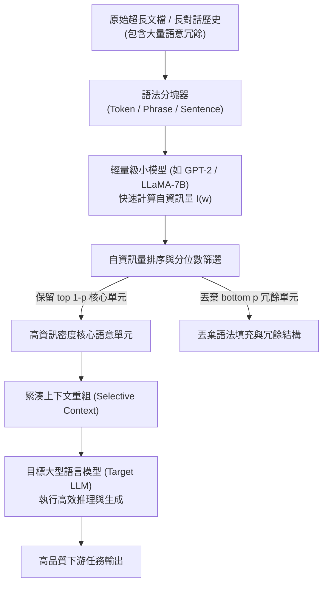

# Compressing Context to Enhance Inference Efficiency of Large Language Models (Selective Context)

> [!INFO] 論文元數據 (Metadata)
> - **Paper ID**：`Li2023_SelectiveContext`
> - **作者**：Yucheng Li, Bo Dong, Chenghua Lin, Frank Guerin (Univ of Surrey, Univ of Manchester)
> - **預印本初次發布年份 (Preprint)**：2023 (arXiv:2310.06201)
> - **正式發表年份 / 會議或期刊 (Venue)**：2023 (EMNLP 2023, Main Conference)
> - **DOI**：[10.18653/v1/2023.emnlp-main.391](https://doi.org/10.18653/v1/2023.emnlp-main.391)
> - **ACL Anthology**：[https://aclanthology.org/2023.emnlp-main.391/](https://aclanthology.org/2023.emnlp-main.391/)
> - **arXiv**：[2310.06201](https://arxiv.org/abs/2310.06201)
> - **驗證狀態**：`verified` (已比對 EMNLP 2023 官方全文與論文 PDF)
> - **本地 PDF 連結**：[[Papers/02 - Compression & KV Cache/(EMNLP 2023-12) Compressing Context to Enhance Inference Efficiency of Large Language Models.pdf|開啟本地 PDF 檔案]]

---

## 一話摘要 (TL;DR)
Selective Context 提出一種基於小語言模型**自資訊量（Self-Information / Perplexity）**評估輸入上下文冗餘度的通用 Prompt 壓縮算法；在將輸入上下文壓縮 50% 的條件下，為下游 LLM 降低 **36% 顯存開銷**並縮短 **32% 推論延遲**，且生成品質（BERTScore 與真實度）僅產生極微小波動。

---

## 研究背景與問題定義 (Problem Statement)

### 1. 核心痛點
隨著 LLM 應用場景拓展至長篇文檔摘要、長程多輪對話與檢索增強生成（RAG）：
1. **二次方計算與 Prefill 延遲暴增**：長文本輸入使得 Self-Attention 計算複雜度急劇攀升，首字生成延遲（Time-to-First-Token, TTFT）顯著延長。
2. **上下文窗口溢出（Context Truncation）**：商用模型長度限制迫使系統必須對長文檔進行機械式粗暴截斷，往往丟失後半段關鍵資訊。
3. **文本中充斥無效語意冗餘**：自然語言文本包含大量語法虛詞、客套寒暄、格式重複句與高可預測性結構，直接全量輸入是對 GPU 記憶體與算力的巨大浪費。

### 2. 研究假設
文本中的「資訊密度」是不均勻的。高自資訊量（高困惑度、低預測機率）的詞彙與句子承載了核心命題與新實體；而低自資訊量（高預測機率）的單元大多為冗餘語法結構。若利用輕量級小模型預先計算單元的自資訊量並進行選擇性剪枝，即可在保證語意核心完整的前提下大幅縮短 Prompt 長度。

---

## 核心方法與技術架構 (Methodology & Architecture)

### 1. 自資訊量量化 (Self-Information Calculation)
給定輸入長文本序列 $S = (w_1, w_2, \dots, w_N)$，使用一個預訓練的小型基礎模型（如 GPT-2 或 LLaMA-7B）評估各語言單元（Lexical Units，可為 Token、Phrase 或 Sentence）的負對數似然：
$$I(w_i | w_{<i}) = -\log P(w_i | w_1, \dots, w_{i-1})$$
- **高自資訊量單元 $I(w)$ 大**：表示該內容在給定前文條件下不可預測，包含罕見名詞、事實數據、邏輯轉折；
- **低自資訊量單元 $I(w)$ 小**：表示該內容極易被前文推導，屬於語言填充詞或冗餘重複。

### 2. 多粒度選擇性過濾 (Selective Filtering)
- 支援三種切分粒度：
  1. **Token 級剪枝**：最靈活，但可能偶爾損害局部語法連貫性；
  2. **短語/語義塊級剪枝 (Phrase-level)**：平衡資訊密度與可讀性；
  3. **句子級剪枝 (Sentence-level)**：保留完整的句法結構，適合篇章級長文本。
- 根據預設的壓縮比例 $\rho \in (0, 1)$，保留自資訊量排名前 $(1 - \rho)$ 的單元，將低資訊量單元剔除後重組為緊湊 Prompt。

### 系統架構流程圖 (Mermaid)

#### 圖中節點對照
- `RawDoc`: 未經壓縮的原始輸入文本
- `SmallLM`: 專門用於計算資訊量分布的輕量級輔助模型
- `Ranker`: 資訊量閾值篩選器
- `Reconstruct`: 壓縮後的緊湊 Prompt
- `TargetLLM`: 負責實際生成或摘要的昂貴下游大模型

---

## 主要實驗結果與證據 (Empirical Results & Evidence)

### 1. 不同壓縮比例下的生成品質保持 (Table 1, Page 6)
在長文本生成基準上，評估不同壓縮比率（Reduction Ratio）與未壓縮全量上下文（Original）的對比（生成溫度 0.7）：

| 壓縮方法 | 壓縮比率 $\rho$ | BLEU | METEOR | ROUGE-1 | ROUGE-2 | ROUGE-L | BERTScore F1 |
| :--- | :---: | :---: | :---: | :---: | :---: | :---: | :---: |
| **Original Context** | 0.00 | .347 | .496 | .571 | .383 | .471 | .909 |
| **Selective Context** | 0.20 | .295 | .460 | .540 | .346 | .438 | .902 |
| **Selective Context** | 0.35 | .243 | .421 | .504 | .294 | .396 | .897 |
| **Selective Context** | **0.50** | .179 | .362 | .449 | .237 | .344 | **.887** |
| **Selective Context** | 0.65 | .127 | .299 | .391 | .178 | .287 | .877 |
| **Selective Context** | 0.80 | .070 | .224 | .311 | .122 | .225 | .863 |

*(出處：Table 1, Page 6)*

### 2. 對比隨機刪除基準 (Table 2, Page 6)
在 Greedy Decoding 條件下，對比 Selective Context 與同比例隨機刪除（Random Deletion）：
- 在 **50% 壓縮比例** 下：
  - **Random Deletion**：ROUGE-1 為 0.576，BERTScore-F1 為 0.873；
  - **Selective Context**：ROUGE-1 達 **0.642**，BERTScore-F1 達 **0.900**（顯著優於隨機丟棄，證實自資訊量能精準定位核心知識）。

### 3. 硬體顯存與延遲實際收益 (Page 1, Abstract)
在標準下游應用評估中：
- 達成 **50% 輸入 Context 縮減**；
- 帶來 **36% 顯存開銷降低**；
- 帶來 **32% 推論延遲縮短**；
- 下游 BERTscore 僅微跌 0.023，真實度（Faithfulness）僅微跌 0.038。

---

## 優勢、限制及 Trade-offs (Strengths, Limitations & Trade-offs)

### 1. 優勢 (Strengths)
1. **黑盒無侵入性**：作用於純文本空間（Text-to-Text），對目標下游 LLM 的權重、架構或 API 呼叫完全無侵入，通用性極強。
2. **顯著減少 API Token 帳單與 Prefill 延遲**：對於以 Token 計費的商用 API（如 GPT-4），直接在前端降低 30%–50% 的呼叫成本。
3. **無須微調即可適配多種下遊任務**：在摘要、問答、多輪會話中均展現出高度一致的抗降解表現。

### 2. 限制與代價 (Limitations & Trade-offs)
1. **需依賴本機小模型預處理**：需要常駐一個小型 LM 計算自資訊量，引入了一道額外的輕量級預處理管線。
2. **極限壓縮下的句意破碎**：當壓縮比例超過 65%（如 $\rho = 0.8$）時，語法結構被過度破壞，下游 LLM 的 ROUGE 指標出現明顯下降。
3. **與 KV 快取層剪枝的維度差異**：Selective Context 屬於「Prompt 文本級靜態壓縮」，無法直接解決生成階段隨輸出步數增加帶來的 KV Cache 顯存膨脹（需與 H2O / Scissorhands 結合）。

---

## 對本專案研究領域的實際意義 (Implications for Research Domains)

1. **Domain 02 (上下文壓縮與 KV Cache 管理)**：
   確立了「Prompt-level 資訊熵壓縮」的代表性基準。後續知名工作如 LongLLMLingua、LLMLingua 均直接繼承並擴展了此種基於自資訊量的剪枝思想。
2. **工業級 RAG 檢索段落二次壓縮**：
   在 RAG 系統檢索出 Top-$k$ 篇粗粒度段落後，直接塞入 LLM 往往成本過高。利用 Selective Context 作為「檢索後置過濾器（Post-Retrieval Filter）」，可大幅減少無關上下文，提高下游問答的精準度與性價比。

---

## 原始來源及相關筆記連結 (Sources & Related Notes)

- **本地 PDF 連結**：[[Papers/02 - Compression & KV Cache/(EMNLP 2023-12) Compressing Context to Enhance Inference Efficiency of Large Language Models.pdf|開啟本地 PDF 檔案]]
- **關聯之快取與上下文壓縮筆記**：
  - [[03 - 論文庫 (Literature Notes)/02 - Compression & KV Cache/(NeurIPS 2023-12) H2O - Heavy-Hitter Oracle for Efficient Generative Inference of Large Language Models|H2O: Heavy-Hitter Oracle for Efficient Generative Inference]]
  - [[03 - 論文庫 (Literature Notes)/02 - Compression & KV Cache/(NeurIPS 2023-12) Scissorhands - Exploiting the Persistence of Importance Hypothesis for LLM KV Cache Compression at Test Time|Scissorhands: Exploiting the Persistence of Importance Hypothesis]]
- **所屬研究領域**：
  - [[02 - 研究領域專題 (Research Domains)/Domain 02 - 上下文壓縮與 KV Cache 管理 (Prompt 壓縮, 選擇性丟棄, 量化)|Domain 02 - 上下文壓縮與 KV Cache 管理]]
