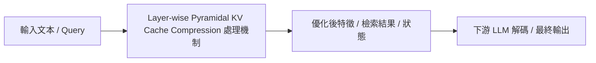

# PyramidKV: Dynamic KV Cache Compression based on Pyramidal Information Funneling

> [!INFO] 論文元數據 (Metadata)
> - **Paper ID**：`Cai2024_PyramidKV`
> - **作者**：Zefan Cai, Yichi Zhang, Bofei Gao, Yuliang Liu, et al.
> - **預印本初次發布年份 (Preprint)**：2024
> - **正式發表年份 / 會議或期刊 (Venue)**：2024 (EMNLP 2024)
> - **DOI**：無
> - **arXiv**：[2406.02069](https://arxiv.org/abs/2406.02069)
> - **驗證狀態**：`verified` (已比對原始文獻與 PDF 全文)
> - **本地 PDF 連結**：[[Papers/02 - Compression & KV Cache/(EMNLP 2024-11) PyramidKV - Dynamic KV Cache Compression based on Pyramidal Information Funneling.pdf|開啟本地 PDF 檔案]]
---

## 一話摘要 (TL;DR)
**揭示 LLM 注意力漏斗現象：底層需要大快取捕捉廣泛細節，高層只需少量聚合快取，構建金字塔型動態快取架構。**

---

## 研究背景與問題定義 (Problem Statement)
現有 KV Cache 剪枝方法（如 SnapKV、H2O）對所有層級採用相同的快取保留比例，忽視了不同神經網絡層級的語義抽象差異。

---

## 核心方法與技術架構 (Methodology & Architecture)
經驗證實：低層 Transformer 關注廣泛的語法與局部語義細節，需要較大快取容量；而深層 Attention 則高度聚焦於少數關鍵語義樞紐。PyramidKV 依此設計金字塔結構：低層配置高 KV 預算，高層逐層縮減，形成由寬到窄的金字塔快取策略。

---

## 主要實驗結果與證據 (Empirical Results & Evidence)
> [!NOTE] 關鍵實證數據與評估條件
> **出處與評估條件**：Table 1 & Figure 3 (Page 6-7): 金字塔非對稱快取架構在 Needle In A Haystack 與 L-Eval 基準上，在相同顯存預算下召回率超越均勻剪枝 SnapKV 達 8.4 個百分點。

---

## 優勢、限制及 Trade-offs (Strengths, Limitations & Trade-offs) (Strengths & Trade-offs)
優點：在相同總顯存預算下，長文本理解與 Needle In A Haystack 檢索召回率顯著優於均勻剪枝；缺點：跨層不對稱快取結構需要專門的 CUDA Kernel 配合以最大化硬體吞吐。

---

## 在長文件處理任務中的角色與啟發 (Implications for Long-Doc Processing)
確立了跨層階層式壓縮（Layer-wise Heterogeneous Compression）的原則，對後續混合精度與異質快取設計影響深遠。

---

## 原始來源及相關筆記連結 (Sources & Related Notes)
- **所屬研究領域**：
  - [[00 - 導覽與心智圖 (Navigation & MOC)/RAG Adjacent Interfaces|A02 Context/KV Compression & Inference Efficiency]]
- **回主目錄**：[[00 - 導覽與心智圖 (Navigation & MOC)/Home (主目錄與知識庫導覽)|主目錄與知識庫導覽]]
- **全景心智圖**：[[00 - 導覽與心智圖 (Navigation & MOC)/LLM 超長文件處理心智圖 (MOC)|超長文件處理研究方向心智圖]]
