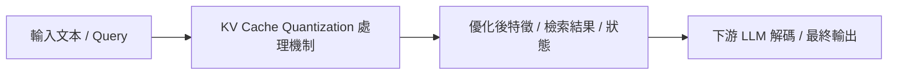

# KIVI: A Tuning-Free Asymmetric 2-bit Quantization for KV Cache

> [!INFO] 論文元數據 (Metadata)
> - **Paper ID**：`Liu2024_KIVI`
> - **作者**：Zirui Liu, Jiayi Yuan, Hongye Jin, Shaochen Zhong, Zhaozhuo Xu, Vladimir Braverman, Beidi Chen, Xia Hu
> - **預印本初次發布年份 (Preprint)**：2024
> - **正式發表年份 / 會議或期刊 (Venue)**：2024 (ICML 2024)
> - **DOI**：無
> - **arXiv**：[2402.02750](https://arxiv.org/abs/2402.02750)
> - **驗證狀態**：`verified` (已比對原始文獻與 PDF 全文)
> - **本地 PDF 連結**：[[Papers/02 - Compression & KV Cache/(ICML 2024-07) KIVI - A Tuning-Free Asymmetric 2-bit Quantization for KV Cache.pdf|開啟本地 PDF 檔案]]
---

## 一話摘要 (TL;DR)
**KIVI 是 tuning-free 的非對稱 2-bit KV-cache quantization：Key 採 per-channel、Value 採 per-token 量化；論文報告約 2.6× 較低 peak memory、最多 4× batch size，以及約 2.35×–3.47× throughput。**

---

## 研究背景與問題定義 (Problem Statement)
在長 context 或較大 batch 下，KV Cache 會成為重要的推論記憶體成本，限制可服務的 batch size 與 context 長度；其相對於模型權重的占比依模型與工作負載而異。

---

## 核心方法與技術架構 (Methodology & Architecture)
深入分析 Key 與 Value 快取的數值分佈特性：發現 Key 向量在特定通道維度存在離群值（Outliers），適合按 Channel-wise 量化；而 Value 向量分佈相對平滑，適合按 Token-wise 量化。結合非對稱量化策略，將 KV Cache 壓縮為 2-bit，並保留小規模的 Full-precision Residual Window。

---

## 主要實驗結果與證據 (Empirical Results & Evidence)
> [!NOTE] 關鍵實證數據與評估條件
> **論文整體結果**：KIVI 在 Llama-2、Falcon 與 Mistral 等模型上以 2-bit KV cache 維持接近原精度品質；作者報告約 **2.6× 較低 peak memory（包含 model weights）**、最多 **4× 較大 batch size**，以及約 **2.35×–3.47× throughput**。這些數字是特定實驗設定結果，不應解讀為所有模型與硬體的固定倍率。

---

## 優勢、限制及 Trade-offs (Strengths, Limitations & Trade-offs) (Strengths & Trade-offs)
優點：無需重新訓練、即插即用、顯存節省極大、長文本準確率幾乎無損；缺點：引入了 Dequantization 的計算開銷，對極低延遲的短文本任務加速有限。

---

## 在長文件處理任務中的角色與啟發 (Implications for Long-Doc Processing)
KIVI 說明 KV-cache quantization 是降低推論記憶體成本的一條可行路線；是否由特定 serving framework 採用、採用何種 quantization scheme，需依各框架版本另行核實。

---

## 原始來源及相關筆記連結 (Sources & Related Notes)
- **所屬研究領域**：
  - [[00 - 導覽與心智圖 (Navigation & MOC)/RAG Adjacent Interfaces|A02 Context/KV Compression & Inference Efficiency]]
- **回主目錄**：[[00 - 導覽與心智圖 (Navigation & MOC)/Home (主目錄與知識庫導覽)|主目錄與知識庫導覽]]
- **全景心智圖**：[[00 - 導覽與心智圖 (Navigation & MOC)/RAG System Maps|RAG System Maps]]
