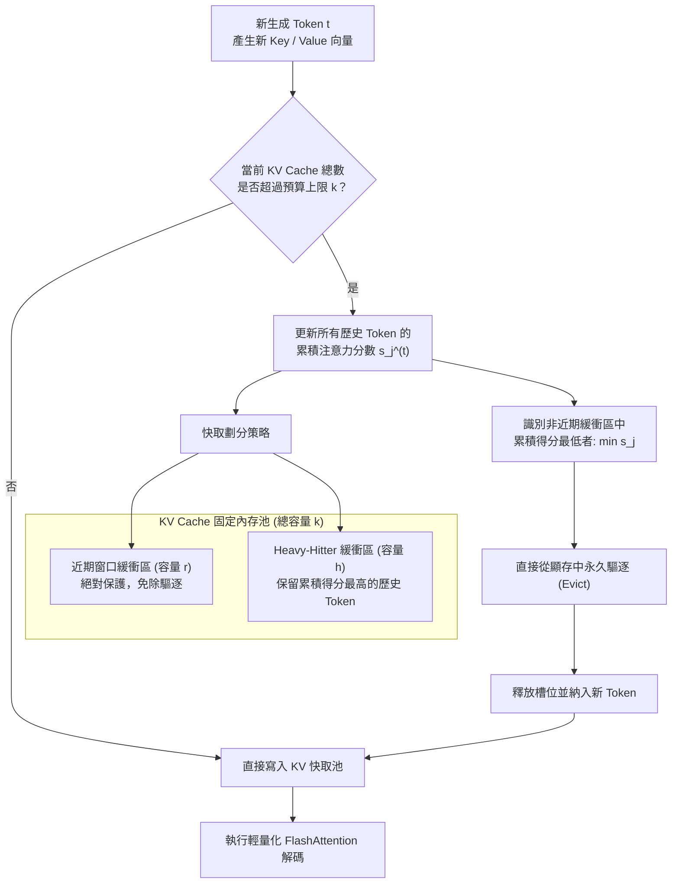

# H2O: Heavy-Hitter Oracle for Efficient Generative Inference of Large Language Models

> [!INFO] 論文元數據 (Metadata)
> - **Paper ID**：`Zhang2023_H2O`
> - **作者**：Zhenyu Zhang, Ying Sheng, Tianyi Zhou, Tianlong Chen, Lianmin Zheng, Ruisi Cai, Zhao Song, Yuandong Tian, Christopher Ré, Clark Barrett, Zhangyang Wang, Beidi Chen (UT Austin, Stanford, UCSD, UC Berkeley, Adobe, Meta FAIR, CMU)
> - **預印本初次發布年份 (Preprint)**：2023 (arXiv:2306.14048)
> - **正式發表年份 / 會議或期刊 (Venue)**：2023 (NeurIPS 2023)
> - **DOI / 官方論文集連結**：[NeurIPS 2023 Proceedings](https://proceedings.neurips.cc/paper_files/paper/2023/hash/6ceffa7b734e425fb93e1a73b5199870-Abstract-Conference.html)
> - **arXiv**：[2306.14048](https://arxiv.org/abs/2306.14048)
> - **驗證狀態**：`verified` (已比對 NeurIPS 2023 官方全文與論文 PDF)
> - **本地 PDF 連結**：[[Papers/02 - Compression & KV Cache/(NeurIPS 2023-12) H2O - Heavy-Hitter Oracle for Efficient Generative Inference of Large Language Models.pdf|開啟本地 PDF 檔案]]

---

## 一話摘要 (TL;DR)
H2O 發現 LLM 注意力矩陣中僅有極少數關鍵 Token（稱為「重擊者」Heavy-Hitters, $H_2$）貢獻了絕大多數累積注意力權重，據此提出動態 KV Cache 驅逐算法（保留最近局部 Token 與累積注意力最高的 $H_2$），在僅保留 20% KV 預算（內存節省達 5 倍）下維持與完整快取相當的精度，吞吐量提升最高達 29 倍。

---

## 研究背景與問題定義 (Problem Statement)

### 1. 核心痛點
在大語言模型的長序列自回歸解碼推論中：
1. **KV Cache 顯存線性膨脹**：隨著序列長度與批次大小（Batch Size）的增加，KV Cache 所佔據的 GPU 顯存迅速超過模型本身權重（例如在 30B 模型長文本生成時，KV Cache 可佔據數十 GB 顯存）。
2. **Batch Size 受限阻礙高吞吐量**：顯存耗盡迫使推論引擎必須減小 Batch Size，導致 GPU 運算單元無法飽和，大幅壓低每秒吞吐 Token 數（Tokens/sec）。
3. **固定或滑動窗口策略功能性崩潰**：單純的局部滑動窗口（Local Sliding Window）在驅逐早期 Token 時，會引發模型「功能崩潰（Functional Collapse）」，困惑度急速飆升。

### 2. 研究假設
在生成過程中，注意力分佈具備強烈的冪律（Power-Law）稀疏性：
- 絕大多數歷史 Token 在後續生成步中幾乎不再被關注；
- 少數關鍵 Token（如初始 Prompt 的語意錨點、語法轉折點與命名實體）在整個生成週期中會被所有後續 Token 反覆高度關注。
若在運行時動態維護這些 Heavy-Hitter Tokens，並僅剔除累積注意力極低的不重要 Token，即可在不重新訓練的情況下實現無損大幅壓縮。

---

## 核心方法與技術架構 (Methodology & Architecture)

### 1. 累積注意力分數與 Heavy-Hitters ($H_2$)
在第 $t$ 個生成步驟，給定當前查詢 $q_t$ 與歷史所有 Key 向量 $k_1, \dots, k_t$，模型計算第 $t$ 步的注意力權重向量：
$$A_{t, j} = \text{Softmax}\left(\frac{q_t k_j^T}{\sqrt{d}}\right), \quad j \in [1, t]$$
Token $j$ 在當前為止所累積的總影響力定義為累積注意力分數（Cumulative Attention Score）：
$$s_j^{(t)} = \sum_{\tau=1}^t A_{\tau, j}$$
實驗發現，按 $s_j^{(t)}$ 排序後，排名前 10%–20% 的 Token（即 Heavy-Hitters, $H_2$）佔據了注意力權重總和的絕大部分。

### 2. H2O 動態驅逐機制 (Eviction Policy)
設定 KV Cache 的固定預算容量為 $k$。H2O 將快取分為兩部分：
1. **近期局部快取（Recent Local Tokens, 預算容量 $r$）**：始終保留最近產生的 $r$ 個 Token，確保對話與生成內容的局部語法連貫性；
2. **重擊者快取（Heavy-Hitter Cache, 預算容量 $h = k - r$）**：從歷史所有非近期 Token 中，根據累積分數 $s_j^{(t)}$ 動態維護排名前 $h$ 大的 Token。
- 當新 Token 進入且總快取數量達到預算上限 $k$ 時：
  - 局部滑動窗口中的最老 Token 移入候選區；
  - 在所有非局部候選 Token 中，剔除累積注意力分數最小的 Token：
    $$\text{Evict} = \arg\min_{j \notin \text{Recent}} s_j^{(t)}$$
  - 被剔除的 Key-Value 嵌入直接釋放顯存，其後續步驟不再參與自注意力運算。

### 系統架構流程圖 (Mermaid)

#### 圖中節點對照
- `NewToken`: 每個自回歸生成步的新 Key-Value 向量
- `CacheCheck`: 快取預算超限判斷 (Budget Constraint)
- `Recent`: 近期局部連續滑動窗口 (Local Sliding Window)
- `H2`: 累積注意力重擊者保留池 (Heavy-Hitter Buffer)
- `Evict`: 最小權重動態驅逐操作

---

## 主要實驗結果與證據 (Empirical Results & Evidence)

### 1. 各項下游任務性能評測 (Table 1 & Table 2, Page 8)
在 OPT-30B 模型上對比全量快取與 20% KV 快取預算（壓縮 5 倍）：

| 方法 | 快取預算比例 | COPA (Acc) | OpenBookQA (Acc) | PiQA (Acc) | Winogrande (Acc) |
| :--- | :---: | :---: | :---: | :---: | :---: |
| **Full KV Cache (完整快取)** | 100% | 85.00 | 43.20 | 78.51 | 70.24 |
| Local (純局部窗口無 $H_2$) | 20% | 48.00 | 25.20 | 55.82 | 49.17 |
| **Local + $H_2$ (H2O)** | **20%** | **84.00** | **43.00** | **78.45** | **69.06** |
| Strided Sparse Transformer w/o $H_2$ | 20% | 50.00 | 24.60 | 56.20 | 47.59 |
| **Strided Sparse Transformer w. $H_2$** | **20%** | **83.00** | **42.60** | **78.24** | **69.61** |

*(出處：Table 2, Page 8)*

- **關鍵發現**：
  - 在僅使用 20% 快取時，純局部窗口策略準確率發生災難性崩潰（COPA 從 85.00 跌至 48.00，OpenBookQA 跌至 25.20）；
  - 引入 $H_2$ 重擊者後，H2O 在四個基準上幾乎無損還原了 Full 快取的精度（PiQA 達 78.45 vs 78.51，OpenBookQA 達 43.00 vs 43.20）。

### 2. 端到端推論吞吐量與延遲提升 (Table 3, 4, 5, Page 8–9)
- **A100 GPU 測試** (Table 5, Page 9, OPT-6.7B, 序列長度 2048+2048)：
  - Batch Size = 24：吞吐量由 Full 系統的 494.1 tokens/s 提升至 H2O 的 **918.9 tokens/s (提升 1.86 倍)**；
  - Batch Size = 64：Full 系統發生顯存溢出 (OOM)，而 H2O 成功運行並達到 **1161.0 tokens/s**。
- **對比主流推論引擎** (Page 3, Page 8)：
  - 相較於 DeepSpeed Zero-Inference 達成最高 **29 倍** 吞吐提升；
  - 相較於 HuggingFace Accelerate 達成 **29 倍** 吞吐提升；
  - 相較於 FlexGen 達成 **3 倍** 吞吐提升。

---

## 優勢、限制及 Trade-offs (Strengths, Limitations & Trade-offs)

### 1. 優勢 (Strengths)
1. **即時零訓練適配（Training-Free）**：無需對 LLM 進行任何重新預訓練或微調，完全在推論解碼階段實施。
2. **突破顯存瓶頸實現超大 Batch Size**：將 KV Cache 顯存縮減 5 倍以上，使推論服務能在相同 GPU 硬體下支撐顯著擴大的並行請求批次。
3. **與量化正交兼容**：可與 4-bit / 8-bit KV 量化技術完美疊加，實現 10–20 倍的極限顯存壓縮。

### 2. 限制與代價 (Limitations & Trade-offs)
1. **不可逆的永久驅逐**：一旦某個 Token 被從 KV Cache 驅逐，若後續超長推理步驟重新需要該細節事實，模型無法召回該 Token（除非重新執行 Prefill）。
2. **累積得分更新維護成本**：每一步需要對所有快取中的 Token 累加當前步的注意力權重並維護最小堆/排序隊列，若未進行 CUDA 內核優化，可能引入微小的 CPU/GPU 同步延遲。
3. **對密集檢索與細節多跳問答的潛在擾動**：在合成大海撈針或多跳長文推理中，若分散在中間的證據 Token 早期權重不高，存在被過早驅逐的風險。

---

## 對本專案研究領域的實際意義 (Implications for Research Domains)

1. **A02 (Context/KV Compression & Inference Efficiency)**：
   H2O 是現代動態 KV Cache 驅逐（Eviction-based Compression）的奠基之作，啟發了後續的 Scissorhands、StreamingLLM、SnapKV 等大量快取壓縮工作。
2. **工業級部署與長文本 RAG Serving**：
   在 RAG 系統的生成階段，檢索到的大量段落往往導致輸入 context 突破 4k–16k tokens。H2O 提供了一種在保持 Generation 質量的同時，使部署服務具備高並發抗壓能力的關鍵工程解決方案。

---

## 原始來源及相關筆記連結 (Sources & Related Notes)

- **本地 PDF 連結**：[[Papers/02 - Compression & KV Cache/(NeurIPS 2023-12) H2O - Heavy-Hitter Oracle for Efficient Generative Inference of Large Language Models.pdf|開啟本地 PDF 檔案]]
- **同類與後續快取壓縮筆記**：
  - [[03 - 論文庫 (Literature Notes)/01 - Long Context & Sequence/(ICLR 2024-05) Efficient Streaming Language Models with Attention Sinks|StreamingLLM: Efficient Streaming Language Models with Attention Sinks]]
  - [[03 - 論文庫 (Literature Notes)/02 - Compression & KV Cache/(NeurIPS 2023-12) Scissorhands - Exploiting the Persistence of Importance Hypothesis for LLM KV Cache Compression at Test Time|Scissorhands: Exploiting the Persistence of Importance Hypothesis]]
  - [[03 - 論文庫 (Literature Notes)/02 - Compression & KV Cache/(EMNLP 2023-12) Compressing Context to Enhance Inference Efficiency of Large Language Models|Selective Context: Compressing Context to Enhance Inference Efficiency]]
- **所屬研究領域**：
  - [[00 - 導覽與心智圖 (Navigation & MOC)/RAG Adjacent Interfaces|A02 Context/KV Compression & Inference Efficiency]]
