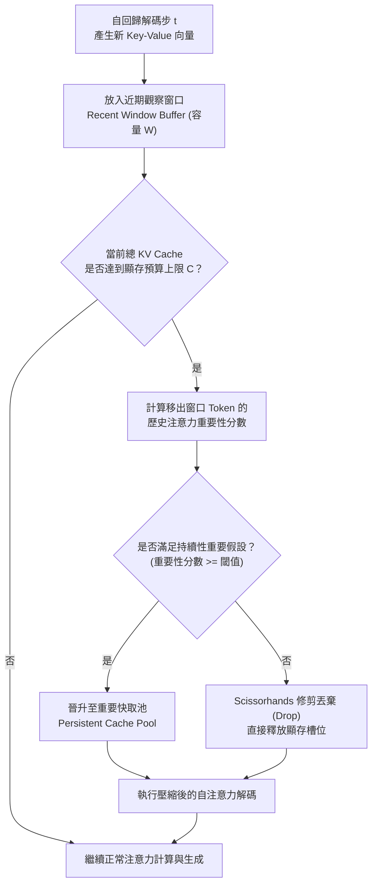

# Scissorhands: Exploiting the Persistence of Importance Hypothesis for LLM KV Cache Compression at Test Time

> [!INFO] 論文元數據 (Metadata)
> - **Paper ID**：`Liu2023_Scissorhands`
> - **作者**：Zichang Liu, Aditya Desai, Fangshuo Liao, Weitao Wang, Victor Xie, Zhaozhuo Xu, Anastasios Kyrillidis, Anshumali Shrivastava (Rice University)
> - **預印本初次發布年份 (Preprint)**：2023 (arXiv:2305.17118)
> - **正式發表年份 / 會議或期刊 (Venue)**：2023 (NeurIPS 2023)
> - **DOI / 官方論文集連結**：[NeurIPS 2023 Proceedings](https://proceedings.neurips.cc/paper_files/paper/2023/hash/e9cf5f76ee3b6a96bc4df0a996fbe53e-Abstract-Conference.html)
> - **arXiv**：[2305.17118](https://arxiv.org/abs/2305.17118)
> - **驗證狀態**：`verified` (已比對 NeurIPS 2023 官方全文與論文 PDF)
> - **本地 PDF 連結**：[[Papers/02 - Compression & KV Cache/(NeurIPS 2023-12) Scissorhands - Exploiting the Persistence of Importance Hypothesis for LLM KV Cache Compression at Test Time.pdf|開啟本地 PDF 檔案]]

---

## 一話摘要 (TL;DR)
Scissorhands 提出**重要性持續性假說（Persistence of Importance Hypothesis）**，發現歷史上被高度關注的關鍵 Token 在後續步驟中會持續受到關注（重疊率超 90%）；據此在推論解碼階段設計出無需微調的動態快取丟棄算法，達成 **5 倍 KV Cache 顯存壓縮（保留 15%–30% 快取）**且完全無損模型精度，並能與 4-bit 量化無縫疊加。

---

## 研究背景與問題定義 (Problem Statement)

### 1. 核心痛點
在大規模 LLM 服務部署環境中：
1. **KV 快取容量超越模型權重**：當推論批次（Batch Size）與上下文長度增加時，KV Cache 的顯存佔用可輕易超越模型權重本身（如 Table 1, Page 3 所示，OPT-66B 在 Batch=128、序列 2048 時，KV Cache 顯存需 258 GB，遠超模型參數的 132 GB）。
2. **Batch Size 受限阻礙硬體吞吐**：受限於顯存牆（Memory Wall），推論服務被迫採用較小的 Batch Size，導致 GPU 算力嚴重閒置（如 Table 2, Page 4，GPT-3 在 8 張 A100 80GB 上允許的最大 Batch 僅為 19）。
3. **推論時快取壓縮的理論空白**：缺乏嚴謹的理論依據來預測「哪些歷史 Key-Value 嵌入在未來完全不會再被使用」，盲目剪枝極易導致後續生成質量雪崩。

### 2. 重要性持續性假說 (Persistence of Importance Hypothesis)
作者透過對 Transformer 各層注意力權重的深入分析發現：
- **注意力集中度高**：在任意生成步驟，僅有少量 Token 佔據大部分注意力權重；
- **影響力的跨步持續性**：若一個 Token 在序列早期的解碼步驟中獲得了較高的注意力，它在隨後的所有生成步驟中維持高注意力的機率超過 **90%**；相反地，若一個 Token 在初入窗口時未被重點關注，它在未來被重新激活為關鍵 Token 的機率微乎其微。

---

## 核心方法與技術架構 (Methodology & Architecture)

### 1. 快取結構與預算劃分
Scissorhands 為每一層 Transformer 的 KV Cache 分配一個固定的顯存預算緩衝區（總容量為 $C$）：
1. **近期觀察緩衝區（Recent Window Buffer, 容量 $W$）**：所有新生成的 Token 優先進入該緩衝區，確保剛產生的上下文具備足夠的觀察期，以確認其是否具備持續重要性。
2. **重要 Token 快取池（Persistent Cache Pool, 容量 $C - W$）**：長期存儲被驗證具有持續重要性的歷史關鍵 Token。

### 2. 動態修剪演算法 (Dynamic Pruning Algorithm)
當快取總數達到上限預算 $C$ 時：
1. **識別持久重要 Token**：計算移出近期窗口的 Token 的歷史平均/峰值注意力權重；
2. **丟棄非重要 Token**：若該 Token 的重要性未達到設定閾值，直接從顯存中移除其 Key 與 Value 向量；
3. **理論逼近保證**：論文在 Section 4 證明了 Theorem 4.1，證明丟棄非重要 Token 後，重構的注意力輸出與原始全量輸出的誤差受到有界控制：
   $$\| \text{Attention}_{\text{pruned}} - \text{Attention}_{\text{full}} \| \le \epsilon$$

### 系統架構流程圖 (Mermaid)

#### 圖中節點對照
- `RecBuf`: 近期觀察緩衝區 (Recent Buffer)
- `CheckCap`: 顯存預算閾值檢查 (Memory Budget Check)
- `Identify`: 基於假設的重要性持久性評估模組
- `Promote`: 長期保留池晉升操作
- `Drop`: 非關鍵 Token 物理顯存釋放操作

---

## 主要實驗結果與證據 (Empirical Results & Evidence)

### 1. 5 倍壓縮無損精度驗證 (Page 9, Figure 3)
在 OPT-6B、OPT-13B 與 OPT-66B 上評估語言模型困惑度（C4）與下游任務（Hellaswag, MathQA, PIQA, Winogrande）：
- **語言建模困惑度 (C4 PPL)**：
  - OPT-6B 在保留 50% 快取時維持原始 PPL；
  - OPT-66B 在保留 25% 快取（壓縮 4 倍）時依然維持完全無損 PPL；
  - **重要規律**：**模型規模越大，精度對快取壓縮的耐受度越高（Accuracy Curve 越平緩）**，證實大型模型中注意力稀疏與持久性特徵更加顯著。
- **下游常識與推理任務**：
  - 在 Winogrande 與 MathQA 上，OPT-66B 在 **5 倍壓縮（僅保留 20% 快取）** 下，準確率與 Full KV Cache 完全持平。

### 2. 與 4-bit 量化之相容性 (Table 3, Page 9)
在 Hellaswag 上評估 2 倍剪枝疊加 4-bit KV 量化的表現：

| 模型規模 | 原始未壓縮 (FP16) | Scissorhands (2× 剪枝) | Scissorhands + 4-bit 量化 |
| :--- | :---: | :---: | :---: |
| **OPT-6B** | 0.702 | 0.706 | 0.704 |
| **OPT-13B** | 0.720 | 0.720 | 0.720 |

*(出處：Table 3, Page 9)*

- **關鍵結論**：在 2 倍結構化 Token 剪枝基礎上進一步疊加 4-bit 量化，完全沒有引入複合誤差（Compounded Errors），OPT-13B 準確率維持在精準的 0.720，為極限顯存壓縮提供了雙重技術疊加驗證。

---

## 優勢、限制及 Trade-offs (Strengths, Limitations & Trade-offs)

### 1. 優勢 (Strengths)
1. **嚴謹的經驗假說與理論支撐**：基於廣泛驗證的「重要性持續性假說」，並提供注意力近似誤差界（Theorem 4.1），消除黑盒剪枝的不確定性。
2. **超大模型收益遞增（Scale-Friendly）**：在 OPT-66B 上的表現顯著優於 OPT-6B，完美契合現代前沿大模型部署需求。
3. **無縫正交疊加**：與量化（Quantization）及 FlashAttention 解碼內核天然相容。

### 2. 限制與代價 (Limitations & Trade-offs)
1. **無法應對延遲回憶（Late-Recall）任務**：如果某個事實資訊在輸入前半段完全不被生成任務引用，而在上千 Token 之後突然被問及（如多跳跨文檔查詢），該 Token 在早期已被修剪丟棄，將無法重現。
2. **固定窗口預設的超參數敏感性**：觀察窗口 $W$ 若設得過小，可能誤殺剛生成的重要 Token；設得過大則壓縮收益受限。

---

## 對本專案研究領域的實際意義 (Implications for Research Domains)

1. **A02 (Context/KV Compression & Inference Efficiency)**：
   與 H2O 同為 2023 年 KV 快取剪枝領域的代表性突破。深入揭示了 Transformer 自注意力權重在時間維度上的「時間局部性（Temporal Locality）」與「長期黏性（Long-term Stickiness）」。
2. **超長文本 RAG 生成推論優化**：
   在長文本 RAG 架構中，檢索注入的文檔背景大多包含過渡句與格式符號。Scissorhands 能夠在解碼的第一時間將這些無關背景 Token 剔除，顯著減輕伺服端在長對話與長報告撰寫中的顯存瓶頸。

---

## 原始來源及相關筆記連結 (Sources & Related Notes)

- **本地 PDF 連結**：[[Papers/02 - Compression & KV Cache/(NeurIPS 2023-12) Scissorhands - Exploiting the Persistence of Importance Hypothesis for LLM KV Cache Compression at Test Time.pdf|開啟本地 PDF 檔案]]
- **對比與關聯快取壓縮筆記**：
  - [[03 - 論文庫 (Literature Notes)/02 - Compression & KV Cache/(NeurIPS 2023-12) H2O - Heavy-Hitter Oracle for Efficient Generative Inference of Large Language Models|H2O: Heavy-Hitter Oracle for Efficient Generative Inference]]
  - [[03 - 論文庫 (Literature Notes)/01 - Long Context & Sequence/(ICLR 2024-05) Efficient Streaming Language Models with Attention Sinks|StreamingLLM: Efficient Streaming Language Models with Attention Sinks]]
- **所屬研究領域**：
  - [[00 - 導覽與心智圖 (Navigation & MOC)/RAG Adjacent Interfaces|A02 Context/KV Compression & Inference Efficiency]]
