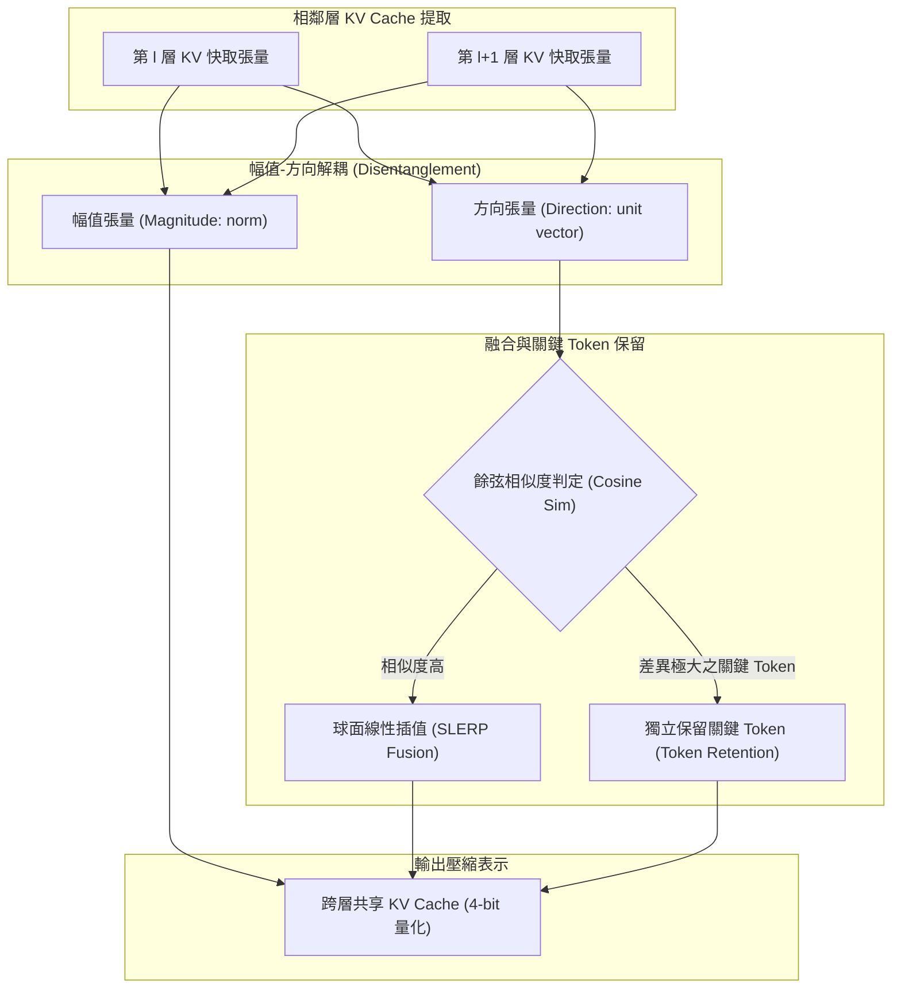

# MiniCache: KV Cache Compression in Depth Dimension for Large Language Models

## 1. 一話摘要 (TL;DR)
MiniCache 開拓了 KV Cache 壓縮的新維度——**深度維度（Depth Dimension）**，發現中深層 Transformer 相鄰層間的 KV 快取具有高度語意相似性，進而提出一套免微調（Training-free）的跨層融合算法：將狀態解耦為「方向」與「幅值」，以球面線性插值（SLERP）合成分割表示並保留關鍵 Token，結合 4-bit 量化達成 **5.02× 顯存壓縮比**，在 LongBench 上維持極高準確率。

---

## 2. 研究背景與問題定義 (Problem Statement)

### 既有壓縮方法的瓶頸
現有 KV Cache 壓縮技術主要聚焦於兩個軸向：
1. **長度維度（Token Pruning / Eviction）**：如 H2O、Scissorhands、StreamingLLM，藉由注意力權重丟棄不重要 Token，但在需要全域細節的事實檢索中容易造成不可逆的資訊缺失；
2. **精度維度（Quantization）**：如 KIVI、SmoothQuant，將 FP16 壓縮至 2-bit 或 4-bit，但極低位元（如 <2-bit）會引發嚴重的量化雜訊與崩潰。

### 核心洞察：深度維度冗餘（Depth-wise Redundancy）
作者觀測到，隨著神經網路層數加深，相鄰 Transformer 層之間的隱層表徵逐漸平滑，其注意力狀態呈現出顯著的高餘弦相似度。然而，若直接以算術平均進行跨層權重相加，會破壞特徵幅值尺度並損壞輸出。

---

## 3. 核心方法與技術架構 (Methodology & Architecture)

MiniCache 提出一套輕量且精確的跨層壓縮管線：

### 圖中節點對照
- `L_i`, `L_next`: 相鄰兩層尚未壓縮的原始 Key-Value 矩陣
- `MAG`: 提取張量 $L_2$ 範數，保留能量尺度
- `DIR`: 歸一化後的單位超球面方向向量
- `SIM`: 評估跨層 Token 語意差異度的檢驗器
- `SLERP`: 球面線性插值運算，避免歐氏空間平均造成的方向扭曲
- `RETAIN`: 識別少數敏感 Token（如命名實體、數值）並免予融合
- `FINAL`: 達到 5.02× 壓縮比且可直接參與後續解碼計算之快取

---

## 4. 主要實驗結果與證據 (Empirical Results & Evidence)

實驗涵蓋 LLaMA-2-7B/13B-Chat、Mistral-7B 及 Mistral-7B-Instruct，在長文本評測基準 **LongBench**（包含 LCC、RepoBench、TREC、2WikiMultiHopQA、GovReport、MultiFieldQA 等任務）上進行完整驗證：

1. **基準表現與壓縮比（Table 1, Page 9）**：
   - **LLaMA-2-7B-Chat**：
     - FP16 Baseline（1× 壓縮）：LongBench 平均分 **36.41**；
     - 4-bit KIVI-2（3.95× 壓縮）：平均分降至 **31.51**；
     - **MiniCache（5.02× 壓縮）**：平均分高達 **35.44**（僅微幅損耗 0.97 分，遠優於 RTN 的 4.90 與 SmoothQuant 的 16.28）。
   - **LLaMA-2-13B-Chat**：
     - FP16 Baseline（1×）：**32.71**；
     - **MiniCache（5.02×）**：**32.61**（幾乎零損耗，準確率保留率達 99.7%）。
   - **Mistral-7B-Instruct**：
     - FP16 Baseline：**48.32**；
     - **MiniCache（5.02×）**：**46.99**（優於 KIVI-2 的 43.74）。
2. **顯存與推論加速吞吐量（Figure 5, Page 9 & Efficiency Analysis）**：
   - 在單張 80GB NVIDIA A100 GPU 上針對 ShareGPT 負載（平均 prompt 161 tokens，output 338 tokens）進行 Batch-serving 評測：
   - 當 Batch Size 達到 128 時，MiniCache 成功降低 **25GB 顯存佔用（降低 41%）**，使最大服務併發吞吐量顯著提升。

---

## 5. 優勢、限制及 Trade-offs (Strengths, Limitations & Trade-offs)

### 優勢
- **正交相容性（Orthogonal Compatibility）**：MiniCache 運作於深度維度，可與長度維度（Token Pruning）及精確度維度（INT4/FP4 量化）完全疊加使用；
- **免微調（Training-free）**：無需重新執行代價高昂的二次訓練或 LoRA 微調，即插即用。

### 限制與 Trade-offs
- **底層架構依賴**：淺層 Transformer 的跨層相似度較低，因此前 20%–30% 的層無法安全融合，限制了理論最高壓縮極限；
- **解碼計算微量開銷**：SLERP 向量展開需在解碼時進行動態重構，對 Tensor Core 運算排程有微小依賴。

---

## 6. 對本專案研究領域的實際意義 (Implications for Research Domains)
在超長文本問答與大規模 RAG 系統中，單一模型往往需要加載數萬甚至數十萬 Token 的檢索文檔。MiniCache 證實了：
- **模型內部表徵存在顯著結構性冗餘**：即使不丟棄任何 Token 的時序歷史，僅憑跨層融合與低位元量化即可取得 5× 的顯存節省，使得單張消費級或企業級 GPU 部署長文本 RAG 的可行性大幅躍升。

---

## 7. 原始來源及相關筆記連結 (Sources & Related Notes)
- **本地 PDF**：`[[Papers/02 - Compression & KV Cache/(NeurIPS 2024-12) MiniCache - KV Cache Compression in Depth Dimension for Large Language Models.pdf|開啟本地 PDF 檔案]]`
- **關聯筆記**：
  - [[02 - 研究領域專題 (Research Domains)/Domain 02 - 多層次壓縮技術 (Token, KV Cache, Context)|Domain 02 - 多層次壓縮技術]]
  - [[03 - 論文庫 (Literature Notes)/02 - Compression & KV Cache/(ICML 2024-07) KIVI - A Tuning-Free Asymmetric 2-bit Quantization for KV Cache|KIVI 2-bit 量化筆記]]
  - [[03 - 論文庫 (Literature Notes)/02 - Compression & KV Cache/(NeurIPS 2023-12) H2O - Heavy-Hitter Oracle for Efficient Generative Inference of Large Language Models|H2O 注意力驅逐筆記]]
