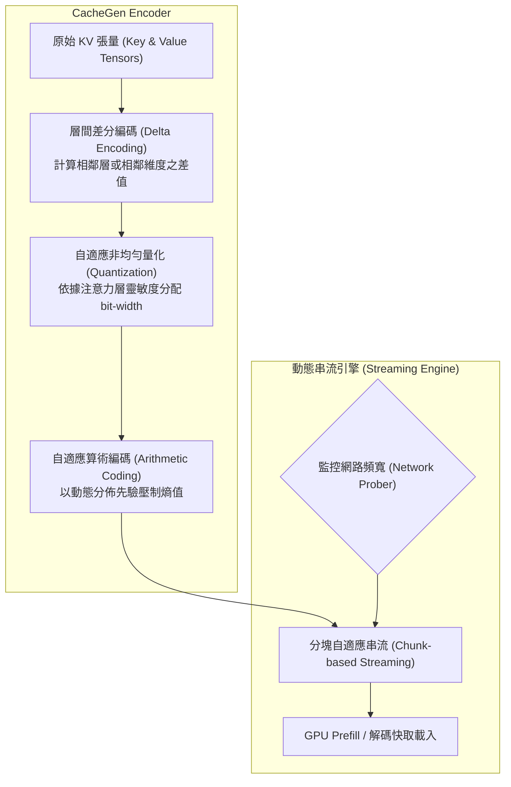

# CacheGen: KV Cache Compression and Streaming for Fast Large Language Model Serving

## 1. 一話摘要 (TL;DR)
CacheGen 針對大語言模型雲端服務中長上下文「首字生成延遲（Time-To-First-Token, TTFT）」居高不下的痛點，提出一套結合**層間差分量化編碼（Delta-Quantization）**與**自適應算術編碼（Customized Arithmetic Coding）**的 KV Cache 壓縮與動態串流系統，將 KV Cache 壓縮為緊湊二進位串流，在精準度損失小於 1% 的前提下實現 3.5×–4.3× 的頻寬節省與推論加速。

---

## 2. 研究背景與問題定義 (Problem Statement)

### 核心痛點
在大模型長文本服務（如長文件 QA、程式碼倉理解、多輪對話）中，Prefill 階段的開銷極為龐大：
1. **重複 Prefill 計算開銷**：每次請求如果重新計算數萬 Token 的 Prompt，會佔用大量 GPU 算力並造成數秒的 TTFT 延遲；
2. **跨節點與儲存傳輸瓶頸**：將已計算的 KV Cache 快取至外部分散式記憶體或硬碟（如 vLLM、LMCache 架構），其原始 FP16/BF16 體積極其龐大（例如 32k 上下文的 7B 模型 KV 快取超過 4GB）。在網路傳輸中，頻寬瓶頸往往抵消了快取帶來的收益；
3. **動態頻寬適配問題**：客戶端與推論叢集或跨節點間的網路頻寬動態起伏，傳統未壓縮或剛性壓縮機制無法動態適配傳輸通量。

---

## 3. 核心方法與技術架構 (Methodology & Architecture)

CacheGen 包含三大核心技術組件：

### 圖中節點對照
- `RAW`: 原始 FP16 浮點張量
- `DELTA`: 消除相鄰 Token 與注意力頭間冗餘數值的差分器
- `QUANT`: 依重要性將數值映射至 2-bit 到 8-bit 的量化器
- `ARITH`: 利用特定符號頻率分佈進行無損熵編碼的算術編碼器
- `STREAM`: 依網路 RTT 與吞吐自適應選擇壓縮等級的傳輸模組
- `DEC`: 推論節點 GPU 快速解壓縮並載入 KV Cache

### 關鍵技術機制
1. **數值分佈先驗分析**：作者深入分析發現，KV Cache 數值在不同注意力層呈現顯著的局部平滑性與高偏態分佈（偏向 0 且分佈集中），因此差分編碼後殘差的資訊熵大幅降低。
2. **動態多解析度分塊（Multi-level Bitstream Chunking）**：類似於現代視訊串流（如 DASH/HLS），CacheGen 將長上下文劃分為數個獨立 Chunk，各 Chunk 提供不同壓縮位元率（Base Layer + Enhancement Layers），網路擁塞時優先保證核心 Context 載入。
3. **硬體加速解碼內核**：在 GPU 端客製化高效解壓縮 CUDA Kernel，解壓縮開銷遠低於重新執行 Prefill 計算與原始未壓縮網路傳輸耗時。

---

## 4. 主要實驗結果與證據 (Empirical Results & Evidence)

實驗採用 Mistral-7B、LLaMA-2-7B/13B，評測基準包括 LongBench、L-Eval 及合成長文本工作負載（Synthetic Serving Traces）：

1. **推論延遲與加速比（Table 1, Page 2）**：
   - 在 Mistral-7B 模型下，面對 8k–32k 長文本，CacheGen 相較於直接重新 Prefill 基準，TTFT 加速達 **3.5× 至 4.3×**；
   - 相較於無壓縮的原始 KV Cache 網路傳輸，端到端傳輸與載入時間縮短 **3.6×**。
2. **頻寬與儲存壓縮比（Table 2, Page 8 & Section 6.2）**：
   - 相比 FP16 原始格式，CacheGen 達到 **3.5×–4.4×** 的實質資料量縮減；
   - 在 4-bit 浮點量化配合算術編碼時，平均每個 Token 的 Key/Value 佔用僅約 4.2–4.8 bits。
3. **下游任務精度保真度（Section 6.3）**：
   - 在 LongBench 16 項跨領域長文本基準（涵蓋 Multi-doc QA、Summarization、Code）中，CacheGen 壓縮後的精度下降控制在 **0.8% 範圍內**，實質達到近乎無損（Near-lossless）品質。

---

## 5. 優勢、限制及 Trade-offs (Strengths, Limitations & Trade-offs)

### 優勢
- **兼顧計算與通訊**：突破了以往僅關注 GPU 顯存容量的局限，首次系統性解決分散式 Serving 中 KV 快取在網路層的傳輸瓶頸；
- **自適應網路狀況**：分層可擴展串流技術使雲端集群在遇到突發頻寬抖動時仍能維持穩定吞吐。

### 限制與 Trade-offs
- **CPU/GPU 解碼開銷**：算術編碼解壓縮需要佔用少量 CPU 或 GPU 週期，若本機 PCI-e 頻寬極度充裕且網路延遲為 0，壓縮收益會略微衰減；
- **系統整合複雜度**：要求 Serving 框架（如 vLLM、TensorRT-LLM）修改內部 PagedAttention 記憶體排程協議以支援非同步 Chunk 解壓縮。

---

## 6. 對本專案研究領域的實際意義 (Implications for Research Domains)
在超長文本與多輪 Agentic 系統架構中，長文本的重複檢索與 Prompt 往往具有極高的重疊度。CacheGen 的思想為本專案提供了重要的工程啟示：
- **分散式 Evidence Cache**：在多 Agent 協同或長篇報告生成中，可將共享的背景知識庫（Evidence Store）預先編碼為 CacheGen 串流，各 Worker Agent 無需重複解析與重複計算 Prefill，直接流式載入 KV 狀態。

---

## 7. 原始來源及相關筆記連結 (Sources & Related Notes)
- **本地 PDF**：`[[Papers/02 - Compression & KV Cache/(SIGCOMM 2024-08) CacheGen - KV Cache Compression and Streaming for Fast Large Language Model Serving.pdf|開啟本地 PDF 檔案]]`
- **關聯筆記**：
  - [[02 - 研究領域專題 (Research Domains)/Domain 02 - 多層次壓縮技術 (Token, KV Cache, Context)|Domain 02 - 多層次壓縮技術]]
  - [[03 - 論文庫 (Literature Notes)/02 - Compression & KV Cache/(ICML 2024-07) KIVI - A Tuning-Free Asymmetric 2-bit Quantization for KV Cache|KIVI 2-bit 量化筆記]]
