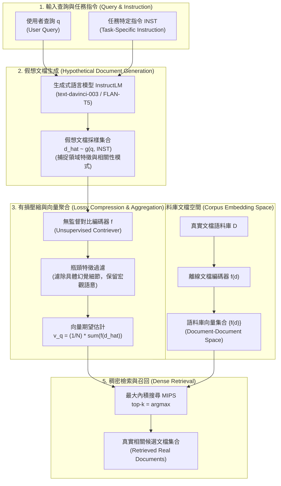

# Precise Zero-Shot Dense Retrieval without Relevance Labels (HyDE)

> [!INFO] 論文元數據 (Metadata)
> - **Paper ID**：`Gao2023_HyDE`
> - **作者**：Luyu Gao, Xueguang Ma, Jimmy Lin, Jamie Callan (Carnegie Mellon University & University of Waterloo)
> - **預印本初次發布年份 (Preprint)**：2022-12 (arXiv:2212.10496)
> - **正式發表年份 / 會議或期刊 (Venue)**：ACL 2023 (Long Paper, Pages 1761–1777)
> - **DOI**：[10.18653/v1/2023.acl-long.99](https://doi.org/10.18653/v1/2023.acl-long.99)
> - **arXiv**：[2212.10496](https://arxiv.org/abs/2212.10496)
> - **開源專案**：[texttron/hyde (GitHub)](https://github.com/texttron/hyde)
> - **驗證狀態**：`verified` (已逐頁比對 ACL 2023 正式發表版本 PDF 全文與附錄實驗數據)
> - **本地 PDF 連結**：[[Papers/03 - RAG & Retrieval/(ACL 2023-07) Precise Zero-Shot Dense Retrieval without Relevance Labels.pdf|開啟本地 PDF 檔案]]

---

## 1. 一話摘要 (TL;DR)
HyDE (Hypothetical Document Embeddings) 解耦了稠密檢索中的「相關性建模」與「語意表徵學習」：先利用具備指令遵循能力的語言模型（Instruction-following LLM）根據 Query 生成未經事實檢驗但捕捉相關性模式的假想文檔（Hypothetical Document），再藉由無監督對比編碼器（如 Contriever）作為「有損壓縮器（Lossy Compressor）」濾除細節幻覺並提取嵌入向量，將傳統幾何非對稱的「查詢-文檔相關性匹配」重構為同構的「文檔-文檔語意相似度檢索」；在完全無需任何人工相關性標籤的純 Zero-Shot 設定下，檢索表現大幅超越無監督基準（TREC DL19 nDCG@10 達 61.3 vs Contriever 44.5 / BM25 50.6），甚至逼近或超越在 MS-MARCO 上深度監督微調的模型。

---

## 2. 研究背景與問題定義 (Problem Statement)

### 2.1 零樣本稠密檢索 (Zero-Shot Dense Retrieval) 的核心困境
稠密雙塔檢索（Dual-Encoder Retrieval）透過雙向編碼器將查詢與文檔映射到同維向量空間，以內積衡量相似度：
$$\text{sim}(q, d) = \langle \text{enc}_q(q), \text{enc}_d(d) \rangle = \langle v_q, v_d \rangle$$

在標準設定下，建立高性能稠密檢索系統存在嚴重的先決條件依賴：
1. **空間幾何分佈非對稱（Query-Document Asymmetry）**：使用者查詢 $q$ 通常只有簡短數詞（短小且資訊稀疏），而候選文檔 $d$ 往往是數百字的段落（語意豐富且結構完整）。兩者在文本長度、詞彙分佈與語法結構上存在先天的幾何非對稱性。
2. **對海量標註相關性標籤的極度依賴**：雙塔架構若要在同一個度量空間中拉近語義關聯的 $(q, d)$ 對，必須依賴大規模相關性標籤（如 MS-MARCO 上百萬量級的人工評判三元組 $\langle q, d^+, d^- \rangle$）進行對比學習與度量學習（Metric Learning）。
3. **無監督條件下學習 intractable**：若面對冷啟動、新興專業領域或低資源語言，缺乏相關性標籤 $r_{ij}$ 時，直接聯合學習雙編碼器 $\text{enc}_q$ 與 $\text{enc}_d$ 使得數值相關度完全不可解（intractable）。未經微調的純自監督稠密模型（如純對比學習預訓練的 Contriever）在零樣本遷移下表現往往急遽下滑，甚至顯著落後於基於單純單詞頻率統計的經典 BM25。
4. **遷移學習（Transfer Learning）的隱含假定失效**：學界常以 MS-MARCO 預訓練作為通用基準（如 DPR、ANCE），但 MS-MARCO 等大型數據集包含嚴格的非商業使用條款，且跨領域語義漂移（Domain Shift）往往導致微調特徵失效。

### 2.2 核心研究假設 (Core Hypothesis)
- **相關性建模與語意表徵解耦（Decoupling Relevance Modeling from Representation）**：相關性評判不一定非得透過幾何空間的向量內積硬性擬合，而可以委派給具備強大語言生成能力與泛化能力的指令式大型語言模型（Instruction-following NLG LLM）。
- **假想文檔的模式捕捉能力（Relevance Pattern over Factual Grounding）**：LLM 即使生成的假想文檔包含事實性錯誤或幻覺（Ungrounded / Hallucinated），其段落組織方式、領域專業語彙、語氣與問題對應的邏輯結構，仍然能精準捕捉「相關文檔」的文本特徵模式。
- **文檔-文檔空間的同構性（Symmetric Document Space）**：文檔與文檔之間的語意相似度，可直接藉助純無監督對比學習（Unsupervised Contrastive Learning，如隨機片段裁切預訓練）完滿解決，從而徹底擺脫對人工檢索標籤的依賴。

---

## 3. 核心方法與技術架構 (Methodology & Architecture)

### 3.1 數學形式化與檢索空間重構

HyDE 避開了直接訓練 $\text{enc}_q$ 與 $\text{enc}_d$ 跨空間擬合相關性的難題，將檢索操作完全重構於**文檔空間（Document-only Embedding Space）**中：

1. **文檔編碼器（Document Encoder）**：直接採用在海量無標註語料庫上進行自監督對比學習預訓練的編碼器 $f = \text{enc}_d = \text{enc}_{\text{con}}$（如 Contriever）。語料庫文檔向量預先離線計算：
   $$v_d = f(d), \quad \forall d \in \mathcal{D}_1 \cup \mathcal{D}_2 \cup \dots \cup \mathcal{D}_L$$
2. **假想文檔生成（Hypothetical Document Generation）**：引入指令遵循語言模型 $g(q, \text{INST}) = \text{InstructLM}(q, \text{INST})$，接收查詢 $q$ 與特定任務指令 $\text{INST}$，取樣生成一篇虛擬文檔 $\hat{d}$。
3. **查詢向量期望值估計（Expectation Estimation）**：
   $$\mathbb{E}[v_q] = \mathbb{E}_{\hat{d} \sim g(q, \text{INST})}[f(\hat{d})]$$
   在查詢無歧義（Uni-modal distribution）的假設下，HyDE 透過 Monte Carlo 採樣 $N$ 篇假想文檔 $[\hat{d}_1, \hat{d}_2, \dots, \hat{d}_N]$ 並計算平均向量：
   $$\hat{v}_q = \frac{1}{N} \sum_{k=1}^N f(\hat{d}_k)$$
   亦可將原始查詢 $q$ 作為一種弱假設納入加權平均：
   $$\hat{v}_q = \frac{1}{N + 1} \left[ \sum_{k=1}^N f(\hat{d}_k) + f(q) \right]$$
4. **最大內積檢索（MIPS）**：使用聚合後的假想向量 $\hat{v}_q$ 與語料庫中文檔向量計算內積相似度，召回最相似的真實文檔：
   $$\text{sim}(\hat{v}_q, d) = \langle \hat{v}_q, f(d) \rangle$$

### 3.2 編碼器作為「有損壓縮器」(Lossy Compressor) 的關鍵機制
論文提出一個至關重要的理論觀察：**稠密編碼器 $f$ 本質上充當了有損壓縮器（Lossy Compressor）**。
- LLM 在生成假想段落時，必然會生成非真實、未經事實檢驗的細節（例如具體捏造的百分比數字、研究機構或發明時間）。
- 稠密編碼器將數百詞的文本映射至低維度瓶頸空間（如 768 維 Dense Vector）。在自監督對比學習目標下，編碼器保留的是高層次主題語義、文檔結構模式與關鍵領域概念，而細部幻覺與孤立數值被自然過濾（Filtered out）。
- 此一過濾機制將假想向量「錨定（Grounding）」回真實語料庫的分佈之中，使得假想文檔能精準匹配包含真實事實的相關文檔。

### 3.3 系統架構流程圖 (Mermaid Architecture)

#### 圖中節點對照
| 節點名稱 | 模組職責與技術實現 |
|---|---|
| `Q`, `INST` | 原始查詢與引導 LLM 生成特定文體之 Prompt 樣板 |
| `LLM` | 具指令理解能力之生成模型（實驗採用 InstructGPT `text-davinci-003`） |
| `HypoDocs` | 依據指令生成之虛構文檔（包含語意與風格模式，允許事實瑕疵） |
| `Encoder` | 無監督對比學習編碼器（Contriever / mContriever） |
| `Filter`, `VecAgg` | 低維稠密瓶頸過濾幻覺噪聲，並對 $N$ 個採樣假想向量取平均 |
| `DocEnc`, `CorpusVecs` | 語料庫真實段落之離線嵌入向量（完全共用同一編碼器 $f$） |
| `Search`, `Results` | 透過 MIPS 計算向量內積並返回前 $k$ 篇真實檢索文檔 |

### 3.4 各任務專屬 Prompt 設計 (Task-Specific Instructions)
HyDE 不改變底層編碼器與語言模型參數，僅依據檢索任務類別切換輕量指令（論文 Appendix A.1）：
- **Web Search (DL19/20)**:
  `Please write a passage to answer the question`
  `Question: [QUESTION]`
  `Passage:`
- **SciFact (科學事實查核)**:
  `Please write a scientific paper passage to support/refute the claim`
  `Claim: [Claim]`
  `Passage:`
- **ArguAna (論點對抗檢索)**:
  `Please write a counter argument for the passage`
  `Passage: [PASSAGE]`
  `Counter Argument:`
- **TREC-COVID (生醫領域檢索)**:
  `Please write a scientific paper passage to answer the question`
  `Question: [QUESTION]`
  `Passage:`
- **FiQA (金融論壇問答)**:
  `Please write a financial article passage to answer the question`
  `Question: [QUESTION]`
  `Passage:`
- **DBPedia-Entity (知識圖譜實體檢索)**:
  `Please write a passage to answer the question.`
  `Question: [QUESTION]`
  `Passage:`
- **Mr.TyDi (多語言檢索)**:
  `Please write a passage in Swahili/Korean/Japanese/Bengali to answer the question in detail.`
  `Question: [QUESTION]`
  `Passage:`

---

## 4. 主要實驗結果與證據 (Empirical Results & Evidence)

### 4.1 實驗設定與評估條件
- **模型實作**：LLM 採用 InstructGPT（`text-davinci-003`，175B，OpenAI API，生成溫度設置為 0.7）；稠密編碼器採用無監督 Contriever（英語任務）與 mContriever（多語言任務）。檢索框架採用 Pyserini。
- **對照基線**：
  - 無相關性標註（w/o relevance judgement）：BM25（經典詞彙檢索）、Contriever / mContriever（純無監督對比學習稠密模型）。
  - 有相關性標註（w/ relevance judgement，以 MS-MARCO 百萬標註深度微調）：DPR、ANCE、ContrieverFT / mContrieverFT。

### 4.2 Web Search 實證表現 (TREC DL19 & DL20)
評估基準建立於 MS-MARCO 測試集上，數據出處為論文 Table 1 (Page 5)：

| 檢索方法 | 相關性標註監督 | DL19 MAP | DL19 nDCG@10 | DL19 Recall@1k | DL20 MAP | DL20 nDCG@10 | DL20 Recall@1k |
|---|---|---|---|---|---|---|---|
| **BM25** | 無 (Heuristic) | 30.1 | 50.6 | 75.0 | 28.6 | 48.0 | 78.6 |
| **Contriever** | 無 (Unsupervised) | 24.0 | 44.5 | 74.6 | 24.0 | 42.1 | 75.4 |
| **HyDE** | **無 (Zero-Shot)** | **41.8** | **61.3** | **88.0** | **38.2** | **57.9** | **84.4** |
| DPR | 有 (MS-MARCO FT) | 36.5 | 62.2 | 76.9 | 41.8 | 65.3 | 81.4 |
| ANCE | 有 (MS-MARCO FT) | 37.1 | 64.5 | 75.5 | 40.8 | 64.6 | 77.6 |
| ContrieverFT | 有 (MS-MARCO FT) | 41.7 | 62.1 | 83.6 | 43.6 | 63.2 | 85.8 |

> [!NOTE] 關鍵實證分析
> 1. **大幅逆轉無監督劣勢**：純自監督 Contriever 在 DL19 上僅取得 44.5 nDCG@10，顯著落後於 BM25 (50.6)；而 HyDE 引入假想文檔後飆升至 **61.3**（絕對提升 **+16.8**），並超越 BM25 **+10.7**。
> 2. **逼近甚至超越在域微調模型**：在 DL19 上，完全無標註的 HyDE（MAP 41.8, nDCG@10 61.3）與經過百萬樣本微調的 ContrieverFT（MAP 41.7, nDCG@10 62.1）持平；且在 Recall@1k 指標上，HyDE（88.0）超越了包含 ContrieverFT (83.6)、ANCE (75.5) 與 DPR (76.9) 在內的所有微調系統。

### 4.3 低資源與跨領域檢索 (BEIR Low-Resource Datasets)
數據出處為論文 Table 2 (Page 5)，涵蓋 6 個極具挑戰的低資源/專業領域任務：

| 評測指標 | 檢索模型 | SciFact | ArguAna | TREC-COVID | FiQA | DBPedia | TREC-NEWS |
|---|---|---|---|---|---|---|---|
| **nDCG@10** | BM25 | 67.9 | 39.7 | 59.5 | 23.6 | 31.8 | 39.5 |
| | Contriever (w/o sup) | 64.9 | 37.9 | 27.3 | 24.5 | 29.2 | 34.8 |
| | **HyDE (w/o sup)** | **69.1** | **46.6** | **59.3** | **27.3** | **36.8** | **44.0** |
| | DPR (MS-MARCO FT) | 31.8 | 17.5 | 33.2 | 29.5 | 26.3 | 16.1 |
| | ANCE (MS-MARCO FT) | 50.7 | 41.5 | 65.4 | 30.0 | 28.1 | 38.2 |
| | ContrieverFT | 67.7 | 44.6 | 59.6 | 32.9 | 41.3 | 42.8 |
| **Recall@100** | BM25 | 92.5 | 93.2 | 49.8 | 54.0 | 46.8 | 44.7 |
| | Contriever (w/o sup) | 92.6 | 90.1 | 17.2 | 56.2 | 45.3 | 42.3 |
| | **HyDE (w/o sup)** | **96.4** | **97.9** | **41.4** | **62.1** | **47.2** | **50.9** |
| | DPR (MS-MARCO FT) | 72.7 | 75.1 | 21.2 | 34.2 | 34.9 | 21.5 |
| | ANCE (MS-MARCO FT) | 81.6 | 93.7 | 45.7 | 58.1 | 31.9 | 39.8 |
| | ContrieverFT | 94.7 | 97.7 | 40.7 | 65.6 | 54.1 | 49.2 |

> [!NOTE] 關鍵實證分析
> 1. **修復生醫專業領域崩潰**：在 TREC-COVID 上，底層 Contriever 發生嚴重失效（nDCG@10 僅 27.3，Recall@100 僅 17.2）；HyDE 透過 LLM 生成符合論文風格的假想段落，將 nDCG@10 大幅拉回至 **59.3**（+32.0），Recall@100 提升至 **41.4**（+24.2），追平 BM25 (59.5) 與 ContrieverFT (59.6)。
> 2. **對抗檢索 SOTA**：在 ArguAna 論點反駁檢索中，HyDE 取得 **46.6 nDCG@10** 與 **97.9 Recall@100**，超越所有監督與無監督基線（超越 ContrieverFT 的 44.6 與 ANCE 的 41.5）。
> 3. **指令欠指定問題**：在 FiQA（金融問答）與 DBPedia（實體檢索）上，ContrieverFT 表現略高於 HyDE；論文分析指出這是由於單純的 `write a financial article passage` 指令對高度特定風格的論壇回覆描述不足（Under-specification of the instruction），若客製化指令仍有進一步提升空間。

### 4.4 多語言檢索 (Mr.TyDi Benchmark)
評估非英語檢索環境下的表現，指標為 MRR@100，數據出處為 Table 3 (Page 6)：

| 模型類別 | 模型名稱 | Swahili (斯瓦希里語) | Korean (韓語) | Japanese (日語) | Bengali (孟加拉語) |
|---|---|---|---|---|---|
| **w/o relevance** | BM25 | 38.9 | 28.5 | 21.2 | 41.8 |
| | mContriever | 38.3 | 22.3 | 19.5 | 35.3 |
| | **HyDE** | **41.7** | **30.6** | **30.7** | **41.3** |
| **w/ relevance** | mDPR | 7.3 | 21.9 | 18.1 | 25.8 |
| | mBERT (MS-MARCO FT) | 37.4 | 28.1 | 27.1 | 35.1 |
| | XLM-R (MS-MARCO FT) | 35.1 | 32.2 | 24.8 | 41.7 |
| | mContrieverFT | 51.2 | 34.2 | 32.4 | 42.3 |

> [!NOTE] 關鍵實證分析
> 在資源較匱乏的非英語語言中，HyDE 相比 mContriever 在韓語（30.6 vs 22.3）與日語（30.7 vs 19.5）取得顯著增長，且全面擊敗跨語言微調的 mDPR 與 mBERT；但相較於 mContrieverFT 仍存在差距，主因在於非英語語料在 InstructGPT 的指令微調與預訓練權重中佔比較低，生成品質受到語言資源限制。

### 4.5 LLM 參數量與編碼器微調狀態之消融分析
數據出處為論文 Table 4 (Page 6)，檢驗不同生成骨幹與微調編碼器的交互效應（指標：nDCG@10）：

| 生成模型骨幹 (Generative LM) | 參數量規模 | 搭配無監督 Contriever (DL19 / DL20) | 搭配監督微調 ContrieverFT (DL19 / DL20) |
|---|---|---|---|
| *(無生成骨幹 / 原始查詢)* | - | 44.5 / 42.1 | 62.1 / 63.2 |
| **FLAN-T5-xxl** | 11B | 48.9 / 52.9 | 60.2 / 62.1 |
| **Cohere (command-xlarge)** | 52B | 53.8 / 53.8 | 61.4 / 63.1 |
| **InstructGPT (text-davinci-003)** | 175B | **61.3** / **57.9** | **67.4** / **63.5** |

> [!NOTE] 關鍵實證分析
> 1. **生成能力正相關**：所有指令模型皆能大幅提升無監督 Contriever 的表現，且表現隨模型規模（11B $\to$ 52B $\to$ 175B）呈單調遞增，證實 HyDE 效益高度取決於 LLM 的語言理解與生成能力。
> 2. **微調編碼器上限突破**：當搭配已在 MS-MARCO 充分微調的 ContrieverFT 時，強大的 InstructGPT 能將 DL19 的表現進一步推升至 **67.4**（淨增 **+5.3**），證明生成式假想文檔捕捉到了監督雙塔編碼器所遺漏的語義面向。
> 3. **弱生成模型的負遷移風險**：若生成模型能力不足（如 11B FLAN-T5），其生成的假想文檔噪聲可能干擾已被充分調優的微調編碼器（DL19 從 62.1 下降至 60.2）。

---

## 5. 優勢、限制及 Trade-offs (Strengths, Limitations & Trade-offs)

### 5.1 技術優勢 (Strengths)
1. **真正的冷啟動 Zero-shot 能力**：完全不需要標註相關性訓練對，無需針對目標領域重新訓練雙塔模型，真正做到 Out-of-the-box 即插即用。
2. **巧妙化解長度與語法非對稱性**：將難以對齊的「短查詢 vs 長段落」轉為同質的「長段落 vs 長段落」，消除了查詢與文檔間的空間幾何偏置。
3. **對事實幻覺具備內生容忍度**：透過 Dense Encoder 的低維度有損壓縮瓶頸，過濾細節事實錯誤，僅保留詞彙語意分佈，使得「生成幻覺」不再是檢索的致命傷。
4. **與強大 LLM 的正向規模效應（Scaling Laws）**：下游 LLM 語言理解與生成能力越強，HyDE 檢索品質直接水漲船高。

### 5.2 核心限制與失效情境 (Limitations & Failure Modes)
1. **推論延遲與計算成本顯著增加（Latency & Cost Overhead）**：
   - 傳統雙編碼器在線檢索僅需一次 Query Forward Pass（數毫秒）與 MIPS 檢索（數毫秒）。
   - HyDE 強制在檢索前插入一次 LLM 自回歸解碼生成（通常需生成 100~300 tokens），Time-to-First-Token (TTFT) 與完整檢索延遲從數毫秒飆升至數百毫秒甚至秒級，大幅增加系統推論延遲與 API 費用。
2. **多意圖與歧義查詢的語意漂移（Semantic Drift on Ambiguous Queries）**：
   - 論文核心推導建立於「查詢向量空間為單峰分佈（Uni-modal distribution）」之假設。
   - 若使用者查詢具備多義性或歧義性（如單詞 `Apple` 或短語 `Python installation`），LLM 的單次取樣可能陷入特定某一意圖生成假想文檔，導致檢索結果發生嚴重的「意圖坍縮」與語意漂移，遺漏其他合法意圖。
3. **實體密集型與符號型查詢失效（Entity-Centric & Code/ID Queries）**：
   - 在法規案號、產品型號、醫學代碼或程式碼特定函式名稱等高度要求 Exact Keyword Matching 的檢索場景中，LLM 經常「以假亂真」捏造不存在的料號或實體，這些捏造的符號特徵一旦被編碼，將直接誤導檢索器召回完全無關的文檔。
4. **Prompt 設計敏感度與領域未指定（Instruction Under-specification）**：
   - 如 FiQA 與 DBPedia 實驗所示，缺乏具體文體限制的 Prompt 會產出與語料庫風格不相符的假想段落，削弱無監督編碼器的檢索精準度。

### 5.3 工程權衡與生命週期技術選型 (Engineering Trade-offs & Lifecycle Routing)
論文第 6 節提出了極具工業啟發性的檢索系統生命週期演進視角：
- **階段一：系統冷啟動（Cold-Start Phase）**：
  在系統發布初期，缺乏任何使用者點擊日誌（Click Logs）或標註對，此時採用 **HyDE + 無監督 Contriever** 能在零標註下提供超越 BM25、媲美有監督模型的檢索品質。
- **階段二：成熟與查詢路由分流（Matured Phase & Query Routing）**：
  隨著日誌與相關性數據累積，訓練專屬的監督微調稠密檢索器（如 Fine-tuned Dense Retriever）上線。
  - 對於 80% 的高頻頭部查詢（Head Queries），直接路由至低延遲的微調雙塔檢索器處理，保證毫秒級響應與極低推論成本。
  - 對於 20% 罕見長尾查詢（Tail Queries）、專業知識密集查詢或領域外查詢（OOD Queries），動態路由至 **HyDE 後端**，利用 LLM 先驗知識增強檢索召回。

---

## 6. 對本專案研究領域的實際意義 (Implications for Research Domains)

### 6.1 在 D05 (Query Understanding & Retrieval) 的關鍵定位
- **範式轉換的分水嶺**：HyDE 開創了「以假想生成代替查詢改寫（Hypothetical Document Generation as Query Transformation）」的新範式，將傳統資訊檢索中的偽相關反饋（Pseudo-Relevance Feedback, PRF）徹底倒置——傳統 PRF 依賴「先檢索可能不準確的文檔 $\to$ 再擴充查詢」，而 HyDE 是「先依模型先驗生成假想文檔 $\to$ 再進行精確檢索」。
- **標準對照基準**：HyDE 是後續所有 Query Rewriting、Query2Doc、Step-Back Prompting 與 Iterative Retrieval（如 ITER-RETGEN）在 D05 評測中必備的經典 Baseline。

### 6.2 在 D04 (Representation & Indexing) 的啟發
- **對稱檢索轉換器**：HyDE 展示了如何巧妙地將一個「幾何非對稱度量學習問題」降維轉換為「幾何同構對稱聚類問題」，為無監督表徵模型在檢索系統中的直接應用開闢了可行路徑。

---

## 7. 原始來源及相關筆記連結 (Sources & Related Notes)

### 7.1 原始來源與資源
- **本地文獻**：[[Papers/03 - RAG & Retrieval/(ACL 2023-07) Precise Zero-Shot Dense Retrieval without Relevance Labels.pdf|開啟本地 PDF 檔案]]
- **ACL 官方出版**：[ACL Anthology (Volume 1: Long Papers, pp. 1761–1777)](https://aclanthology.org/2023.acl-long.99/)
- **arXiv 預印本**：[arXiv:2212.10496](https://arxiv.org/abs/2212.10496)
- **官方開源代碼**：[GitHub - texttron/hyde](https://github.com/texttron/hyde)

### 7.2 所屬研究專題與知識庫導覽
- **所屬研究領域**：
  - [[02 - 研究領域專題 (Research Domains)/Domain 05 - Query Understanding & Retrieval|Domain 05 - Query Understanding & Retrieval]] (Primary Domain: D05)
  - [[02 - 研究領域專題 (Research Domains)/Domain 04 - Representation & Indexing|Domain 04 - Representation & Indexing]] (Secondary Domain: D04)
- **底層無監督編碼器基礎**：
  - [[03 - 論文庫 (Literature Notes)/03 - RAG & Retrieval/(TMLR 2022-08) Unsupervised Dense Information Retrieval with Contrastive Learning|Contriever: Unsupervised Dense Information Retrieval with Contrastive Learning]]
- **對比基準文獻**：
  - [[03 - 論文庫 (Literature Notes)/03 - RAG & Retrieval/(EMNLP 2020-11) Dense Passage Retrieval for Open-Domain Question Answering|DPR: Dense Passage Retrieval for Open-Domain Question Answering]]
  - [[03 - 論文庫 (Literature Notes)/03 - RAG & Retrieval/(EMNLP 2023-12) Query Rewriting in Retrieval-Augmented Large Language Models|Query Rewriting in Retrieval-Augmented Large Language Models]]
- **全局導覽與全景地圖**：
  - [[00 - 導覽與心智圖 (Navigation & MOC)/Home (主目錄與知識庫導覽)|主目錄與知識庫導覽]]
  - [[00 - 導覽與心智圖 (Navigation & MOC)/RAG Research Taxonomy & Domain Map|RAG Research Taxonomy & Domain Map]]
  - [[00 - 導覽與心智圖 (Navigation & MOC)/RAG System Maps|RAG System Maps]]
